# Legacy Data Import - Master Strategy & Mapping Document

**Generated**: 2025-11-16  
**Status**: CONSOLIDATED MASTER DOCUMENT  
**Total Schemas**: 5 (mwnf3, sh, thg, travels, explore)  
**Total Tables**: ~1,150 tables

---

## Table of Contents

1. [Executive Summary](#executive-summary)
2. [Schema Architecture Overview](#schema-architecture-overview)
3. [Collection Type Mapping & Hierarchy](#collection-type-mapping--hierarchy)
4. [Image Import Strategy - NEW APPROACH](#image-import-strategy---new-approach)
5. [Entity Mapping Reference](#entity-mapping-reference)
6. [backward_compatibility Format Standards](#backward_compatibility-format-standards)
7. [Import Execution Order](#import-execution-order)
8. [Deduplication Strategy](#deduplication-strategy)
9. [Data Volume Estimates](#data-volume-estimates)

---

## Executive Summary

### Project Scope

Import legacy museum inventory data from 5 interconnected database schemas into the new unified Laravel-based inventory management system. The import covers approximately **1,150 tables** containing:

- **~10,000+ items** (objects, monuments, details) across all schemas
- **~1,808 monuments** in explore schema alone (critical dataset)
- **Multiple hierarchical collection structures** (exhibitions, galleries, trails, themes)
- **Cross-schema references** requiring careful deduplication
- **Complex image relationships** with contextual descriptions

### Key Challenges & Solutions

| Challenge | Solution |
|-----------|----------|
| **Denormalization** | Language in PK for mwnf3/travels - Group rows, create one Item + multiple translations |
| **Multi-column PKs** | Up to 7 columns - Use backward_compatibility field for UUID resolution |
| **Cross-schema refs** | Items referenced across schemas - Deduplication via backward_compatibility lookup |
| **Hierarchical collections** | 4-level deep hierarchies - Import parents before children, use parent_id |
| **Contextual translations** | Same item, different descriptions per context - Multiple ItemTranslation records with context_id |
| **Image complexity** | NEW: Single images in galleries + ordered lists - Tree structure with "picture" type items |

### Data Flow Architecture

```
LEGACY SCHEMAS                    NEW MODEL
┌─────────────────┐              ┌──────────────────┐
│ mwnf3 (core)    │──────────────>│ Context          │
│ - 759 tables    │              │ Collection       │
│ - Denormalized  │              │ Partner          │
└─────────────────┘              │ Item             │
                                  │ ItemTranslation  │
┌─────────────────┐              │ ImageUpload      │
│ sh, thg, travel │──────────────>│ Author, Tag      │
│ explore         │              │ ItemItemLink     │
│ - 391 tables    │              └──────────────────┘
└─────────────────┘
        │
        └─> Deduplication via backward_compatibility
```

---

## Schema Architecture Overview

### Schema Relationships

```
mwnf3 (FOUNDATION - Import First)
  ├─ Projects, Museums, Institutions, Countries, Languages
  ├─ Objects, Monuments, Details (denormalized: lang in PK)
  ├─ Authors, Dynasties (tags)
  └─ Images (ordered lists per item)
       ↓
mwnf3_sharing_history (Exhibitions)
  ├─ NORMALIZED: Base + Texts tables
  ├─ 4-level hierarchy: Country → Exhibition → Theme → Subtheme
  ├─ Own objects/monuments (new items)
  ├─ References mwnf3.countries, langs
  └─ Contextual item descriptions per exhibition
       ↓
mwnf3_travels (Travel Guides)
  ├─ DENORMALIZED: Lang in PK (like mwnf3)
  ├─ 3-level hierarchy: Trail → Itinerary → Location
  ├─ Monument references (mostly to mwnf3)
  └─ References mwnf3.projects, museums
       ↓
mwnf3_thematic_gallery (Curated Galleries)
  ├─ NORMALIZED: Base + Texts tables
  ├─ Self-referencing galleries (unlimited depth)
  ├─ Cross-schema item references (mwnf3, sh, explore, travel)
  ├─ Single image selections with contextual captions
  └─ Multi-source tag system (thg_tags, sh_tags, mwnf3_tags)
       ↓
mwnf3_explore (Geographic Browser)
  ├─ NORMALIZED: Separate translation tables
  ├─ 2-level hierarchy: Country → Location
  ├─ **~1,808 exploremonuments** (LARGEST DATASET)
  ├─ REF_* fields for cross-schema deduplication
  └─ 5 description fields per language
```

### Normalization Patterns

| Schema | Pattern | Language Handling | Example PK |
|--------|---------|-------------------|------------|
| **mwnf3** | Denormalized | Lang in PK | `project_id, country, museum_id, number, lang` |
| **sh** | Normalized | Separate texts table | Base: `project_id, country, number`<br>Texts: `...+ lang` |
| **thg** | Normalized | Separate texts table | Base: `partners_id, number`<br>Texts: `...+ lang` |
| **travels** | Denormalized | Lang in PK | `project_id, country, trail_id, itinerary_id, location_id, number, lang` |
| **explore** | Normalized | Separate translated table | Base: `monumentId` (auto-increment)<br>Translated: `monumentId, langId` |

---

## Collection Type Mapping & Hierarchy

### New Model Collection Types

The new model supports **7 collection types** with hierarchical relationships:

```typescript
type CollectionType = 
  | 'collection'          // Generic collection (default)
  | 'exhibition'          // Curated exhibitions (sh)
  | 'gallery'             // Thematic galleries (thg)
  | 'theme'               // Themes within exhibitions/galleries
  | 'exhibition_trail'    // Travel trails (travels)
  | 'itinerary'           // Travel itineraries
  | 'location';           // Geographic locations
```

### Collection Hierarchy Mappings

#### 1. mwnf3 (Core Schema) - SIMPLE FLAT

```
Context (Project)
  └─ Collection [type: collection]
       └─ Items (objects, monuments, details)
```

**Mapping**:
- `mwnf3.projects` → Context + Collection (type: `collection`)
- No hierarchy beyond project level
- backward_compatibility: `mwnf3:projects:{project_id}:collection`

---

#### 2. Sharing History - 4-LEVEL HIERARCHY

```
Context (SH Project)
  └─ Country Collection [type: collection]
       └─ Exhibition [type: exhibition]
            └─ Theme [type: theme]
                 └─ Subtheme [type: theme]
                      └─ Items
```

**Legacy Tables**:
- `sh_national_context_countries` → Collection (type: `collection`)
- `sh_national_context_exhibitions` → Collection (type: `exhibition`)
- `sh_national_context_themes` → Collection (type: `theme`)
- `sh_national_context_subthemes` → Collection (type: `theme`)

**Alternative: My Exhibitions** (user-created):
```
MyExh Exhibition [type: exhibition]
  └─ MyExh Theme [type: theme]
       └─ MyExh Subtheme [type: theme]
```

**backward_compatibility**:
```
sh:nc_countries:{country}
sh:nc_exhibitions:{country}:{exhibition_id}
sh:nc_themes:{country}:{exhibition_id}:{theme_id}
sh:nc_subthemes:{country}:{exhibition_id}:{theme_id}:{subtheme_id}
```

---

#### 3. Thematic Gallery - SELF-REFERENCING

```
Context (THG Project)
  └─ Gallery [type: gallery]
       └─ Sub-Gallery [type: gallery] (parent_gallery_id)
            └─ Theme [type: theme]
                 └─ Sub-Theme [type: theme] (parent_theme_id)
                      └─ Items (from ANY schema)
```

**Legacy Tables**:
- `thg_gallery` with `parent_gallery_id` → Collection (type: `gallery`)
- `theme` with `parent_theme_id` → Collection (type: `theme`)

**Key Feature**: Galleries can contain items from mwnf3, sh, explore, travels via pivot tables:
- `thg_gallery_mwnf3_objects`, `thg_gallery_sh_objects`, etc.

**backward_compatibility**:
```
thg:gallery:{gallery_id}
thg:theme:{gallery_id}:{theme_id}
```

---

#### 4. Travel - 3-LEVEL HIERARCHY (DENORMALIZED)

```
Context (Travel Project)
  └─ Trail [type: exhibition_trail]
       └─ Itinerary [type: itinerary]
            └─ Location [type: location]
                 └─ Monuments
```

**Legacy Tables** (ALL denormalized with lang in PK):
- `trails` → Collection (type: `exhibition_trail`)
- `tr_itineraries` → Collection (type: `itinerary`)
- `tr_locations` → Collection (type: `location`)
- `tr_monuments` → Items

**Denormalization Handling**:
1. Group by non-lang PK columns
2. Create ONE Collection per grouped record
3. Create CollectionTranslation per language row

**backward_compatibility** (NO LANG):
```
travels:trails:{project_id}:{country}:{number}
travels:itineraries:{project_id}:{country}:{trail_id}:{number}
travels:locations:{project_id}:{country}:{trail_id}:{itinerary_id}:{number}
```

---

#### 5. Explore - 2-LEVEL HIERARCHY

```
Context (Explore)
  └─ Country [type: collection]
       └─ Location [type: location]
            └─ Monuments (~1,808 records)
```

**Legacy Tables** (Normalized):
- `explorecountry` → Collection (type: `collection`)
- `locations` → Collection (type: `location`)
- `exploremonument` → Items

**Special: Explore Itineraries** (separate hierarchy):
```
Explore Itinerary [type: itinerary]
  └─ Links to Countries, Locations, Monuments
```

**backward_compatibility**:
```
explore:countries:{countryId}
explore:locations:{locationId}
explore:itineraries:{itineraryId}
```

---

### Collection Type Selection Rules

Use this decision tree when importing:

```
Is it a curated exhibition with themes?
  YES → type: exhibition
  NO ↓
Is it a thematic gallery?
  YES → type: gallery
  NO ↓
Is it a travel trail?
  YES → type: exhibition_trail
  NO ↓
Is it a travel itinerary?
  YES → type: itinerary
  NO ↓
Is it a geographic location (city/site)?
  YES → type: location
  NO ↓
Is it a theme within exhibition/gallery?
  YES → type: theme
  NO ↓
Default → type: collection
```

---

## Image Import Strategy - NEW APPROACH

### Problem: Multiple Image Use Cases

The legacy system had **two incompatible image models**:

1. **Ordered image lists** (mwnf3, sh, travels, explore):
   - Each item has 1..N ordered images
   - Images numbered: 1, 2, 3, ...
   - Full image data: path, caption, photographer, copyright

2. **Single image selections** (thg galleries):
   - Gallery includes only ONE image from an item (not the entire item)
   - Contextualized caption specific to the gallery
   - Translated caption per language per gallery

### Solution: Tree-Structured Items with "picture" Type

**New Model Philosophy**: Items form a **directory-tree structure** where:
- Top-level items: `object`, `monument`
- Child items can be:
  - `detail` (architectural detail of monument)
  - **`picture`** (image as a standalone item)

### Image Import Rules

#### Rule 1: Top-Level Item with Primary Image

For each top-level item (object/monument):
1. Import **image #1** as the primary image of the parent item
2. Attach via `item_images` pivot
3. Store in ImageUpload with backward_compatibility

**Example**: `mwnf3:objects:{proj}:{country}:{museum}:{number}` gets image #1

---

#### Rule 2: Child Items of Type "picture"

For **every image** (including #1):
1. Create a **child Item** with:
   - `type = 'picture'`
   - `parent_id = {parent_item_uuid}`
   - Link to ImageUpload (same image)
2. Create ItemTranslation for each language with:
   - Caption from `*_pictures.caption` or `*_image_texts.caption`
   - Photographer, copyright metadata
   - **context_id**: Default context (mwnf3 project)

**Result**: Each image exists as both:
- Primary image of parent (via pivot)
- Child item of type "picture" (in item tree)

---

#### Rule 3: Thematic Gallery Contextual Images

When thg gallery references a specific image with contextualized caption:

1. Find the child "picture" item (from Rule 2)
2. Create **additional ItemTranslation** with:
   - `item_id = {picture_item_uuid}`
   - `context_id = {gallery_collection_uuid}` ← Gallery-specific context
   - `language_id = {language}`
   - Caption from thg gallery context

**Result**: Picture item has translations in multiple contexts:
- Default context (original caption)
- Gallery context (contextualized caption)

---

### Image Import Examples

#### Example 1: mwnf3 Object with 3 Images

**Legacy**:
```sql
-- Object (denormalized with lang in PK)
objects: (vm, ma, louvre, 001, en)
objects: (vm, ma, louvre, 001, fr)

-- Images (7-column PK with lang!)
objects_pictures: (vm, ma, louvre, 001, en, small, 1) → image1.jpg, caption_en
objects_pictures: (vm, ma, louvre, 001, fr, small, 1) → image1.jpg, caption_fr
objects_pictures: (vm, ma, louvre, 001, en, small, 2) → image2.jpg, caption_en
objects_pictures: (vm, ma, louvre, 001, fr, small, 2) → image2.jpg, caption_fr
objects_pictures: (vm, ma, louvre, 001, en, small, 3) → image3.jpg, caption_en
objects_pictures: (vm, ma, louvre, 001, fr, small, 3) → image3.jpg, caption_fr
```

**New Model Import**:
```yaml
# 1. Create parent object item (ONE record from grouped rows)
Item:
  uuid: {uuid_object}
  type: object
  backward_compatibility: "mwnf3:objects:vm:ma:louvre:001"

# 2. Create ItemTranslations (one per language)
ItemTranslation (en):
  item_id: {uuid_object}
  language_id: eng
  context_id: {mwnf3_project_context_uuid}
  name: "Object Name EN"

ItemTranslation (fr):
  item_id: {uuid_object}
  language_id: fra
  context_id: {mwnf3_project_context_uuid}
  name: "Object Name FR"

# 3. Upload images (deduplicate by path)
ImageUpload (image1):
  uuid: {uuid_img1}
  path: "storage/.../image1.jpg"
  backward_compatibility: "mwnf3:objects_pictures:vm:ma:louvre:001:1"

ImageUpload (image2):
  uuid: {uuid_img2}
  path: "storage/.../image2.jpg"
  backward_compatibility: "mwnf3:objects_pictures:vm:ma:louvre:001:2"

ImageUpload (image3):
  uuid: {uuid_img3}
  path: "storage/.../image3.jpg"
  backward_compatibility: "mwnf3:objects_pictures:vm:ma:louvre:001:3"

# 4. Attach image #1 as primary image of parent
item_images:
  item_id: {uuid_object}
  image_upload_id: {uuid_img1}
  order: 1

# 5. Create child "picture" items for ALL images (including #1)
Item (picture 1):
  uuid: {uuid_pic1}
  type: picture
  parent_id: {uuid_object}
  backward_compatibility: "mwnf3:objects_pictures:vm:ma:louvre:001:1:item"

ItemTranslation (picture 1, EN):
  item_id: {uuid_pic1}
  language_id: eng
  context_id: {mwnf3_project_context_uuid}
  name: "caption_en for image 1"
  # photographer, copyright in metadata

ItemTranslation (picture 1, FR):
  item_id: {uuid_pic1}
  language_id: fra
  context_id: {mwnf3_project_context_uuid}
  name: "caption_fr for image 1"

item_images (link picture item to image):
  item_id: {uuid_pic1}
  image_upload_id: {uuid_img1}

# Repeat for pictures 2 and 3...
Item (picture 2):
  uuid: {uuid_pic2}
  type: picture
  parent_id: {uuid_object}
  backward_compatibility: "mwnf3:objects_pictures:vm:ma:louvre:001:2:item"
  # + translations for EN, FR

Item (picture 3):
  uuid: {uuid_pic3}
  type: picture
  parent_id: {uuid_object}
  backward_compatibility: "mwnf3:objects_pictures:vm:ma:louvre:001:3:item"
  # + translations for EN, FR
```

**Result Tree Structure**:
```
Object (vm:ma:louvre:001)
  ├─ [Primary Image]: image1.jpg (via item_images pivot)
  ├─ Picture Item 1 (child, type: picture)
  │    ├─ Links to: image1.jpg
  │    └─ Captions: EN, FR (context: mwnf3 project)
  ├─ Picture Item 2 (child, type: picture)
  │    ├─ Links to: image2.jpg
  │    └─ Captions: EN, FR
  └─ Picture Item 3 (child, type: picture)
       ├─ Links to: image3.jpg
       └─ Captions: EN, FR
```

---

#### Example 2: THG Gallery with Contextualized Image

**Legacy**:
```sql
-- THG gallery references mwnf3 object
thg_gallery_mwnf3_objects: 
  gallery_id: 42
  object_project_id: vm
  object_museum_id: louvre
  object_number: 001
  # Implies: Use image from this object in gallery

-- Gallery-specific image caption
thg_gallery_object_image_text:
  gallery_id: 42
  object_ref: (vm:louvre:001)
  image_number: 2  ← Gallery uses image #2, not #1!
  lang: en
  caption: "Contextualized caption for gallery 42 (EN)"
  
thg_gallery_object_image_text:
  gallery_id: 42
  object_ref: (vm:louvre:001)
  image_number: 2
  lang: fr
  caption: "Contextualized caption for gallery 42 (FR)"
```

**New Model Import** (after Example 1 already imported):

```yaml
# 6. Gallery collection already exists
Collection (gallery 42):
  uuid: {uuid_gallery42}
  type: gallery
  backward_compatibility: "thg:gallery:42"

# 7. Link object to gallery (collection_item pivot)
collection_item:
  collection_id: {uuid_gallery42}
  item_id: {uuid_object}  # The parent object, NOT the picture item

# 8. Add contextualized translations to Picture Item #2
# (Picture Item 2 already exists from Example 1)

ItemTranslation (picture 2, EN, GALLERY CONTEXT):
  item_id: {uuid_pic2}  # Existing picture item
  language_id: eng
  context_id: {uuid_gallery42}  ← Gallery-specific context!
  name: "Contextualized caption for gallery 42 (EN)"

ItemTranslation (picture 2, FR, GALLERY CONTEXT):
  item_id: {uuid_pic2}
  language_id: fra
  context_id: {uuid_gallery42}
  name: "Contextualized caption for gallery 42 (FR)"
```

**Result**: Picture Item 2 now has translations in **two contexts**:
- Default context (mwnf3 project): Original caption
- Gallery 42 context: Contextualized caption

---

### Image Import Workflow

**Phase A: Import Parent Items**
1. Import top-level items (objects, monuments, details)
2. Import image #1 as primary image (via item_images pivot)

**Phase B: Create Picture Items**
1. For each image (1..N):
   - Create child Item (type: picture, parent_id = parent item)
   - Link to ImageUpload
   - Create ItemTranslations (default context)

**Phase C: Add Gallery Contexts** (after THG import)
1. For each thg gallery image reference:
   - Find picture item via backward_compatibility
   - Add ItemTranslation with gallery context_id

---

### backward_compatibility for Images

**ImageUpload** (one per unique file):
```
mwnf3:objects_pictures:{proj}:{country}:{museum}:{num}:{image_num}
sh:object_images:{proj}:{country}:{num}:{image_num}
thg:object_images:{partners_id}:{num}:{image_num}
travels:tr_monuments_pictures:{proj}:{country}:{trail}:{itin}:{loc}:{num}:{image_num}
explore:exploremonument_pictures:{monument_id}:{picture_id}
```

**Picture Items** (child items of type picture):
```
mwnf3:objects_pictures:{proj}:{country}:{museum}:{num}:{image_num}:item
sh:object_images:{proj}:{country}:{num}:{image_num}:item
# etc...
```

**Suffix `:item`** distinguishes picture item from ImageUpload record.

---

## Entity Mapping Reference

### Projects → Contexts + Collections

| Legacy Schema | Table | Maps To | Collection Type | backward_compatibility |
|---------------|-------|---------|-----------------|------------------------|
| mwnf3 | `projects` | Context + Collection | `collection` | `mwnf3:projects:{id}:collection` |
| sh | `sh_projects` | Context + Collection | `collection` | `sh:projects:{id}:collection` |
| thg | `thg_projects` | Context + Collection | `collection` | `thg:projects:{id}:collection` |
| travels | (uses mwnf3.projects) | - | - | - |
| explore | (implicit) | Context + Collection | `collection` | `explore:context` |

---

### Partners

| Legacy Schema | Table | Partner Type | Deduplication Check | backward_compatibility |
|---------------|-------|--------------|---------------------|------------------------|
| mwnf3 | `museums` | museum | - | `mwnf3:museums:{id}:{country}` |
| mwnf3 | `institutions` | institution | - | `mwnf3:institutions:{id}:{country}` |
| sh | `sh_partners` | From partner_category | Check mwnf3 | `sh:partners:{id}` |
| thg | `thg_partners` | From partner_category | Check mwnf3, sh | `thg:partners:{id}` |

**Deduplication**: Match on name + country + address before creating new Partner.

---

### Items (Objects, Monuments, Details)

| Legacy Schema | Table | Item Type | Normalization | PK Pattern | backward_compatibility (NO LANG) |
|---------------|-------|-----------|---------------|------------|-----------------------------------|
| mwnf3 | `objects` | object | Denormalized | 5 cols + lang | `mwnf3:objects:{proj}:{country}:{museum}:{num}` |
| mwnf3 | `monuments` | monument | Denormalized | 5 cols + lang | `mwnf3:monuments:{proj}:{country}:{inst}:{num}` |
| mwnf3 | `monument_details` | detail | Denormalized | 6 cols + lang | `mwnf3:monument_details:{proj}:{country}:{inst}:{mon}:{detail}` |
| sh | `sh_objects` | object | Normalized | 3 cols (no lang) | `sh:objects:{proj}:{country}:{num}` |
| sh | `sh_monuments` | monument | Normalized | 3 cols | `sh:monuments:{proj}:{country}:{num}` |
| sh | `sh_monument_details` | detail | Normalized | 5 cols | `sh:monument_details:{proj}:{country}:{partners}:{mon}:{detail}` |
| thg | `thg_objects` | object | Normalized | 2 cols | `thg:objects:{partners}:{num}` |
| thg | `thg_monuments` | monument | Normalized | 2 cols | `thg:monuments:{partners}:{num}` |
| thg | `thg_monument_details` | detail | Normalized | 3 cols | `thg:monument_details:{partners}:{mon}:{detail}` |
| travels | `tr_monuments` | monument | Denormalized | 7 cols + lang | `travels:tr_monuments:{proj}:{country}:{trail}:{itin}:{loc}:{num}` |
| explore | `exploremonument` | monument | Normalized | 1 col (auto-inc) | `explore:exploremonument:{id}` |

**Cross-Schema Deduplication**:
- sh items: Check mwnf3 via working_number, inventory_id, partner
- thg items: Check mwnf3 AND sh
- explore items: Check REF_monuments_* and REF_tr_monuments_* fields FIRST

---

### Authors

| Legacy Schema | Table | Deduplication | backward_compatibility |
|---------------|-------|---------------|------------------------|
| mwnf3 | `authors` | - | `mwnf3:authors:{id}` |
| sh | `sh_authors` | Check mwnf3 | `sh:authors:{id}` or use mwnf3 |
| thg | `thg_authors` | Check mwnf3, sh | `thg:authors:{id}` or use existing |

**Author Relationships**: `authors_objects`, `authors_monuments` tables
- Type: writer, copyEditor, translator, translationCopyEditor

---

### Tags

| Legacy Schema | Table | Tag Category | backward_compatibility |
|---------------|-------|--------------|------------------------|
| mwnf3 | `dynasties` | dynasty | `mwnf3:dynasties:{id}` |
| sh | (uses dynasties or own) | sh_tag | `sh:tags:{id}` |
| thg | `thg_tags` | thg_tag | `thg:tags:{id}` |
| explore | `explorethemes` | explore_theme | `explore:themes:{id}` |

**Cross-Schema Tagging** (thg can use tags from all schemas):
- `thg_objects_thg_tags`, `thg_objects_sh_tags`, `thg_objects_mwnf3_tags`

---

### Collections (Hierarchical)

See [Collection Type Mapping](#collection-type-mapping--hierarchy) section for complete hierarchy mappings.

---

## backward_compatibility Format Standards

### Format Convention

```
{schema}:{table}:{pk_columns_excluding_language}
```

**Critical Rules**:
1. **NO language code** in format (for denormalized tables)
2. **Colon-separated** PK columns
3. **Schema prefix** for disambiguation
4. **Suffix `:item`** for picture items (vs ImageUpload)

### Complete Reference Table

| Entity Type | Schema | Format Example |
|-------------|--------|----------------|
| **Context** | mwnf3 | `mwnf3:projects:{project_id}` |
| **Collection** | mwnf3 | `mwnf3:projects:{project_id}:collection` |
| **Collection** | sh | `sh:nc_exhibitions:{country}:{exhibition_id}` |
| **Collection** | thg | `thg:gallery:{gallery_id}` |
| **Collection** | travels | `travels:trails:{proj}:{country}:{num}` |
| **Collection** | explore | `explore:countries:{country_id}` |
| **Partner** | mwnf3 | `mwnf3:museums:{museum_id}:{country}` |
| **Partner** | sh | `sh:partners:{partners_id}` |
| **Item (object)** | mwnf3 | `mwnf3:objects:{proj}:{country}:{museum}:{num}` |
| **Item (monument)** | mwnf3 | `mwnf3:monuments:{proj}:{country}:{inst}:{num}` |
| **Item (detail)** | mwnf3 | `mwnf3:monument_details:{proj}:{country}:{inst}:{mon}:{detail}` |
| **Item (object)** | sh | `sh:objects:{proj}:{country}:{num}` |
| **Item (monument)** | travels | `travels:tr_monuments:{proj}:{country}:{trail}:{itin}:{loc}:{num}` |
| **Item (monument)** | explore | `explore:exploremonument:{monument_id}` |
| **ImageUpload** | mwnf3 | `mwnf3:objects_pictures:{proj}:{country}:{museum}:{num}:{img_num}` |
| **Picture Item** | mwnf3 | `mwnf3:objects_pictures:{proj}:{country}:{museum}:{num}:{img_num}:item` |
| **ImageUpload** | explore | `explore:exploremonument_pictures:{mon_id}:{pic_id}` |
| **Author** | mwnf3 | `mwnf3:authors:{author_id}` |
| **Tag** | mwnf3 | `mwnf3:dynasties:{dynasty_id}` |
| **Tag** | thg | `thg:tags:{tag_id}` |
| **Tag** | explore | `explore:themes:{theme_id}` |

---

## Import Execution Order

### Phase Dependencies

```mermaid
graph TD
    A[Reference Data: Countries, Languages] --> B[mwnf3: Projects, Partners, Authors, Tags]
    B --> C[mwnf3: Items Objects, Monuments, Details]
    C --> D[mwnf3: Images - Primary + Picture Items]
    D --> E[sh: Projects, Partners, Collections]
    E --> F[sh: Items Objects, Monuments]
    F --> G[sh: Images - Primary + Picture Items]
    G --> H[travels: Collections Trails, Itineraries, Locations]
    H --> I[travels: Items Monuments]
    I --> J[travels: Images - Primary + Picture Items]
    J --> K[thg: Projects, Partners, Collections, Tags]
    K --> L[thg: Items Objects, Monuments]
    L --> M[thg: Gallery Cross-Schema Pivots]
    M --> N[thg: Images - Primary + Picture Items]
    N --> O[explore: Collections Countries, Locations]
    O --> P[explore: Items 1808 Monuments]
    P --> Q[explore: Images - Primary + Picture Items]
    Q --> R[explore: Themes, Itineraries]
    R --> S[ALL: Author Relationships]
    S --> T[ALL: Tag Relationships]
    T --> U[ALL: Item-Item Links]
    U --> V[thg: Contextualized Picture Translations]
```



### Detailed Execution Sequence

#### **PHASE 1: Foundation** (Already Seeded)
- ✅ Countries (3-char ISO codes)
- ✅ Languages (3-char ISO codes)

---

#### **PHASE 2: mwnf3 Core (Foundation Schema)**

**2.1: Contexts & Collections**
1. Import `projects` → Context + Collection (type: `collection`)
2. Import `projectnames` → ContextTranslation + CollectionTranslation

**2.2: Partners**
3. Import `museums` → Partner (type: museum)
4. Import `museumnames` → PartnerTranslation
5. Import `institutions` → Partner (type: institution)
6. Import `institutionnames` → PartnerTranslation
7. Import `associated_museums`, `associated_institutions`

**2.3: Authors & Tags (Definitions)**
8. Import `authors` → Author
9. Import `dynasties` → Tag (category: dynasty)

**2.4: Items (Denormalized - Group by non-lang PK)**
10. Import `objects` → Item (type: object) + ItemTranslation (per lang)
11. Import `monuments` → Item (type: monument) + ItemTranslation
12. Import `monument_details` → Item (type: detail, parent_id from monument)

**2.5: Images Phase A (Primary Images)**
13. Import `objects_pictures` image #1 → ImageUpload + item_images pivot

**2.6: Images Phase B (Picture Items)**
14. Import ALL `objects_pictures` → Child Item (type: picture) + ItemTranslation
15. Import `monuments_pictures` → Same pattern
16. Import `monument_detail_pictures` → Same pattern

**2.7: Relationships**
17. Import `authors_objects`, `authors_monuments` → author_item pivot
18. Import `objects_dynasties`, `monuments_dynasties` → item_tag pivot
19. Parse dynasty, keywords fields → Additional item_tag
20. Import `objects_objects`, `objects_monuments`, `monuments_monuments` → ItemItemLink
21. Parse linkobjects, linkmonuments fields → Additional ItemItemLink

---

#### **PHASE 3: Sharing History (Exhibitions)**

**3.1: Contexts & Collections**
22. Import `sh_projects` → Context + Collection
23. Import `sh_national_context_countries` → Collection (type: `collection`)
24. Import `sh_national_context_exhibitions` → Collection (type: `exhibition`)
25. Import `sh_national_context_themes` → Collection (type: `theme`)
26. Import `sh_national_context_subthemes` → Collection (type: `theme`)
27. Import `myexh_exhibitions`, `myexh_exhibition_themes`, `myexh_exhibition_subthemes`

**3.2: Partners (Deduplicated)**
28. Import `sh_partners` → Check mwnf3 duplicates, create Partner or link

**3.3: Items (Normalized - Separate base/texts)**
29. Import `sh_objects` + `sh_objects_texts` → Item + ItemTranslation (per lang, per context)
30. Import `sh_monuments` + `sh_monuments_texts` → Item + ItemTranslation
31. Import `sh_monument_details` + `sh_monument_detail_texts` → Item (type: detail)

**3.4: Collection-Item Associations**
32. Import `rel_objects_*`, `rel_monuments_*` → collection_item pivots

**3.5: Images (Same 2-phase approach)**
33. Import `sh_object_images` image #1 → Primary image
34. Import ALL `sh_object_images` → Picture items
35. Import `sh_monument_images` → Same pattern

**3.6: Relationships**
36. Import sh author, tag relationships

---

#### **PHASE 4: Travel (Travel Guides)**

**4.1: Collections (Denormalized - Group by non-lang PK)**
37. Import `trails` → Collection (type: `exhibition_trail`)
38. Import `tr_itineraries` → Collection (type: `itinerary`)
39. Import `tr_locations` → Collection (type: `location`)

**4.2: Items (Denormalized)**
40. Import `tr_monuments` → Check mwnf3 duplicates, Item + ItemTranslation

**4.3: Images**
41. Import `tr_monuments_pictures` → Primary + Picture items

---

#### **PHASE 5: Thematic Gallery (Cross-Schema)**

**5.1: Contexts & Collections**
42. Import `thg_projects` → Context + Collection
43. Import `thg_gallery` (self-referencing) → Collection (type: `gallery`)
44. Import `theme` (self-referencing) → Collection (type: `theme`)

**5.2: Partners & Tags (Deduplicated)**
45. Import `thg_partners` → Check mwnf3, sh
46. Import `thg_authors` → Check mwnf3, sh
47. Import `thg_tags` → Tag

**5.3: Items (Normalized)**
48. Import `thg_objects` + `thg_objects_texts` → Check mwnf3, sh duplicates
49. Import `thg_monuments` + `thg_monuments_texts` → Check duplicates
50. Import `thg_monument_details` → Item (type: detail)

**5.4: Cross-Schema Gallery Associations**
51. Import `thg_gallery_mwnf3_objects` → Link to existing mwnf3 items
52. Import `thg_gallery_sh_objects` → Link to existing sh items
53. Import `thg_gallery_thg_objects` → Link to thg items
54. Similar for monuments, explore, travel

**5.5: Images**
55. Import `thg_object_images` → Primary + Picture items

**5.6: Cross-Schema Tag Relationships**
56. Import `thg_objects_thg_tags`, `thg_objects_sh_tags`, `thg_objects_mwnf3_tags`

---

#### **PHASE 6: Explore (Geographic Browser - CRITICAL 1808 Monuments)**

**6.1: Collections**
57. Import `explorecountry` → Collection (type: `collection`)
58. Import `locations` → Collection (type: `location`)

**6.2: Items (HIGHEST PRIORITY - Check REF_* fields)**
59. Import `exploremonument` → Check REF_monuments_*, REF_tr_monuments_* FIRST
60. Import `exploremonumenttranslated` → ItemTranslation (5 description fields!)
61. Import `exploremonumentacademic` → Additional ItemTranslation
62. Import `exploremonumentext`, `exploremonumentotherdescriptions` → Metadata or translations

**6.3: Themes & Itineraries**
63. Import `explorethemes` → Tag
64. Import `exploremonumentsthemes` → item_tag
65. Import `explore_itineraries` → Collection (type: `itinerary`)
66. Import `explore_itineraries_rel_*` → collection relationships

**6.4: Images**
67. Import `exploremonument_pictures` → Primary + Picture items

---

#### **PHASE 7: Contextualized Gallery Images (thg)**

**7.1: Add Gallery-Specific Picture Translations**
68. For each `thg_gallery_*_image_text`:
   - Find picture item via backward_compatibility
   - Add ItemTranslation with gallery context_id

---

#### **PHASE 8: Final Relationships**

**8.1: Item-Item Links**
69. Parse related_monument fields (explore)
70. Create all ItemItemLink records

---

### Import Command Structure

```bash
php artisan import:legacy --phase=1  # Foundation (if needed)
php artisan import:legacy --phase=2  # mwnf3
php artisan import:legacy --phase=3  # sh
php artisan import:legacy --phase=4  # travels
php artisan import:legacy --phase=5  # thg
php artisan import:legacy --phase=6  # explore
php artisan import:legacy --phase=7  # contextualized images
php artisan import:legacy --phase=8  # final relationships

# Or all at once
php artisan import:legacy --all
```

---

## Deduplication Strategy

### Critical Deduplication Points

#### 1. Partners

**Check before creating**:
- Name (case-insensitive fuzzy match)
- Country (exact match)
- Address (fuzzy match)

**Process**:
```php
$partner = Partner::where('country_id', $country)
    ->where('name', 'LIKE', "%{$name}%")
    ->first();

if ($partner) {
    // Use existing UUID
    // Store sh/thg backward_compatibility as alternate reference
} else {
    // Create new Partner
}
```

---

#### 2. Items (Objects, Monuments)

**Deduplication Triggers**:

| Importing | Check Against | Match Fields |
|-----------|---------------|--------------|
| sh items | mwnf3 | working_number, inventory_id, partner_id, name |
| thg items | mwnf3, sh | Same + project/exhibition context |
| travels items | mwnf3 | Title, location, coordinates |
| explore items | **REF_* fields FIRST** | Explicit cross-schema references |

**Special: explore REF_* Fields**:
```sql
exploremonument columns:
  REF_monuments_project_id
  REF_monuments_country
  REF_monuments_institution_id
  REF_monuments_number
  REF_monuments_lang
  REF_tr_monuments_*
```

**Process**:
```php
// Check REF_* fields first
if ($row->REF_monuments_project_id) {
    $compat = "mwnf3:monuments:{$row->REF_monuments_project_id}:...";
    $item = Item::where('backward_compatibility', $compat)->first();
    if ($item) {
        // Add explore backward_compatibility as alternate
        // DO NOT create new item
        return $item->id;
    }
}

// Check working_number, inventory_id...
// Only create if genuinely new
```

---

#### 3. Authors

**Check before creating**:
- Lastname + Givenname + Firstname (exact match)

**Process**:
```php
$author = Author::where('lastname', $lastname)
    ->where('givenname', $givenname)
    ->where('firstname', $firstname)
    ->first();
```

---

#### 4. Images (ImageUpload)

**Deduplication Method**: File path hash

**Process**:
```php
$originalPath = resolveOriginalPath($row->path); // Strip cache/format
$hash = hash_file('sha256', $originalPath);

$imageUpload = ImageUpload::where('hash', $hash)->first();
if ($imageUpload) {
    // Use existing UUID
    // Store new backward_compatibility as alternate
} else {
    // Upload and create new ImageUpload
}
```

---

#### 5. Tags

**Tags can be shared across schemas** (especially thg using mwnf3 tags)

**Check before creating**:
- Name + Category (exact match)

---

### backward_compatibility as Deduplication Key

**Primary Use**: Resolve legacy PKs to new UUIDs

**Example**:
```php
// When importing thg gallery that references mwnf3 object
$compat = "mwnf3:objects:{$proj}:{$country}:{$museum}:{$num}";
$item = Item::where('backward_compatibility', $compat)->first();

if ($item) {
    // Link gallery to existing item
    $gallery->items()->attach($item->id);
}
```

**Alternative References**: Same entity can have multiple backward_compatibility values

**Solution**: Use separate `backward_compatibility_aliases` table (one-to-many) or JSON field

---

## Data Volume Estimates

### Total Counts by Schema

| Schema | Objects | Monuments | Details | Partners | Authors | Images | Collections |
|--------|---------|-----------|---------|----------|---------|--------|-------------|
| **mwnf3** | ~5,000 | ~3,000 | ~1,000 | ~500 | ~200 | ~20,000 | ~100 |
| **sh** | ~800 | ~600 | ~100 | ~100 | (refs) | ~3,000 | ~200 |
| **thg** | ~500 | ~300 | ~50 | ~50 | ~50 | ~2,000 | ~150 |
| **travels** | - | ~200 | - | - | - | ~500 | ~100 |
| **explore** | - | **1,808** | - | ~50 | - | ~5,000 | ~100 |
| **TOTAL** | ~6,300 | ~5,908 | ~1,150 | ~700 | ~250 | ~30,500 | ~650 |

**After Deduplication**: Expect ~20-30% reduction in items, ~50% reduction in partners/authors

**Estimated Final Counts**:
- Items: ~10,000 (objects + monuments + details)
- Picture Items: ~30,500 (one per image)
- Partners: ~400
- Authors: ~150
- Collections: ~650
- ImageUploads: ~30,000 (deduplicated)

---

### Processing Time Estimates

| Phase | Entity Count | Estimated Time | Notes |
|-------|--------------|----------------|-------|
| mwnf3 Items | ~9,000 | 2-3 hours | Denormalization grouping overhead |
| mwnf3 Images | ~20,000 | 3-5 hours | File copy from network share |
| mwnf3 Picture Items | ~20,000 | 1-2 hours | Database records only |
| sh Items | ~1,500 | 30-45 min | Normalized, faster |
| sh Images | ~3,000 | 45-60 min | |
| travels Items | ~200 | 10-15 min | Small dataset |
| thg Items | ~850 | 30-45 min | Cross-schema checks |
| thg Pivots | ~5,000 | 15-20 min | Lookup via backward_compatibility |
| explore Items | ~1,808 | 45-60 min | REF_* field checking |
| explore Images | ~5,000 | 60-90 min | |
| Relationships | ~15,000 | 30-45 min | ItemItemLink, pivots |
| **TOTAL** | | **12-18 hours** | Sequential execution |

**Optimization**: Parallel processing per schema (after dependencies met) could reduce to 6-10 hours

---

## Validation & Quality Checks

### Post-Import Validation Checklist

#### Count Validation
```sql
-- Compare legacy vs imported counts
SELECT 'mwnf3 objects' AS entity, 
       COUNT(DISTINCT CONCAT(project_id, country, museum_id, number)) AS legacy_count,
       (SELECT COUNT(*) FROM items WHERE backward_compatibility LIKE 'mwnf3:objects:%') AS imported_count;
```

#### Referential Integrity
```sql
-- Check for orphaned records
SELECT COUNT(*) FROM item_translations 
WHERE item_id NOT IN (SELECT id FROM items);

SELECT COUNT(*) FROM item_images 
WHERE item_id NOT IN (SELECT id FROM items);

SELECT COUNT(*) FROM items 
WHERE parent_id IS NOT NULL 
  AND parent_id NOT IN (SELECT id FROM items);
```

#### backward_compatibility Uniqueness
```sql
-- Ensure no duplicate backward_compatibility values
SELECT backward_compatibility, COUNT(*) 
FROM items 
GROUP BY backward_compatibility 
HAVING COUNT(*) > 1;
```

#### Translation Completeness
```sql
-- Items without any translation
SELECT COUNT(*) FROM items 
WHERE id NOT IN (SELECT DISTINCT item_id FROM item_translations);

-- Collections without any translation
SELECT COUNT(*) FROM collections 
WHERE id NOT IN (SELECT DISTINCT collection_id FROM collection_translations);
```

#### Image Relationships
```sql
-- Picture items without image link
SELECT COUNT(*) FROM items 
WHERE type = 'picture' 
  AND id NOT IN (SELECT item_id FROM item_images);

-- Images not referenced by any picture item
SELECT COUNT(*) FROM image_uploads 
WHERE id NOT IN (SELECT image_upload_id FROM item_images 
                 WHERE item_id IN (SELECT id FROM items WHERE type = 'picture'));
```

#### Collection Hierarchy
```sql
-- Collections with invalid parent_id
SELECT COUNT(*) FROM collections 
WHERE parent_id IS NOT NULL 
  AND parent_id NOT IN (SELECT id FROM collections);

-- Check for circular references (should be 0)
WITH RECURSIVE hierarchy AS (
  SELECT id, parent_id, ARRAY[id] AS path
  FROM collections
  WHERE parent_id IS NOT NULL
  
  UNION ALL
  
  SELECT c.id, c.parent_id, h.path || c.id
  FROM collections c
  JOIN hierarchy h ON c.parent_id = h.id
  WHERE c.id = ANY(h.path)  -- Circular reference!
)
SELECT * FROM hierarchy WHERE id = ANY(path[2:]);
```

---

## Troubleshooting Guide

### Common Issues

#### Issue 1: Duplicate backward_compatibility

**Symptom**: Unique constraint violation on backward_compatibility

**Cause**: Same entity imported twice from different sources

**Solution**: 
- Use backward_compatibility_aliases table for alternate references
- Check deduplication logic before creating records

---

#### Issue 2: Orphaned Translations

**Symptom**: ItemTranslation with invalid item_id

**Cause**: Item creation failed but translation import continued

**Solution**:
- Wrap item + translation import in transaction
- Validate item_id before creating translation

---

#### Issue 3: Missing Images

**Symptom**: ImageUpload record exists but file not found

**Cause**: Network share path resolution failed

**Solution**:
- Log all failed file copies
- Manual copy from legacy share
- Update ImageUpload.path after manual copy

---

#### Issue 4: Slow Import Performance

**Symptom**: Import taking >24 hours

**Optimizations**:
- Disable foreign key checks during import: `SET FOREIGN_KEY_CHECKS=0`
- Batch inserts (use `DB::table()->insert([...])` with 500-1000 records)
- Index backward_compatibility field
- Use chunked queries for large datasets

---

#### Issue 5: Contextualized Translations Not Showing

**Symptom**: Gallery-specific captions not displaying

**Cause**: context_id not set correctly on ItemTranslation

**Solution**:
- Verify context_id matches collection UUID
- Check query scopes use correct context filtering

---

## Next Steps: Implementation

### Phase 5: Model & Migration Adjustments (if needed)

Review findings from this analysis and assess if current models need:
- Additional fields discovered in legacy schema
- Indexes on backward_compatibility
- backward_compatibility_aliases table (one-to-many)
- Adjustments to Collection.type enum (already complete)

### Phase 6-7: Foundation Import Scripts

Implement Laravel Artisan commands:
```bash
php artisan make:command Import\\ImportMwnf3Projects
php artisan make:command Import\\ImportMwnf3Partners
php artisan make:command Import\\ImportMwnf3Items
# etc...
```

### Phase 8+: Schema-Specific Import Scripts

Following execution order documented above.

---

## Appendices

### A. Language Code Mapping

| Legacy (2-char) | ISO 639-2/T (3-char) | English Name |
|-----------------|----------------------|--------------|
| en | eng | English |
| fr | fra | French |
| ar | ara | Arabic |
| es | spa | Spanish |
| de | deu | German |
| it | ita | Italian |
| pt | por | Portuguese |
| tr | tur | Turkish |
| ... | ... | ... |

**Implementation**: Use Laravel language seeder, add mapping table if needed

---

### B. Country Code Mapping

Legacy uses 2-char ISO codes, new model uses 3-char ISO 3166-1 alpha-3.

| Legacy (2-char) | ISO 3166-1 (3-char) | Country Name |
|-----------------|---------------------|--------------|
| ma | MAR | Morocco |
| tn | TUN | Tunisia |
| eg | EGY | Egypt |
| jo | JOR | Jordan |
| sy | SYR | Syria |
| lb | LBN | Lebanon |
| ps | PSE | Palestine |
| es | ESP | Spain |
| tr | TUR | Turkey |
| ... | ... | ... |

---

### C. Collection Type Matrix

| Legacy Entity | Schema | Collection Type | Has Children | Max Depth |
|---------------|--------|-----------------|--------------|-----------|
| Project | mwnf3 | collection | No | 1 |
| Country (NC) | sh | collection | Yes | 4 |
| Exhibition | sh | exhibition | Yes | 3 |
| Theme | sh | theme | Yes | 2 |
| Gallery | thg | gallery | Yes | Unlimited |
| Theme (thg) | thg | theme | Yes | Unlimited |
| Trail | travels | exhibition_trail | Yes | 3 |
| Itinerary | travels | itinerary | Yes | 2 |
| Location | travels/explore | location | No | 1 |
| Country (explore) | explore | collection | Yes | 2 |
| Itinerary (explore) | explore | itinerary | No | 1 |

---

**Document Status**: ✅ COMPLETE  
**Last Updated**: 2025-11-16  
**Ready for Implementation**: Phase 6+ (Laravel Artisan Commands)
