# Legacy Import

## Introduction

### Foreword

This whole project's purpose is to refactor our many legacy databases into a single database model and a RESTful API, dramatically simplifying and reducing the database model.
We are advanced enough to start importing data from the legacy model, validating that our new approach covers the need.

### Context

We want to import Partners, Items, Pictures and their Contextual descriptions and translations from the legacy models.

Some mapping and transformation will be required.
A comprehensive analysis of the legacy models is required; but in general the entities map as follows:

| Legacy | New Model | Comments |
| --- | --- | --- |
| Object, Monument, Detail | Items | |
| Museum, Institution, Partner | Partners | |
| Projects | Contextsn Collections | Project are the old way of defining context; and they also are defacto "Collections" as all items belonging to a project form a Collection |
| Exhibition, Gallery | Contexts and Collection | These are other collections where objects, monuments, details, or their images where manually selected; and where the managers also defined "contextualized text" by re-defining some of the item's textual properties adapting them to the specific needs of that Collection |
| *i18n, *names | Their contextual description and Translation | |
| *pictures, *images | Their images | |
| Thematic Galleries' Theme/Subtheme and Travel's Trail-Itinerary-Location-City | Collections | These tables where used to organize the collection in "chapters" or "layers". In our new model, Collections can be hierarchical (a Collection may have a Parent Collection and may have Children collections - defacto allowing to organize the collections in a Directory-tree like structure) we will need to map the legacy "collection layers" accordingly by creating child collections. |

Legacy databases consists in multiple database schemas (each serving distinct applications):
- **mwnf3** (sometimes aslo called "virtual-museum" or vm) is the mother of all, and the oldest.
- **mwnf3_thematic_gallery** (thg) and **mwnf3_sharing_history** (sh) serve different applications but share many concepts of **mwnf3** (in fact they have been built to "customize" or "extend" **mwnf3**), and often include **references** to records in the **mwnf3** database.
- **mwnf3_travel** (explore) is a very similar product, but based on a pretty different database model, and with specific hierarchy of the collection by Exhibition Trail, Country, Itinerary, Location.
- **mwnf3_explore** (travels) is something very different again, it contains a LOT of monuments that are a MUST to keep, as well as a large number of references to other schemas
- ... There are other schemas, but they are less relevant. Analysis could be lighter, and focus in finding if they contain FK to any of the models above - and only analyze the tables with such FK's.
- Databases thg_demo_47, mwnf3_las, mwnf3_portal shall be ignored.
- Tables with "old" prefix or "bkp|backup" suffixes shall be ignored


In legacy, **PK and FK are typically compound (multi-column) constraints**. e.g. for an object: ProjectId,CountryId,MuseumId,SequenceNumber,Language.
In legacy, some **entities are not normalized** and are defined as multiple rows in a single table, e.g. mwnf3.objects include the languageId in their primary key; there are therefore several rows for one single item; each row in a different language. They are seen as multiple rows; but the legacy system sees them as one single record by "grouping" them on the PK columns minus the LanguageId. Some other are more normalized and decouples the information over two tables e.g. mwnf3_thematic_gallery.objects and mwnf3_thematic_gallery.objectnames, the first defines the ID and common data, the later defines their translations.

As non normalized content depends on other records (some PK are at the same time FK columns) we must make sure to import the most common data first (e.g. Projects and Partners).
Reference data such as Country and Language was already seeded to our new model from ISO's official definitions. Some mapping is required as our model uses the latest ISO '3 character' codes; and the legacy was using obsolete '2 character' codes.

The legacy database also has some utility tables (e.g. mwnf3.global*entities, and other mwnf3.global*\* that were fed by triggers and were supposed to contain a standardised version of all database's records); it is safer to ignore such tables to avoid duplicating content.

When inserting data in our new model, we must keep track of the reference in the old model using the `backward_compatibility` text field; it is expected to receive a string in the format: `{legacy_db}:{legacy_table}:{semicolumn_separated_list_of_the_legacy_pk_columns_values}. We should pay attention in properly disambiguating the backward_compatibility field when importin data from non normalized tables; by excluding the languageId column.

Images in the legacy system contain relative path. Image relative path almost always include a "format definition" (e.g. small, thumb, large, ...) they refer to resized version of the image.

To import the images, we have to use our ImageUpload mechanism. Uploading the original image only (not the resized ones), and avoiding uploading the same image multiple times (all formats of a same image results in inserting one single image: the original one).
For images also the ´backward_compatibility` field must be initialized following the legacy's PK column, table and schema.
The image database is pretty large (in term of number of files to upload); we may consider importing only a limited set of them to validate our import.

### Supporting resources

#### Legacy Database

The legacy database can be consulted in:

- `/.legacy-database/ddl`, it contains the legacy databases creation scripts
- `/.legacy-database/data`, it contains a recent dump the legacy databases' content (in the form of SQL INSERT statements)

#### Legacy Images

- `\\virtual-office.museumwnf.org\C$\mwnf-server\pictures\images` is the root storage for original legacy images. **It must not be modified**.
- `\\virtual-office.museumwnf.org\C$\mwnf-server\pictures\cache\{FORMAT}\` are the root storages for legacy resized versions of the images. **It must not be modified**.

---

## Sub-Project I: Preliminary analysis, and preliminary task plan (DEFINITION)

### Objective

Analyse the Legacy schemas - considering both structure and content - and skipping views as well as empty tables.
Analyze the relationships and establish a comprehensive mappings by identifying which legacy tables will be used to feed which part of the new model (there will beoverlap and filtering will be required); and the prerequisites (e.g. if partners have to be loaded BEFORE items by example).
Also some of the legacy model contain references to other legacy models; we should avoid creating duplicated data. The backward_compatibility field may be used for that purpose.
Our new model has a notion of Links; we should make sure to create the links between items during the import process.
The legacy system had also different categories of tags (often referenced in the records by a semi-column separated list of tag ids); they must be converted into Tags and Tag references for our new models.
The legacy often had Author, CopyEditor, TranslationAuthor and TranslationCopyEditor fields. They must be converted into our Author model and references added to the items.

### Procedure

The Legacy Import will not be successfull at the first attempt; we will discover issues in the process. Depending on the issues, changes to our model and API may be required.
Therefore the operation must be chunked in clear steps; run a pre-analysis; in order to establish the best course of action to achieve the goals.

Analyze the legacy models by stages:
1. mwnf3 (historically speaking, the first model)
2. sharing_history and thematic_gallery (the next generations after mwnf3)
3. travels database
4. explore model (which is in fact the same concepts, but in a very different form).

More detailed analysis will be conducted separately. 

### Result

The result of the analysis is a comprehensive task plan for importing your legacy museum data into the new inventory management system. It is organized into **12 phases**.

**Key Features of the Plan:**

1. **Phased Approach**: Starting with mwnf3 (base schema), then extending to sharing_history and thematic_gallery, followed by travel/explore, and finally other schemas
2. **Analysis-First Strategy**: Each schema is thoroughly analyzed before any import work begins, ensuring we understand the data structures and dependencies
3. **Clear Dependencies**: Tasks are ordered to respect foreign key relationships (e.g., Partners before Items, Items before Images)
4. **Deduplication Strategy**: Heavy emphasis on using the `backward_compatibility` field to avoid importing the same data from multiple schemas
5. **Validation Throughout**: Each phase includes validation tasks to catch issues early
6. **Production-Ready**: Includes comprehensive preparation, execution, and post-import phases for production deployment
7. **Context Awareness**: Each phase includes context paragraphs explaining why that phase is important and what it addresses

**The Plan Covers:**

- **Entity Mapping**: Projects→Contexts/Collections, Partners, Items (objects/monuments/details), Images, Authors, Tags
- **Hierarchical Collections**: Exhibitions/Themes/Subthemes, Galleries, Trails/Itineraries
- **Complex Relationships**: Item-to-item links, collection-item associations, partner relationships
- **Non-normalized Data**: Handling multi-row records with language in PK
- **Image Management**: Original files only, deduplication, network share access
- **Model Adjustments**: Phase 6 specifically assesses if current models need changes
- **Validation**: Comprehensive checks at multiple stages

---

### Sub-Project I: Preliminary analysis, and preliminary task plan (RESULT)

#### Overview

This document outlines the phases and tasks required to import data from legacy museum database schemas into the new unified inventory management model. The import will be executed in stages, starting with foundational data structures and progressively incorporating more complex relationships.

**Key Principles:**

- Import foundation data first (Projects, Partners, Countries, Languages)
- Maintain referential integrity through `backward_compatibility` field
- Avoid duplicating data across schemas
- Handle non-normalized legacy structures (multi-row records with language in PK)
- Map legacy multi-column PKs to new UUID-based system
- Convert legacy tag lists and author fields to relational models
- Import original images only (not cached/resized versions)

#### Phase 1: Legacy Schema Analysis - mwnf3 (Core/Base Schema)

**Context:** mwnf3 is the foundational schema. All other schemas reference or extend it. Must be analyzed first to understand the base data model.

##### Task 1.1: Catalog mwnf3 Tables by Category

Examine all mwnf3 table DDL files and categorize them into:

- Reference data (countries, languages, regions)
- Core entities (projects, partners, objects, monuments, details)
- Translations (tables with language in PK or *names/*i18n suffix)
- Images/Media (tables with *pictures/*images/*audio/*video)
- Relationships (junction/pivot tables, \_\_\_ pattern)
- Tags and Authors (author tables, tag references)
- Utility/Generated (global\_\*, avoid importing)
- Legacy/Backup (old\__, _\_bkp, ignore)

##### Task 1.2: Identify Non-Empty Tables

Cross-reference DDL structure with data files to identify:

- Tables with actual data (non-zero INSERT statements)
- Tables that are empty or minimal (can be skipped)
- Views (skip - data comes from source tables)

##### Task 1.3: Analyze mwnf3 Primary Key Structures

Document PK patterns for major entities:

- Multi-column PKs (e.g., ProjectId+CountryId+MuseumId+SequenceNumber+Language)
- Which columns are also FKs
- Which columns are part of denormalization (e.g., language in PK)

##### Task 1.4: Map mwnf3 Projects to Contexts and Collections

Analyze `mwnf3.projects` and `mwnf3.projectnames`:

- Map to Context (representing project scope)
- Map to Collection (items belonging to project form a collection)
- Document backward_compatibility format: `mwnf3:projects:{project_id}`
- Identify hierarchical relationships if any

##### Task 1.5: Map mwnf3 Partners to Partner Model

Analyze partner-related tables:

- `mwnf3.museums`, `mwnf3.museumnames`
- `mwnf3.institutions`, `mwnf3.institutionnames`
- `mwnf3.partners` (if exists)
- Map to unified Partner model with type (museum/institution/individual)
- Document address, contact, and translation patterns
- Identify partner images/logos

##### Task 1.6: Map mwnf3 Items to Item Model

Analyze item-related tables:

- `mwnf3.objects` - Map to Item (type: object)
- `mwnf3.monuments` - Map to Item (type: monument)
- `mwnf3.monument_details` - Map to Item (type: detail) with parent relationship
- Document PK structure and language handling (non-normalized rows)
- Identify translation fields and contextual data

##### Task 1.7: Map mwnf3 Images to ImageUpload

Analyze image tables:

- `mwnf3.objects_pictures`
- `mwnf3.monuments_pictures`
- `mwnf3.monument_detail_pictures`
- Partner/institution images
- Identify original vs cached/resized paths
- Map to ImageUpload with backward_compatibility

##### Task 1.8: Identify mwnf3 Tags and Authors

Analyze author and tag structures:

- `mwnf3.authors`, `mwnf3.authors_*` relationships
- Tag-related fields (semicolon-separated lists)
- Map to Author model
- Map to Tag model and tag relationships

##### Task 1.9: Identify mwnf3 Item Relationships

Analyze relationship tables:

- `mwnf3.objects_objects` (object-to-object links)
- `mwnf3.objects_monuments` (object-to-monument links)
- `mwnf3.monuments_monuments` (monument-to-monument links)
- Map to ItemItemLink model

##### Task 1.10: Document mwnf3 Import Dependencies

Create ordered list of entities based on foreign key dependencies:

1. Reference data (Country, Language - already seeded)
2. Projects → Contexts + Collections
3. Partners (museums, institutions)
4. Items (objects, monuments, details)
5. Images
6. Authors
7. Tags
8. Item relationships
9. Translations (ItemTranslation, PartnerTranslation, CollectionTranslation)

#### Phase 2: Legacy Schema Analysis - Sharing History & Thematic Gallery

**Context:** These schemas extend/customize mwnf3. They share concepts and reference mwnf3 records. Must avoid data duplication.

##### Task 2.1: Catalog sh (Sharing History) Tables

Categorize `mwnf3_sharing_history_*` tables:

- Core entities (sh_projects, sh_exhibitions, sh_partners)
- Items (sh_objects, sh_monuments, sh_monument_details)
- Translations and names
- Images
- Relationships to mwnf3 entities
- References to mwnf3 records (avoid duplicating)

##### Task 2.2: Catalog thg (Thematic Gallery) Tables

Categorize `mwnf3_thematic_gallery_*` tables:

- Core entities (thg_gallery, thg_projects, thg_partners)
- Items (thg_objects, thg_monuments, thg_monument_details)
- Themes and subthemes (hierarchical collections)
- Tags specific to thg
- Translations and names
- Images
- Relationships to mwnf3 and sh entities

##### Task 2.3: Identify Non-Empty sh and thg Tables

Cross-reference with data files to find populated tables

##### Task 2.4: Map sh/thg Projects to Contexts and Collections

Analyze:

- `sh_projects` vs `mwnf3.projects` - map or reference?
- `sh_exhibitions`, `sh_exhibition_themes`, `sh_exhibition_subthemes` - hierarchical collections
- `thg_gallery` - collections
- `thg_theme`, `thg_theme_item` - hierarchical collections
- Document backward_compatibility to avoid duplication

##### Task 2.5: Map sh/thg Partners

Analyze:

- `sh_partners` vs references to `mwnf3.museums/institutions`
- `thg_partners` vs references to `mwnf3.museums/institutions`
- Determine if new Partner records or references to existing

##### Task 2.6: Map sh/thg Items

Analyze:

- `sh_objects`, `sh_monuments`, `sh_monument_details`
- `thg_objects`, `thg_monuments`, `thg_monument_details`
- Check for mwnf3 references vs new records
- Map contextual descriptions (item descriptions adapted for specific exhibitions/galleries)
- Handle as ItemTranslation with appropriate context_id

##### Task 2.7: Map sh/thg Images

Analyze image tables for both schemas

- Identify original paths vs cached
- Check for references to mwnf3 images vs new images
- Map to ImageUpload with proper backward_compatibility

##### Task 2.8: Map sh/thg Tags and Authors

Analyze:

- `sh_authors` vs `mwnf3.authors`
- `thg_authors` vs `mwnf3.authors`
- `thg_tags` and tag relationships
- Determine deduplication strategy using backward_compatibility

##### Task 2.9: Map sh/thg Hierarchical Collections

Analyze:

- Sharing History: Exhibitions → Themes → Subthemes (3 levels)
- Thematic Gallery: Gallery → Theme → Item (2-3 levels)
- Map to Collection model with parent_id relationships

##### Task 2.10: Document sh/thg Import Dependencies

Create ordered list considering:

- Dependencies on mwnf3 imported data
- Internal dependencies within sh and thg
- Contextual translations as final step

#### Phase 3: Legacy Schema Analysis - Travel/Explore Schemas

**Context:** mwnf3_travel and mwnf3_explore have different models but similar concepts. Explore contains critical monument data.

##### Task 3.1: Catalog travel Schema Tables

Categorize `mwnf3_travels_*` and `mwnf3_tr_*` tables:

- Core entities (trails, itineraries, locations)
- Monuments and references
- Travel-specific data (agencies, guides, hotels, etc.)
- Images
- Hierarchical structure: Trail → Itinerary → Location → City

##### Task 3.2: Catalog explore Schema Tables

Categorize `mwnf3_explore_*` tables:

- Core entities (thematiccycle, countries, regions, locations)
- Monuments (explore_exploremonument - CRITICAL DATA)
- Itineraries
- Images and translations
- Hierarchical structure: ThematicCycle → Country → Region → Location

##### Task 3.3: Identify Non-Empty travel and explore Tables

Cross-reference with data files for populated tables

##### Task 3.4: Map travel Trails/Itineraries to Collections

Analyze:

- `travels_trails` - top-level collection
- `tr_itineraries` - child collection of trail
- `tr_locations` - child collection of itinerary
- Map to hierarchical Collection model with parent_id

##### Task 3.5: Map explore ThematicCycles to Collections

Analyze:

- `explore_thematiccycle` - top-level collection
- `explore_explorecountry` - child collection by country
- `explore_exploreregion` - child collection by region
- `explore_explorelocation` - child collection by location
- Map to hierarchical Collection model with parent_id

##### Task 3.6: Map explore Monuments to Items

Analyze:

- `explore_exploremonument` - PRIORITY (many monuments)
- `explore_exploremonumenttranslated` - translations
- `explore_exploremonument_pictures` - images
- References to mwnf3/sh/thg monuments - check for duplicates
- Map to Item model with proper backward_compatibility

##### Task 3.7: Map travel Monuments

Analyze:

- `tr_monuments` - items in travel context
- `tr_monuments_pictures` - images
- References to other schemas

##### Task 3.8: Map travel/explore Images

Identify image tables and map to ImageUpload

##### Task 3.9: Map travel/explore Relationships

Analyze:

- Monument-to-itinerary relationships
- Monument-to-location relationships
- Cross-schema references

##### Task 3.10: Document travel/explore Import Dependencies

Create ordered list considering:

- Dependencies on mwnf3 data
- Hierarchical collection structures
- Monument import priorities (explore first)

#### Phase 4: Legacy Schema Analysis - Other Schemas

**Context:** Remaining schemas may contain FKs to core schemas or contain peripheral data.

##### Task 4.1: Catalog Remaining Schema Names

List all remaining schemas not covered in Phases 1-3

- Exclude: thg_demo_47, mwnf3_las, mwnf3_portal (as specified)

##### Task 4.2: Scan for Foreign Key References

For each remaining schema:

- Check DDL for FK references to mwnf3, sh, thg, travel, explore
- Only analyze tables with such FKs
- Document relationships

##### Task 4.3: Identify Additional Entities

Check if remaining schemas contain:

- Additional partners
- Additional items/monuments
- Additional images
- Additional tags/authors

##### Task 4.4: Document Other Schemas Import Dependencies

Create minimal import plan for any relevant data

#### Phase 5: Import Strategy and Mapping Document

**Context:** Consolidate all analysis into comprehensive import strategy.

##### Task 5.1: Create Master Entity Mapping Table

Document mapping for all entity types:

- Legacy Schema → Legacy Table → New Model → New Table
- PK structure → backward_compatibility format
- Translation handling approach
- Image path resolution

##### Task 5.2: Create Master Import Dependency Graph

Visual/textual representation of import order:

- Nodes: Entity types
- Edges: FK dependencies
- Phases: Logical grouping

##### Task 5.3: Document backward_compatibility Format Standards

Define exact format for each legacy table:

- Format: `{schema}:{table}:{pk_columns_excluding_language}`
- Examples for each entity type
- Deduplication strategy using this field

##### Task 5.4: Document Language Code Mapping

Create mapping table:

- Legacy 2-character codes → New 3-character ISO codes
- Handle special cases or missing mappings

##### Task 5.5: Document Image Path Resolution Strategy

Define rules for:

- Identifying original images vs cached/resized
- Resolving relative paths to network share
- Handling missing files
- Deduplication (same image referenced multiple times)

##### Task 5.6: Document Tag Parsing Strategy

Define approach for:

- Parsing semicolon-separated tag lists
- Creating Tag records
- Creating tag relationships
- Deduplication

##### Task 5.7: Document Author Parsing Strategy

Define approach for:

- Extracting author references from fields (Author, CopyEditor, TranslationAuthor, TranslationCopyEditor)
- Mapping to Author model
- Creating author relationships
- Deduplication

##### Task 5.8: Document Item Relationship Strategy

Define approach for:

- Importing ItemItemLink relationships
- Handling bidirectional links (avoid duplicates)
- Relationship type mapping

##### Task 5.9: Create Import Script Architecture Plan

Design overall structure:

- Laravel Artisan command approach
- Chunking/batching strategy
- Progress tracking
- Error handling and logging
- Rollback/retry mechanisms
- Validation checkpoints

##### Task 5.10: Create Import Validation Checklist

Define validation steps:

- Count checks (legacy records vs imported records)
- Referential integrity checks
- Required fields populated
- Image file accessibility
- Translation completeness
- Sample data spot checks

#### Phase 6: Model and API Adjustments Assessment

**Context:** Import may reveal gaps in current model that need addressing.

##### Task 6.1: Assess Item Model Completeness

Review Item model fields against legacy data:

- Identify missing fields needed for import
- Document required new fields
- Check if existing fields have sufficient length/type

##### Task 6.2: Assess Partner Model Completeness

Review Partner model fields against legacy partner data:

- Check address fields sufficiency
- Check contact fields sufficiency
- Check image handling
- Document required changes

##### Task 6.3: Assess Collection Model Completeness

Review Collection model against legacy collection concepts:

- Check hierarchical relationship support (parent_id field)
- Check type field covers all legacy collection types
- Document required changes

##### Task 6.4: Assess Translation Model Completeness

Review translation models (ItemTranslation, PartnerTranslation, CollectionTranslation):

- Check field coverage
- Check context_id handling for contextualized descriptions
- Document required changes

##### Task 6.5: Assess Author Model Completeness

Review Author model:

- Check if it covers all legacy author fields
- Check relationship structures
- Document required changes

##### Task 6.6: Assess Tag Model Completeness

Review Tag model:

- Check if it supports all legacy tag types
- Check relationship structures
- Document required changes

##### Task 6.7: Implement changes

For each required model change:

- Add migrations
- Design endpoint changes, following patterns in place

#### Phase 7: Import Script Development - Foundation Data

**Context:** Build import scripts for foundational entities that have no dependencies.

##### Task 7.1: Create Base Import Command Structure

Setup Laravel Artisan command:

- Command signature and options
- Progress bar/output utilities
- Error logging framework
- Database transaction handling
- Configuration loading (batch sizes, limits, etc.)

##### Task 7.2: Create Legacy Database Connection

Configure Laravel database connection to legacy database:

- Connection configuration
- Query builder setup
- Test connectivity

##### Task 7.3: Implement Context Import (from mwnf3 Projects)

Create import script section for:

- Reading mwnf3.projects and mwnf3.projectnames
- Creating Context records
- Setting backward_compatibility field
- Logging results

##### Task 7.4: Implement Collection Import (from mwnf3 Projects)

Create import script section for:

- Reading mwnf3.projects and mwnf3.projectnames
- Creating Collection records (one per project)
- Linking to Context
- Setting backward_compatibility field
- Creating CollectionTranslation records
- Logging results

##### Task 7.5: Implement Partner Import (from mwnf3 Partners)

Create import script section for:

- Reading mwnf3.museums, mwnf3.museumnames
- Reading mwnf3.institutions, mwnf3.institutionnames
- Creating Partner records with type
- Setting backward_compatibility field
- Handling address and contact data
- Creating PartnerTranslation records
- Logging results

##### Task 7.6: Implement Author Import

Create import script section for:

- Reading mwnf3.authors (and sh_authors, thg_authors)
- Deduplicating using backward_compatibility
- Creating Author records
- Logging results

##### Task 7.7: Implement Tag Import

Create import script section for:

- Extracting unique tags from semicolon-separated lists
- Creating Tag records
- Deduplication
- Logging results

##### Task 7.8: Test Foundation Data Import

Run import on test database:

- Verify record counts
- Verify backward_compatibility fields
- Verify relationships
- Check for errors

##### Task 7.9: Iterate and Fix Foundation Import Issues

- Fix identified issues
- Re-test

#### Phase 8: Import Script Development - Items and Images

**Context:** Import Items (objects, monuments, details) and their images.

##### Task 8.1: Implement Item Import (from mwnf3 Objects)

Create import script section for:

- Reading mwnf3.objects (denormalized with language in PK)
- Grouping by object identity (excluding language from key)
- Creating single Item record per object
- Setting backward_compatibility (excluding language)
- Linking to Partner
- Logging results

##### Task 8.2: Implement Item Import (from mwnf3 Monuments)

Create import script section for:

- Reading mwnf3.monuments (denormalized with language in PK)
- Grouping by monument identity
- Creating single Item record per monument
- Setting backward_compatibility
- Linking to Partner
- Logging results

##### Task 8.3: Implement Item Import (from mwnf3 Monument Details)

Create import script section for:

- Reading mwnf3.monument_details
- Creating Item records with type 'detail'
- Setting parent_id to monument Item
- Setting backward_compatibility
- Logging results

##### Task 8.4: Implement ItemTranslation Import (from mwnf3)

Create import script section for:

- Reading denormalized mwnf3 object/monument records
- For each language row, create ItemTranslation
- Setting context_id to default Context (mwnf3 project)
- Mapping translation fields
- Mapping language codes
- Logging results

##### Task 8.5: Implement ItemImage Import (from mwnf3)

Create import script section for:

- Reading mwnf3.\*\_pictures tables
- Resolving image paths (original only, exclude cached)
- Checking file existence on network share
- Using ImageUpload mechanism
- Deduplicating based on original file path
- Setting backward_compatibility
- Creating ItemImage relationships
- Logging results

##### Task 8.6: Implement Author Relationships for Items

Create import script section for:

- Parsing Author, CopyEditor fields from ItemTranslation
- Parsing TranslationAuthor, TranslationCopyEditor fields
- Linking to Author records via relationships
- Logging results

##### Task 8.7: Implement Tag Relationships for Items

Create import script section for:

- Parsing tag fields (semicolon-separated)
- Creating ItemTag relationships
- Logging results

##### Task 8.8: Test Item and Image Import

Run import on test database:

- Verify Item counts
- Verify ItemTranslation counts and language distribution
- Verify image upload success rate
- Check file system integration
- Check for errors

##### Task 8.9: Iterate and Fix Foundation Import Issues

- Sample data checks
- Fix identified issues
- Re-test

#### Phase 9: Import Script Development - Item Relationships

**Context:** Import ItemItemLink relationships between items.

##### Task 9.1: Implement ItemItemLink Import (Objects-Objects)

Create import script section for:

- Reading mwnf3.objects_objects
- Resolving object PKs to Item UUIDs via backward_compatibility
- Creating ItemItemLink records
- Avoiding duplicate reciprocal links
- Setting relationship type
- Logging results

##### Task 9.2: Implement ItemItemLink Import (Objects-Monuments)

Create import script section for:

- Reading mwnf3.objects_monuments
- Resolving to Item UUIDs
- Creating ItemItemLink records
- Logging results

##### Task 9.3: Implement ItemItemLink Import (Monuments-Monuments)

Create import script section for:

- Reading mwnf3.monuments_monuments
- Resolving to Item UUIDs
- Creating ItemItemLink records
- Avoiding duplicates
- Logging results

##### Task 9.4: Iterate and Fix Foundation Import Issues

- Sample data checks
- Fix identified issues
- Re-test

#### Phase 10: Import Script Development - Sharing History & Thematic Gallery

**Context:** Import sh and thg entities, avoiding duplication with mwnf3.

##### Task 10.1: Import sh Projects, Exhibitions, Collections

Create import script section for:

- Reading sh_projects, sh_exhibitions
- Checking backward_compatibility to avoid duplicates with mwnf3
- Creating Context and Collection records
- Handling hierarchical collections (exhibitions → themes → subthemes)
- Setting parent_id relationships
- Creating CollectionTranslation records
- Logging results

##### Task 10.2: Import thg Galleries and Themes

Create import script section for:

- Reading thg_gallery, thg_theme
- Creating Collection records
- Handling hierarchical structure
- Creating CollectionTranslation records
- Logging results

##### Task 10.3: Import sh Partners

Create import script section for:

- Reading sh_partners
- Checking if referencing mwnf3 partners (avoid duplication)
- Creating new Partner records only if needed
- Creating PartnerTranslation records
- Logging results

##### Task 10.4: Import thg Partners

Create import script section for:

- Reading thg_partners
- Checking references and deduplicating
- Creating Partner/PartnerTranslation records as needed
- Logging results

##### Task 10.5: Import sh Items

Create import script section for:

- Reading sh_objects, sh_monuments, sh_monument_details
- Checking for mwnf3 references vs new items
- Creating Item records (or skipping if reference)
- Creating contextual ItemTranslation records (context_id = sh exhibition/theme)
- Logging results

##### Task 10.6: Import thg Items

Create import script section for:

- Reading thg_objects, thg_monuments, thg_monument_details
- Checking references
- Creating Item records as needed
- Creating contextual ItemTranslation records
- Logging results

##### Task 10.7: Import sh/thg Images

Create import script section for:

- Reading sh/thg image tables
- Resolving paths and checking existence
- Using ImageUpload mechanism
- Deduplicating
- Creating image relationships
- Logging results

##### Task 10.8: Import sh/thg Collection-Item Relationships

Create import script section for:

- Reading relationship tables (e.g., exhibition_objects)
- Resolving to UUIDs
- Creating collection_item pivot records
- Logging results

##### Task 10.9: Test sh/thg Import

Run import on test database:

- Verify counts and no duplicates
- Verify contextual translations
- Verify hierarchical collections
- Check for errors

##### Task 10.10: Iterate and Fix Foundation Import Issues

- Sample data checks
- Fix identified issues
- Re-test

#### Phase 11: Import Script Development - Travel & Explore

**Context:** Import travel and explore entities with hierarchical collections and critical explore monuments.

##### Task 11.1: Import travel Collections (Trails, Itineraries, Locations)

Create import script section for:

- Reading travels_trails, tr_itineraries, tr_locations
- Creating hierarchical Collection records with parent_id
- Creating CollectionTranslation records
- Logging results

##### Task 11.2: Import explore Collections (ThematicCycles, Countries, Regions, Locations)

Create import script section for:

- Reading explore_thematiccycle, explore_explorecountry, etc.
- Creating hierarchical Collection records with parent_id
- Creating CollectionTranslation records
- Logging results

##### Task 11.3: Import explore Monuments (PRIORITY)

Create import script section for:

- Reading explore_exploremonument (CRITICAL DATA)
- Checking for references to mwnf3/sh/thg
- Creating new Item records
- Reading explore_exploremonumenttranslated for translations
- Creating ItemTranslation records with appropriate context_id
- Logging results

##### Task 11.4: Import travel Monuments

Create import script section for:

- Reading tr_monuments
- Checking references
- Creating Item records as needed
- Creating ItemTranslation records
- Logging results

##### Task 11.5: Import travel/explore Images

Create import script section for:

- Reading image tables
- Using ImageUpload mechanism
- Creating relationships
- Logging results

##### Task 11.6: Import travel/explore Collection-Item Relationships

Create import script section for:

- Reading relationship tables
- Creating collection_item pivot records
- Logging results

##### Task 11.7: Test travel/explore Import

Run import on test database:

- Verify explore monument import success (critical)
- Verify hierarchical collections
- Check for errors

##### Task 11.8: Iterate and Fix Foundation Import Issues

- Sample data checks
- Fix identified issues
- Re-test

#### Phase 12: Import Script Development - Other Schemas

**Context:** Import any remaining relevant data from other schemas.

##### Task 12.1: Review Other Schemas Analysis Results

Review Phase 4 analysis outcomes

##### Task 12.2: Implement Imports for Additional Entities

If Phase 4 identified relevant data:

- Create import script sections
- Follow established patterns
- Log results

##### Task 12.3: Test Other Schema Imports

Run on test database and verify

##### Task 12.4: Iterate and Fix Foundation Import Issues

- Sample data checks
- Fix identified issues
- Re-test

---

## Sub-Project II: Glossary - Preliminary analysis, and preliminary task plan (DEFINITION)

This supplemental plan addresses an additional dimensions that must be imported from the legacy system:

1. **Glossary System** - Specialized terminology with translations, spellings, and direct links to Items

Glossary exist in the new model (Glossary). These entities integrate with the core data import but require specialized handling.

---

## Sub-Project II: Glossary - Preliminary analysis, and preliminary task plan (RESULT)

**Context:** The Glossary system in legacy databases contains specialized terms with multilingual support, alternative spellings, and direct relationships to Objects and Monuments. The new model already supports Glossary, GlossaryTranslation, GlossarySpelling, and GlossarySpelling-ItemTranslation relationships.

### Task 1.1: Analyze mwnf3 Glossary Tables Structure

Review legacy glossary tables:

- `mwnf3.glossary` - Main glossary entries (word_id, name)
- `mwnf3.gl_definitions` - Translations (word_id, lang_id, definition) - denormalized
- `mwnf3.gl_spellings` - Alternative spellings (spelling_id, word_id, lang_id, spelling)
- `mwnf3.glossary_index` - Item-glossary relationships (item_id, terms as semicolon list)
- Document PK structures and denormalization patterns

### Task 1.2: Analyze Legacy vs Current Versions

Review historical glossary tables:

- `mwnf3.old_glossary*` - Previous version (ignore for import)
- `mwnf3.final_glossary*` - Another version (determine if this is active)
- Determine which version is authoritative for import

### Task 1.3: Check Non-Empty Glossary Tables

Cross-reference with data files:

- Identify which glossary tables have actual data
- Count records in each table
- Determine import scope

### Task 1.4: Analyze Glossary-Item Relationships

Study `mwnf3.glossary_index`:

- Parse `item_id` format (e.g., "O;ISL;dz;Mus01;1;fr" or "M;ISL;es;Mon01;17;en")
- Parse `terms` format (semicolon-separated word_id list)
- Map item_id format to backward_compatibility patterns
- Understand how to resolve to Item UUIDs

### Task 1.5: Map Glossary to New Model Structure

Compare legacy schema with new model:

- Legacy `glossary.name` → New `Glossary.internal_name`
- Legacy `gl_definitions` (denormalized) → New `GlossaryTranslation` (normalized)
- Legacy `gl_spellings` → New `GlossarySpelling`
- Legacy `glossary_index.terms` → New `item_translation_spelling` pivot
- Document field mappings

### Task 1.6: Identify Glossary Synonyms

Check if legacy has synonym relationships:

- Review for any synonym tables or fields
- Map to new `glossary_synonyms` if applicable
- Document strategy

### Task 1.7: Analyze Language Codes in Glossary

Review language codes used in:

- `gl_definitions.lang_id`
- `gl_spellings.lang_id`
- `glossary_index.item_id` (includes language)
- Ensure mapping to new 3-character ISO codes; reuse mapping established in importing other entities.

### Task 1.8: Document Glossary backward_compatibility Format

Define format for glossary entities:

- Glossary: `mwnf3:glossary:{word_id}`
- GlossarySpelling: `mwnf3:gl_spellings:{spelling_id}`
- Document deduplication strategy

### Task 1.9: Identify Glossary Import Dependencies

Establish import order:

- Must import after: Languages (reference data)
- Must import before: Glossary-Item relationships (requires Items to exist)
- Document dependencies

### Task 1.10: Document Glossary Data Quality Issues

Review legacy data for:

- Missing definitions for certain languages
- Orphaned spellings
- Invalid item_id references in glossary_index
- Document cleanup strategy

---

## Sub-Project III: HCR - Preliminary analysis, and preliminary task plan (DEFINITION)

This supplemental plan addresses an additional dimensions that must be imported from the legacy system:

1. **Historical Cross-Referencing (HCR)** - Specialized timelines terminology with translations, spellings, and direct links to Items

Historical Cross-Referencing (HCR) timelines do not exist in the current new model and must be designed. Three legacy HCR systems exist with different structures that must be unified.

---

## Sub-Project III: HCR - Preliminary analysis, and preliminary task plan (RESULT)


**Context:** Historical Cross-Referencing (HCR) timelines do not exist in the current new model and must be designed. Three legacy HCR systems exist with different structures that must be unified.

### Task 2.1: Analysis of the legacy mwnf3 HCR Structure

Review `mwnf3.hcr` and `mwnf3.hcr_events`:

- `hcr` table: hcr_id, country_id, name, from_ad, to_ad
- `hcr_events` table: hcr_id, lang_id, name, description, datedesc_ad (the from-to date as a curated string (denormalized))
- Document structure and relationships
- Note: Links to Country, has translations
- Exclude fields: from_ah, to_ah; datedesc_ah (not used)

### Task 2.2: Analysis of the legacy Sharing History HCR Structure

Review `mwnf3_sharing_history.sh_hcr`,  `mwnf3_sharing_history.sh_hcr_events`, `mwnf3_sharing_history.sh_hcr_images`, `mwnf3_sharing_history.sh_hcr_image_texts`:

- `sh_hcr` table: hcr_id, country, exhibition_id (multiple timelines each attached to one exhibition), name, date_from_year, date_to_year, date_from_month (0=null), date_to_month (0=null), date_from_date ('day', 0=null), date_to_date ('day', 0=null)
- `sh_hcr_events` table: hcr_id, lang_id, name, description, date_from (the from date as a curated string (denormalized)), date_to (the to date as a curated string (denormalized))
- `sh_hcr_images` table: hcr_img_id, hcr_id, ref_item and item_type (a denormalized foreign key), picture (relative path of the original image), sort_order (display order of the image when the event has several images)
  - if item_type='obj' then ref_item contains a *"FK"* to sh_objects "{project_id};{country};{number}"
  - if item_type='mon' then ref_item contains a *"FK"* to sh_monuments "{project_id};{country};{number}"
- `sh_hcr_image_texts` table: hcr_img_id, lang, name, date (date as a curated string (denormalized)), museum and location (denormalized reference (by their name) to the partner owning the image)
- Links to Exhibition (sh_exhibitions): Timelines are attached to a Sharing History exhibition (Collection in the New model)
- More granular date fields (year, month, date)
- Note: Links to Country, Links to Collection, has translations, has Image

### Task 2.3: Analysis of the legacy Thematic Gallery HCR Structure

Must be excluded completelly. Tables  `mwnf3_thematic_gallery.hcr` and `hcr_events` were not used in production; the data is irrelevant.

### Task 2.4: New Unified HCR Model for New System

New models' specifications:

- **Timeline** model (main entity)
  - Fields: id (UUID), internal_name, year_from (an integer), year_to (an integer), date_from (a nullable date without time), date_to (a nullable date without time)
  - Mandatory relationship: Country (Timeline belongs to 1 Country), Context (Timeline belongs to 1 Context; legacy rows with no collection reference are attached to the Default Context)
  - Note: date_from_year → year_from, date_to_year → year_to, date_from_year + date_from_month + date_from_date → date_from (or null if day or month are 0), date_to_year + date_to_month + date_to_date → date_to (or null if day or month are 0)
  - Metadata: backward_compatibility
- **TimelineTranslation** model
  - Fields: id (UUID), timeline_id, language_id, name, description, date_from_description, date_to_description
  - Mandatory relationship: Timeline, Language (TimelineTranslation belongs to a Timeline and a Language)
- **TimelineImage**
  - Attach images to Timeline following the same Model pattern and same upload/attach/detach principles as ItemImage
  - Additional optional relationship with Item (allows one TimeLine image has a relationship with 0 or 1 item)
- Format of the `backward_compatibility` field
  - Timeline: `{schema}:{table}:{hcr_id}`
  - TimelineTranslation: `{schema}:{table}:{hcr_id}:{lang_id}`
  - TimelineImage: `{schema}:{table}:{hcr_id}:{hcr_img_id}`

### Task 2.5: Create Timeline Model and Migrations

**Context:** HCR models do not exist and must be created before import. Follow Laravel conventions and new system patterns.

- Create migrations and models following existing patterns (UUID, `backward_compatibility`, `internal_name`, date of creataion and of last update, Scopes...)
- Create Form Requests (Store, Update), API Resources, API Controllers (Follow existing controller patterns)
- Add API Routes
- Create unit tests and factory following existing pattern (single responsibility, kiss, dry, testing the business logic not the framewok, ...)

---

## Sub-Project IV: Legacy Schema Analysis - mwnf3 (Core/Base Schema)

### Executive Summary

mwnf3 is the foundational legacy schema containing 759 tables. This analysis reveals:

- **Core entities**: projects, museums, institutions, objects, monuments, monument_details
- **Denormalization pattern**: Language code (`lang`) included in primary keys for main content tables
- **Multi-column PKs**: Up to 6 columns (project_id, country, museum_id/institution_id, number, lang, detail_id)
- **Complex relationships**: Extensive FK web between projects, partners, items, and contextual data
- **Author system**: Separate author records with typed relationships (writer, copyEditor, translator, translationCopyEditor)
- **Tag system**: Dynasty tags with dedicated relationship tables
- **Image management**: Separate picture tables for objects, monuments, and monument_details
- **Utility tables**: `global_entities` and `global_*` tables fed by triggers (SKIP IMPORT)

###  Task 1.1: Table Categorization

####  Reference Data Tables (4)

- `countries` - Country definitions (non standard 2-char codes, map to new 3-char ISO codes)
- `langs` - Language definitions (non standard 2-char codes, map to new 3-char ISO codes)
- `countrynames` - Country name translations
- `langnames` - Language name translations

####  Core Entity Tables

#####  Projects (2 tables)

- `projects` - Project master records
  - PK: `project_id` (varchar(10))
  - Fields: name, launchdate
- `projectnames` - Project name translations
  - PK: `project_id`, `lang` (2-char)
  - FK: → projects, → langs

#####  Partners - Museums (3 tables)

- `museums` - Museum master records
  - PK: `museum_id`, `country`
  - FK: → countries, → projects, → monuments (optional monument reference)
  - Fields: name, city, address, postal_address, phone, fax, email (x2), url (x5), logo (x3), contact persons (x2 sets)
- `museumnames` - Museum translations
  - PK: `museum_id`, `country`, `lang`
  - FK: → museums, → langs
  - Fields: name, ex_name, city, description, ex_description, how_to_reach, opening_hours
- `museums_pictures` - Museum images/logos

#####  Partners - Institutions (3 tables)

- `institutions` - Institution master records
  - PK: `institution_id`, `country`
  - FK: → countries
  - Fields: name, city, address, description, phone, fax, email, url (x2), logo (x3), contact persons (x2 sets)
- `institutionnames` - Institution translations
  - PK: `institution_id`, `country`, `lang`
  - FK: → institutions, → langs
- `institutions_pictures` - Institution images/logos

#####  Partners - Associated (2 tables)

- `associated_museums` - Additional museums (same structure as museums)
- `associated_institutions` - Additional institutions (same structure as institutions)

#####  Items - Objects (2 tables)

- `objects` - Object master records **[DENORMALIZED - LANGUAGE IN PK]**
  - PK: `project_id`, `country`, `museum_id`, `number`, `lang` (5 columns!)
  - FK: → projects, → museums, → langs
  - Fields: working_number, inventory_id, name, name2, typeof, holding_museum, location, province,
    date_description, start_date, end_date, dynasty (text!), current_owner, original_owner, provenance,
    dimensions, materials, artist, birthdate, birthplace, deathdate, deathplace, period_activity,
    production_place, workshop, description, description2, datationmethod, provenancemethod, obtentionmethod,
    bibliography, linkobjects (text!), linkmonuments (text!), linkcatalogs (text!), keywords,
    preparedby, copyeditedby, translationby, translationcopyeditedby, copyright, log fields, notice (x3),
    binding_desc, catalogue_holding_link, scriber
  - **CRITICAL**: Multiple rows per object (one per language) - must group by non-lang PK columns
  - **CRITICAL**: `preparedby`, `copyeditedby`, `translationby`, `translationcopyeditedby` contain author names as text
  - **CRITICAL**: `dynasty` field contains semicolon-separated values
  - **CRITICAL**: `linkobjects`, `linkmonuments` contain semicolon-separated object/monument references
- `objects_pictures` - Object images
  - PK: `project_id`, `country`, `museum_id`, `number`, `lang`, `type`, `image_number` (7 columns!)
  - FK: → objects, → picture_type
  - Fields: path, thumb (blob), caption, photographer, copyright, lastupdate
  - **CRITICAL**: Language in PK but references denormalized objects table

#####  Items - Monuments (2 tables)

- `monuments` - Monument master records **[DENORMALIZED - LANGUAGE IN PK]**
  - PK: `project_id`, `country`, `institution_id`, `number`, `lang` (5 columns!)
  - FK: → projects, → institutions, → langs
  - Fields: working_number, name, name2, typeof, location, province, address, phone, fax, email,
    institution, date_description, start_date, end_date, dynasty (text!), patrons, architects,
    description, description2, history, datationmethod, bibliography, external_sources,
    linkobjects (text!), linkmonuments (text!), linkcatalogs (text!), keywords,
    preparedby, copyeditedby, translationby, translationcopyeditedby, copyright, log fields, notice (x3)
  - **CRITICAL**: Same denormalization pattern as objects
  - **CRITICAL**: Same author and tag field patterns
- `monuments_pictures` - Monument images
  - PK: `project_id`, `country`, `institution_id`, `number`, `lang`, `type`, `image_number` (7 columns!)
  - FK: → monuments, → picture_type

#####  Items - Monument Details (2 tables)

- `monument_details` - Detail records for monuments **[DENORMALIZED - LANGUAGE IN PK]**
  - PK: `project_id`, `country_id`, `institution_id`, `monument_id`, `lang_id`, `detail_id` (6 columns!)
  - FK: → monuments (CASCADE DELETE!)
  - Fields: name, description, location, date, artist
  - **CRITICAL**: Child items with parent monument relationship
  - **CRITICAL**: Index on non-i18n columns: `idx_mwnf3_monument_detail_noi18n`
- `monument_detail_pictures` - Monument detail images
  - PK: Similar 7-column structure
  - FK: → monument_details

####  Authors and Tags

#####  Authors (4 tables)

- `authors` - Author master records
  - PK: `author_id` (auto-increment)
  - UNIQUE: lastname, givenname, firstname
  - Fields: lastname, givenname, firstname, originalname
- `authors_objects` - Author-object relationships
  - PK: `author_id`, `project_id`, `country_id`, `museum_id`, `object_id`, `lang_id`, `type`
  - FK: → authors, → objects
  - Fields: type (enum: 'writer', 'copyEditor', 'translator', 'translationCopyEditor'), priority
  - **CRITICAL**: Typed relationships matching the text fields in objects table
- `authors_monuments` - Author-monument relationships (same structure)
- `authors_cv` - Author CVs/biographies

#####  Dynasties/Tags (3 tables)

- `dynasties` - Dynasty tag definitions
  - PK: `dynasty_id` (auto-increment)
  - UNIQUE: project_id, name
  - FK: → projects
  - Fields: name, from_ah, to_ah, from_ad, to_ad (date ranges)
- `objects_dynasties` - Object-dynasty relationships
  - PK: `id` (auto-increment)
  - UNIQUE: o1_project_id, o1_country_id, o1_museum_id, o1_number, d1_dynasty_id
  - FK: → objects (non-lang columns!), → dynasties
- `monuments_dynasties` - Monument-dynasty relationships (same structure)

####  Item Relationships (6 tables)

- `objects_objects` - Object-to-object links
  - PK: `id` (auto-increment)
  - UNIQUE: o1*[project/country/museum/number], o2*[project/country/museum/number]
  - FK: → objects (o1), → objects (o2)
  - **CRITICAL**: References non-lang columns of objects
- `objects_objects_justification` - Link justification/description text
- `objects_monuments` - Object-to-monument links
- `objects_monuments_justification` - Link justification text
- `monuments_monuments` - Monument-to-monument links
- `monuments_monuments_justification` - Link justification text

####  Images/Media Support

- `picture_type` - Image type lookup (e.g., small, thumb, large, detail, etc.)

####  Utility/Generated Tables (DO NOT IMPORT)

- `global_entities` - Unified search table populated by triggers from objects/monuments/monument_details
- `global_*` - Other global tables
- **REASON**: Redundant data, fed by triggers, no additional information

####  Legacy/Backup Tables (IGNORE)

- `old_*` - Old versions of tables
- `*_bkp`, `*_backup` - Backup tables

####  Domain-Specific Tables (200+ tables -> DO NOT IMPORT)

Other tables for specific features:

- `act_*` - Activities module
- `arch_*` - Architecture/Press archives
- `artintro_*` - Art introduction module
- `books_*` - Books/publications module
- `cafeteria_*` - Cafeteria recipes module
- `co_*` - Collaborative/curator module
- And many more...

###  Task 1.2: Non-Empty Tables Identification

**METHOD**: Check data files in `.legacy-database/data/` for INSERT statements

####  Critical Tables with Data (Confirmed)

Based on schema structure and FK requirements, these tables MUST have data:

- `projects`, `projectnames`
- `museums`, `museumnames`, `museums_pictures`
- `institutions`, `institutionnames`, `institutions_pictures`
- `objects`, `objects_pictures`
- `monuments`, `monuments_pictures`
- `monument_details`, `monument_detail_pictures`
- `authors`, `authors_objects`, `authors_monuments`
- `dynasties`, `objects_dynasties`, `monuments_dynasties`
- `objects_objects`, `objects_monuments`, `monuments_monuments`
- `countries`, `langs`

###  Task 1.3: Primary Key Structure Analysis

####  PK Patterns Identified

#####  Simple PKs

- `projects`: `project_id` (varchar(10))
- `authors`: `author_id` (int auto-increment)
- `dynasties`: `dynasty_id` (int auto-increment)

#####  Composite PKs (2 columns)

- `museums`: `museum_id`, `country`
- `institutions`: `institution_id`, `country`
- `projectnames`: `project_id`, `lang`

#####  Composite PKs (3 columns)

- `museumnames`: `museum_id`, `country`, `lang`
- `institutionnames`: `institution_id`, `country`, `lang`

#####  Denormalized PKs (5 columns - LANGUAGE IN PK)

- `objects`: `project_id`, `country`, `museum_id`, `number`, **`lang`**
- `monuments`: `project_id`, `country`, `institution_id`, `number`, **`lang`**

#####  Denormalized PKs (6 columns - LANGUAGE + DETAIL)

- `monument_details`: `project_id`, `country_id`, `institution_id`, `monument_id`, **`lang_id`**, `detail_id`

#####  Image PKs (7 columns)

- `objects_pictures`: `project_id`, `country`, `museum_id`, `number`, `lang`, `type`, `image_number`
- `monuments_pictures`: `project_id`, `country`, `institution_id`, `number`, `lang`, `type`, `image_number`
- `monument_detail_pictures`: Similar 7-column structure

####  FK Columns in PK

**Objects Table**:

- `project_id` → FK to projects (also in PK)
- `country` → FK to countries (also in PK)
- `museum_id`, `country` → FK to museums (also in PK)
- `lang` → FK to langs (also in PK)

**Monuments Table**:

- `project_id` → FK to projects (also in PK)
- `country` → FK to institutions (also in PK)
- `institution_id`, `country` → FK to institutions (also in PK)
- `lang` → FK to langs (also in PK)

**Monument Details Table**:

- ALL FK columns are in PK → FK to monuments (`project_id`, `country_id`, `institution_id`, `monument_id`, `lang_id`)

####  Denormalization Impact

**Objects/Monuments**: One logical item = Multiple rows (one per language)

- Must GROUP BY: `project_id`, `country`, `museum_id`/`institution_id`, `number`
- Create ONE Item record in new model
- Create MULTIPLE ItemTranslation records (one per language row)
- backward_compatibility: `mwnf3:objects:{project_id}:{country}:{museum_id}:{number}` (NO lang!)

**Monument Details**: Same pattern but with parent relationship

- Group by non-lang columns
- parent_id points to monument Item UUID (resolved via backward_compatibility)

###  Task 1.4: Projects → Contexts and Collections Mapping

####  Legacy Structure

**Table**: `projects`

- PK: `project_id` (varchar(10))
- Fields: name, launchdate

**Table**: `projectnames`

- PK: `project_id`, `lang`
- FK: → projects, → langs
- Fields: name

####  Mapping Strategy

**One Project → Two Records**:

1. **Context Record**
   - internal_name: Sanitized from projects.name or project_id
   - backward_compatibility: `mwnf3:projects:{project_id}`

2. **Collection Record**
   - internal_name: Same as Context
   - context_id: UUID of created Context
   - parent_id: NULL (root collection for project)
   - backward_compatibility: `mwnf3:projects:{project_id}:collection`

3. **ContextTranslation Records** (one per language in projectnames)
   - context_id: Context UUID
   - language_id: Mapped 2-char → 3-char ISO code
   - name: From projectnames.name

4. **CollectionTranslation Records** (one per language)
   - collection_id: Collection UUID
   - language_id: Mapped ISO code
   - name: From projectnames.name (same as Context)

####  Import Dependencies

- AFTER: Country, Language (already seeded)
- BEFORE: Items (items reference projects via context/collection)

###  Task 1.5: Partners Mapping

####  Legacy Structure

**Museums**:

- Master: `museums` (PK: museum_id, country)
- Translations: `museumnames` (PK: museum_id, country, lang)
- Images: `museums_pictures`
- Also: `associated_museums`

**Institutions**:

- Master: `institutions` (PK: institution_id, country)
- Translations: `institutionnames` (PK: institution_id, country, lang)
- Images: `institutions_pictures`
- Also: `associated_institutions`

####  Mapping Strategy

**Unified Partner Model**:

1. **Partner Record** (from museums)
   - type: 'museum'
   - internal_name: Sanitized from museums.name or museum_id
   - country_id: From museums.country (map to 3-char ISO)
   - backward_compatibility: `mwnf3:museums:{museum_id}:{country}`
   - **Address fields**: city, address, postal_address
   - **Contact fields**: phone, fax, email, email2, url (x5)
   - **Contact persons**: cp1_name, cp1_title, cp1_phone, cp1_fax, cp1_email (2 sets)
   - **Special**: logo fields (x3) → separate image records

2. **Partner Record** (from institutions)
   - type: 'institution'
   - internal_name: Sanitized from institutions.name or institution_id
   - country_id: From institutions.country
   - backward_compatibility: `mwnf3:institutions:{institution_id}:{country}`
   - Similar address/contact fields
   - Logo fields → images

3. **PartnerTranslation Records**
   - From museumnames/institutionnames
   - Fields: name, ex_name, city, description, ex_description, how_to_reach, opening_hours
   - language_id: Mapped ISO code

4. **ImageUpload Records**
   - From museums_pictures, institutions_pictures
   - Use image import mechanism
   - backward_compatibility: `mwnf3:museums_pictures:{museum_id}:{country}:{image_number}`

####  Special Considerations

- `museums.mon_*` fields: Reference to a monument (optional) - may indicate museum building itself
- `museums.con_museum_id`: Reference to another museum (parent/related museum)
- Handle contact person data (2 sets of cp1/cp2 fields)

####  Import Dependencies

- AFTER: Country, Language, Projects (museums FK to projects)
- BEFORE: Items (items reference partners)

###  Task 1.6: Items Mapping

####  Legacy Structure

**Objects**: Denormalized with language in PK

- Table: `objects`
- PK: `project_id`, `country`, `museum_id`, `number`, `lang`
- One logical object = Multiple rows (one per language)

**Monuments**: Denormalized with language in PK

- Table: `monuments`
- PK: `project_id`, `country`, `institution_id`, `number`, `lang`
- One logical monument = Multiple rows (one per language)

**Monument Details**: Denormalized, child of monuments

- Table: `monument_details`
- PK: `project_id`, `country_id`, `institution_id`, `monument_id`, `lang_id`, `detail_id`
- One logical detail = Multiple rows (one per language)
- Parent: monuments

####  Mapping Strategy

**Objects → Item**:

1. **Group rows** by: `project_id`, `country`, `museum_id`, `number` (exclude lang!)

2. **Create ONE Item record**:
   - type: 'object'
   - internal_name: From working_number or generate
   - context_id: Resolved from project_id (Context UUID)
   - collection_id: Resolved from project_id (Collection UUID)
   - partner_id: Resolved from museum_id, country (Partner UUID)
   - backward_compatibility: `mwnf3:objects:{project_id}:{country}:{museum_id}:{number}`

3. **Create ItemTranslation records** (one per language row):
   - item_id: Item UUID
   - language_id: Mapped from lang (2-char → 3-char)
   - context_id: Same as Item.context_id
   - **Fields from objects row**: name, name2, typeof, holding_museum, location, province,
     date_description, start_date, end_date, current_owner, original_owner, provenance,
     dimensions, materials, artist, birthdate, birthplace, deathdate, deathplace,
     period_activity, production_place, workshop, description, description2,
     datationmethod, provenancemethod, obtentionmethod, bibliography, keywords, notice (x3),
     binding_desc, catalogue_holding_link, scriber

4. **Parse and create relationships**:
   - `dynasty` field → Parse semicolon-separated IDs → Tag relationships (after tags imported)
   - `preparedby` → Author relationship (type: writer)
   - `copyeditedby` → Author relationship (type: copyEditor)
   - `translationby` → Author relationship (type: translator)
   - `translationcopyeditedby` → Author relationship (type: translationCopyEditor)
   - `linkobjects` → Parse semicolon-separated references → ItemItemLink (after all items imported)
   - `linkmonuments` → Parse semicolon-separated references → ItemItemLink

**Monuments → Item**:

- Same pattern as objects
- type: 'monument'
- Partner from institution_id instead of museum_id
- backward_compatibility: `mwnf3:monuments:{project_id}:{country}:{institution_id}:{number}`
- Additional fields: address, phone, fax, email, institution, patrons, architects, history, external_sources

**Monument Details → Item**:

- Same grouping pattern
- type: 'detail'
- **parent_id**: Resolved from monument (project_id, country_id, institution_id, monument_id) → Item UUID
- backward_compatibility: `mwnf3:monument_details:{project_id}:{country_id}:{institution_id}:{monument_id}:{detail_id}`
- Simpler fields: name, description, location, date, artist

####  Import Dependencies

- AFTER: Country, Language, Contexts, Collections, Partners
- BEFORE: Images, Tags, Authors, ItemItemLinks (tags/authors/links reference items)

####  Critical Notes

- **inventory_id**: Important field to preserve (objects.inventory_id) → save in Item's `owner_reference` field
- **working_number**: Often used as display identifier → save in Item's `mwnf_reference` field
- **CASCADE DELETE**: monument_details has CASCADE DELETE on FK to monuments - be careful with data integrity

###  Task 1.7: Images Mapping

####  Legacy Structure

**Objects Images**:

- Table: `objects_pictures`
- PK: `project_id`, `country`, `museum_id`, `number`, `lang`, `type`, `image_number`
- FK: → objects (all lang-dependent!)
- Fields: path, thumb (blob), caption, photographer, copyright, lastupdate

**Monument Images**:

- Table: `monuments_pictures`
- Similar structure

**Monument Detail Images**:

- Table: `monument_detail_pictures`
- Similar structure

**Partner Images**:

- Tables: `museums_pictures`, `institutions_pictures`

####  Image Path Pattern

Legacy paths are **relative**, examples:

- `pictures/objects/vm/ma/louvre/obj_001/small/image_01.jpg`
- `pictures/monuments/vm/tn/tunis_inst/mon_042/detail/image_03.jpg`

**Original files location**: `\\virtual-office.museumwnf.org\C$\mwnf-server\pictures\images`
**Cached/resized location**: `\\virtual-office.museumwnf.org\C$\mwnf-server\pictures\cache\{FORMAT}\`

**Formats in `type` field**:

- small, thumb, large, detail, hero, gallery, etc.

####  Mapping Strategy

**For Each Image Record**:

1. **Identify original file**:
   - Parse path to extract format
   - Look for original (not in cache/)
   - If path contains format indicator, reconstruct original path

2. **Deduplicate**:
   - Check if original file already imported (via path hash or backward_compatibility)
   - Same image may be referenced multiple times with different formats

3. **Create ImageUpload record**:
   - Upload original file using ImageUpload API mechanism
   - backward_compatibility: `mwnf3:objects_pictures:{project_id}:{country}:{museum_id}:{number}:{image_number}` (NO lang, NO type!)
   - Store photographer, copyright in ImageUpload metadata

4. **Create item_images pivot**:
   - Resolve item_id from non-lang columns of objects/monuments/monument_details
   - Link ImageUpload to Item
   - Store caption in pivot (may be language-specific)

5. **For partner images**: Create partner_images pivot

####  Import Dependencies

- AFTER: Items, Partners (images link to them)
- File system access required to network share

###  Task 1.8: Tags and Authors Mapping

####  Authors

**Legacy Structure**:

- Table: `authors` (PK: author_id auto-increment)
  - Fields: lastname, givenname, firstname, originalname
  - UNIQUE: (lastname, givenname, firstname)
- Table: `authors_objects` (relationships)
  - PK: author_id, project_id, country_id, museum_id, object_id, lang_id, type
  - FK: → authors, → objects
  - Fields: type (enum: 'writer', 'copyEditor', 'translator', 'translationCopyEditor'), priority
- Table: `authors_monuments` (same structure for monuments)
- Table: `authors_cv` (author biographies)

**Mapping Strategy**:

1. **Create Author records**:
   - Combine lastname, givenname, firstname → name field
   - backward_compatibility: `mwnf3:authors:{author_id}`
   - Store originalname separately if needed

2. **Parse author fields in objects/monuments**:
   - `preparedby` text field → Match/create Author, link with type 'writer'
   - `copyeditedby` → type 'copyEditor'
   - `translationby` → type 'translator'
   - `translationcopyeditedby` → type 'translationCopyEditor'

3. **Create author_item relationships** using authors_objects/authors_monuments tables

4. **Handle CV data** (authors_cv):
   - Store as Author biography or in AuthorTranslation if language-specific

####  Tags (Dynasties, MMaterial, ...)

**Legacy Structure**:

- Table: `dynasties` (PK: dynasty_id auto-increment)
  - FK: → projects
  - UNIQUE: (project_id, name)
  - Fields: name, from_ah, to_ah, from_ad, to_ad
- Table: `objects_dynasties` (relationships)
  - PK: id auto-increment
  - UNIQUE: (o1_project_id, o1_country_id, o1_museum_id, o1_number, d1_dynasty_id)
  - FK: → objects (non-lang columns!), → dynasties
- Table: `monuments_dynasties` (same for monuments)

**Mapping Strategy**:

1. **Create Tag records**:
   - category: 'dynasty'
   - name: From dynasties.name
   - backward_compatibility: `mwnf3:dynasties:{dynasty_id}`
   - Store date ranges (from_ah, to_ah, from_ad, to_ad) in Tag metadata

2. **Parse dynasty field in objects/monuments**:
   - `dynasty` text field contains semicolon-separated dynasty names or IDs
   - Parse and match to dynasty records
   - Create tag relationships

3. **Create item_tag relationships** using objects_dynasties/monuments_dynasties tables

####  Semicolon-Separated Field Parsing

**Pattern in legacy**: `"Dynasty 1;Dynasty 2;Dynasty 3"` or `"1;5;12"` (IDs)

**Strategy**:

- Split on semicolon
- Trim whitespace
- Match to dynasty records (by ID or name)
- Create individual Tag relationships

####  Import Dependencies

- **Authors**: AFTER Items created (relationships need Item UUIDs)
- **Tags**: AFTER Items created, can be parallel with Authors

###  Task 1.9: Item Relationships Mapping

####  Legacy Structure

**Object-to-Object Links**:

- Table: `objects_objects`
- PK: id (auto-increment)
- UNIQUE: (o1_project_id, o1_country_id, o1_museum_id, o1_number, o2_project_id, o2_country_id, o2_museum_id, o2_number)
- FK: → objects (o1 columns), → objects (o2 columns) - **REFERENCES NON-LANG COLUMNS**

**Object-to-Monument Links**:

- Table: `objects_monuments`
- Similar structure linking objects to monuments

**Monument-to-Monument Links**:

- Table: `monuments_monuments`
- Similar structure

**Link Justifications**:

- Tables: `objects_objects_justification`, `objects_monuments_justification`, `monuments_monuments_justification`
- Contain text explaining why items are linked

####  Mapping Strategy

**For Each Link**:

1. **Resolve source Item UUID**:
   - Use backward_compatibility lookup: `mwnf3:objects:{o1_project_id}:{o1_country_id}:{o1_museum_id}:{o1_number}`
   - Or: `mwnf3:monuments:{...}`

2. **Resolve target Item UUID**:
   - Similar backward_compatibility lookup for o2 columns

3. **Create ItemItemLink record**:
   - source_item_id: UUID from step 1
   - target_item_id: UUID from step 2
   - description: From corresponding justification table (if exists)
   - backward_compatibility: `mwnf3:objects_objects:{id}` (use link table's PK)

4. **Handle bidirectionality**:
   - Check if reverse link already exists (A→B and B→A)
   - Avoid creating duplicate links
   - Legacy system may store one or both directions

####  Text Field Links

Objects and monuments also have:

- `linkobjects` text field - semicolon-separated object references
- `linkmonuments` text field - semicolon-separated monument references

**Strategy**:

- Parse semicolon-separated values
- Attempt to resolve to Item UUIDs
- Create ItemItemLink records
- May have less structured data than relationship tables

####  Import Dependencies

- AFTER: ALL Items imported (needs both source and target UUIDs)
- LAST import step for items (references complete item set)

###  Task 1.10: Import Dependencies and Execution Order

####  Dependency Graph

```
1. Reference Data (ALREADY SEEDED)
   ├─ Country
   └─ Language

2. Projects → Contexts + Collections
   ├─ Depends on: Country, Language
   └─ Creates: Context, ContextTranslation, Collection, CollectionTranslation

3. Partners
   ├─ Depends on: Country, Language, Projects (museums FK to projects)
   └─ Creates: Partner, PartnerTranslation

4. Authors (definitions only, no relationships yet)
   ├─ Depends on: (none)
   └─ Creates: Author

5. Tags/Dynasties (definitions only, no relationships yet)
   ├─ Depends on: Projects
   └─ Creates: Tag, TagTranslation

6. Items (objects, monuments, monument_details)
   ├─ Depends on: Contexts, Collections, Partners, Language
   └─ Creates: Item, ItemTranslation

7. Images
   ├─ Depends on: Items, Partners
   ├─ Requires: File system access
   └─ Creates: ImageUpload, item_images pivot, partner_images pivot

8. Author-Item Relationships
   ├─ Depends on: Authors, Items
   └─ Creates: author_item pivot records

9. Tag-Item Relationships
   ├─ Depends on: Tags, Items
   └─ Creates: item_tag pivot records

10. Item-Item Relationships
    ├─ Depends on: ALL Items imported
    └─ Creates: ItemItemLink records
```

####  Execution Order

**A: Foundation** (no inter-dependencies)

1. Import Authors (definitions)
2. Import Projects → Contexts + Collections
3. Import Tags/Dynasties (definitions)

**B: Partners**

4. Import Museums → Partners
5. Import Institutions → Partners
6. Import Associated Museums/Institutions → Partners

**C: Items** (largest phase)

7. Import Objects → Items + ItemTranslations
8. Import Monuments → Items + ItemTranslations
9. Import Monument Details → Items + ItemTranslations (with parent_id)

**D: Media**

1.  Import Object Images
2.  Import Monument Images
3.  Import Monument Detail Images
4.  Import Partner Images

**E: Relationships**

14. Import Author-Item relationships (from authors_objects, authors_monuments)
15. Import Tag-Item relationships (from objects_dynasties, monuments_dynasties)
16. Parse text fields (dynasty, preparedby, etc.) → Additional relationships

**F: Item Links**

17. Import Object-Object links
18. Import Object-Monument links
19. Import Monument-Monument links
20. Parse text fields (linkobjects, linkmonuments) → Additional links

####  backward_compatibility Format Standards

**Projects**:

- Context: `mwnf3:projects:{project_id}`
- Collection: `mwnf3:projects:{project_id}:collection`

**Partners**:

- Museum: `mwnf3:museums:{museum_id}:{country}`
- Institution: `mwnf3:institutions:{institution_id}:{country}`

**Items** (CRITICAL - NO LANGUAGE):

- Object: `mwnf3:objects:{project_id}:{country}:{museum_id}:{number}`
- Monument: `mwnf3:monuments:{project_id}:{country}:{institution_id}:{number}`
- Detail: `mwnf3:monument_details:{project_id}:{country}:{institution_id}:{monument_id}:{detail_id}`

**Images** (CRITICAL - NO LANGUAGE, NO TYPE):

- Object Image: `mwnf3:objects_pictures:{project_id}:{country}:{museum_id}:{number}:{image_number}`
- Monument Image: `mwnf3:monuments_pictures:{project_id}:{country}:{institution_id}:{number}:{image_number}`

**Authors**:

- Author: `mwnf3:authors:{author_id}`

**Tags**:

- Dynasty: `mwnf3:dynasties:{dynasty_id}`

**Item Links**:

- Link: `mwnf3:objects_objects:{id}` (or `objects_monuments`, `monuments_monuments`)

####  Language Code Mapping

**Legacy**: non standard 2-character codes (e.g., `en`, `fr`, `ar`)
**New Model**: 3-character ISO codes (e.g., `eng`, `fra`, `ara`)

**Mapping Required**:

- Create lookup table for common codes
- Handle special cases
- Reference: Similar to ISO 639-2/T standard **with exceptions**!

####  Key Import Principles

1. **Denormalization Handling**: Group by non-language PK columns before creating Item records
2. **backward_compatibility**: Exclude language from format for denormalized tables
3. **Reference Resolution**: Use backward_compatibility field to resolve legacy PKs to new UUIDs
4. **Deduplication**: Check backward_compatibility before creating records
5. **Transaction Safety**: Wrap each phase in transactions for rollback capability
6. **Validation**: Count checks after each phase (legacy row count vs imported count)
7. **Logging**: Comprehensive logging of all operations for debugging
8. **Error Handling**: Continue on individual record errors, log for review

###  Critical Findings to Remember

1. **Denormalization**: Language in PK for objects/monuments - must group rows
2. **Multi-column PKs**: Up to 6-7 columns - backward_compatibility crucial
3. **Text-based relationships**: Semicolon-separated values in dynasty, link fields
4. **Author types**: Four distinct author roles in typed relationships
5. **Image deduplication**: Same image with multiple formats - import original only
6. **Utility tables**: Skip global*entities and global*\* (redundant data from triggers)
7. **Complex FK web**: Extensive relationships between all core entities
8. **Parent-child items**: Monument details have parent_id to monuments

---

## Sub-Project V: Legacy Schema Analysis - Sharing History & Thematic Galleries

### Executive Summary

Sharing History (SH) and Thematic Gallery (THG) are extension schemas built on top of mwnf3. Key findings:

- **Different normalization**: SH/THG separate base records from translations (more normalized than mwnf3)
- **Cross-schema references**: Both schemas extensively reference mwnf3 entities
- **Hierarchical collections**: SH exhibitions with themes/subthemes, THG galleries with themes
- **Deduplication critical**: Many tables link to existing mwnf3 items - must NOT duplicate
- **Contextual translations**: Same items with different descriptions per exhibition/gallery
- **Gallery item associations**: Multiple tables linking galleries to items from mwnf3, sh, and explore schemas
- **Own entities**: Both schemas have their own objects/monuments that are NOT in mwnf3

### Task 2.1: Sharing History Tables Catalog

#### Core Entities (Sharing History)

##### Projects (2 tables)

- `sh_projects` - SH-specific projects
  - PK: `project_id` (varchar(11))
  - Fields: name, addeddate, new_status, show, category ('SP'|'PP'), exhibition_landing_url, portal_image
  - **NO FK to mwnf3.projects** - independent project definitions
- `sh_project_names` - Project name translations
  - PK: `project_id`, `lang`

##### Exhibitions (National Context) - Hierarchical Collections

- `sh_national_context_countries` - Top-level: Countries in exhibition
  - PK: `country`
  - FK: → mwnf3.countries
- `sh_national_context_exhibitions` - Level 2: Exhibitions per country
  - PK: `country`, `exhibition_id`
  - FK: → sh_national_context_countries, → sh_exhibitions
- `sh_national_context_themes` - Level 3: Themes per exhibition
  - PK: `country`, `exhibition_id`, `theme_id`
- `sh_national_context_subthemes` - Level 4: Subthemes per theme
  - PK: `country`, `exhibition_id`, `theme_id`, `subtheme_id`
- Translation/image tables for each level: `*_texts`, `*_images`

**Hierarchy**: Country → Exhibition → Theme → Subtheme (4 levels)

##### Exhibitions (My Exhibitions) - User-Created => OUT OF SCOPE, DO NOT IMPORT

- `myexh_users` - User accounts for custom exhibitions
- `myexh_exhibitions`, `myexh_exhibitionnames` - User exhibitions
- `myexh_exhibition_themes`, `myexh_exhibition_themenames` - Themes
- `myexh_exhibition_subthemes`, `myexh_exhibition_subthemenames` - Subthemes
- `myexh_exhibition_images`, `myexh_exhibition_theme_images`, `myexh_exhibition_subtheme_images`
- `myexh_curator_team` - Team members for exhibitions

**Same 4-level hierarchy** as national context

##### Partners (3 tables)

- `sh_partners` - **NORMALIZED** partner master
  - PK: `partners_id` (varchar(11))
  - FK: → mwnf3.countries
  - Fields: country, partner_category, name, city, address, phone, fax, email (x2), url (x5), logo (x3), contact persons (x2 sets), geoCoordinates, zoom
  - **CRITICAL**: Similar structure to mwnf3.museums/institutions but INDEPENDENT records
- `sh_partner_names` - Partner translations
  - PK: `partners_id`, `lang`
  - Fields: name, ex_name, city, description, ex_description, how_to_reach, opening_hours
- `sh_partner_pictures` - Partner images
- `sh_partner_associated`, `sh_partner_further_associated` - Related partners

#### Items (SH) - Normalized Structure

##### Objects (3 tables)

- `sh_objects` - **NORMALIZED** object master
  - PK: `project_id`, `country`, `number` (**NO LANG**)
  - FK: → sh_projects, → sh_partners, → mwnf3.countries
  - Fields: partners_id, working_number, inventory_id, start_date, end_date, display_status, pd_country
  - **CRITICAL**: No language in PK - more normalized than mwnf3.objects
- `sh_objects_texts` - Object translations (separate table)
  - PK: `project_id`, `country`, `number`, `lang`
  - FK: → sh_objects, → mwnf3.langs
  - Fields: All text fields from mwnf3.objects PLUS second_name, third_name, archival
  - **Same fields as mwnf3.objects**: name, name2, typeof, description, dynasty, keywords, preparedby, etc.
- `sh_object_images` - Object images
  - PK: `project_id`, `country`, `number`, `type`, `image_number`
  - FK: → sh_objects
- `sh_object_image_texts` - Image captions per language

##### Monuments (3 tables)

- `sh_monuments` - **NORMALIZED** monument master
  - PK: `project_id`, `country`, `number`
  - FK: → sh_projects, → sh_partners, → mwnf3.countries
  - **Same normalization** as sh_objects
- `sh_monuments_texts` - Monument translations
  - PK: `project_id`, `country`, `number`, `lang`
  - FK: → sh_monuments, → mwnf3.langs
  - Fields: Similar to mwnf3.monuments
- `sh_monument_images`, `sh_monument_image_texts` - Monument images

##### Monument Details (2 tables)

- `sh_monument_details` - Normalized detail master
  - PK: `project_id`, `country`, `number`, `detail_id`
  - FK: → sh_monuments
- `sh_monument_detail_texts` - Detail translations
  - PK: `project_id`, `country`, `number`, `detail_id`, `lang`

##### Item Document Links

- `sh_objects_document` - Links objects to external documents/PDFs
- `sh_objects_ngm_projects` - Links to NGM (Next Generation Museum) projects
- `sh_objects_video_audio` - Video/audio media attachments

#### Relationships (SH)

##### Item-to-Collection Relationships

Pattern: `rel_[object|monument]_[exhibitions|themes|subthemes]`

- `rel_objects_exhibitions` - Object → Exhibition
- `rel_objects_themes` - Object → Theme
- `rel_objects_subthemes` - Object → Subtheme
- `rel_objects_nc_exhibitions` - Object → National Context Exhibition
- `rel_objects_nc_themes` - Object → NC Theme
- `rel_objects_nc_subthemes` - Object → NC Subtheme
- Similar tables for monuments

Each has corresponding `*_justification` table with descriptive text

##### Item-to-Item Relationships

- `rel_object_objects` - Object to object links
- `rel_object_monuments` - Object to monument links
- `rel_monuments_object` - Monument to object links
- `rel_monuments_monuments` - Monument to monument links
- Each with `*_justifications` table

##### MyExh Relationships

Similar relationship tables prefixed with `myexh_rel_*` for user exhibitions

#### Authors & Team

- `sh_authors` - **CRITICAL: References mwnf3.authors**
  - Contains author IDs that match mwnf3.authors (deduplication via backward_compatibility)
- `rel_curatorteam_exhibition` - Curator assignments to exhibitions
- `myexh_curator_team` - Teams for user exhibitions

#### Supporting Content

- `sh_project_about_*` - About pages: team, topics, historical background
- `sh_sponsor*` - Sponsors and sponsorship categories
- `sh_user_login` - User authentication (probably skip)
- `sh_projects_styles` - CSS/styling definitions

### Task 2.2: Thematic Gallery Tables Catalog

#### Core Entities (Thematic Gallery)

##### Projects (3 tables)

- `thg_projects` - THG-specific projects
  - PK: `project_id` (varchar(10))
  - Fields: name, addeddate, status
  - **Independent from mwnf3.projects**
- `thg_project_names` - Project translations
- `thg_project_type` - Project type classifications

##### Galleries - Hierarchical (with parent_id)

- `thg_gallery` - **HIERARCHICAL** gallery structure
  - PK: `gallery_id` (auto-increment)
  - FK: → thg_projects, → thg_gallery (self-reference), → mwnf3.projects (optional), → mwnf3.trsl_groups
  - Fields:
    - `parent_gallery_id` - Self-referencing for sub-galleries
    - `project_id` - THG project
    - `mwnf3_project_id` - Optional reference to corresponding mwnf3 project
    - name, sort_order, status, featured, new_expire_date, live_date
    - Images: image, banner_image, portal_image, homepage_image
    - Items: banner_item, homepage_item
    - Flags: has_timeline, has_country_timeline
    - Translation groups: i18n_group_id, i18n_common_group_id
- `thg_gallery_lang` - Gallery name translations
  - PK: `gallery_id`, `lang`

**Hierarchy**: Gallery can have parent_gallery_id → creates tree structure

##### Themes - Within Galleries

- `theme` - Themes and sub-themes
  - PK: `gallery_id`, `theme_id`
  - FK: → thg_gallery, → theme (self-reference for parent_theme_id)
  - Fields: parent_theme_id, display_order
  - **CRITICAL**: Parent/child relationship via parent_theme_id
- `theme_i18n` - Theme translations
- `theme_item` - Items within themes
  - PK: `gallery_id`, `theme_id`, `item_id`
- `theme_item_i18n` - Item descriptions per language
- `theme_item_related` - Related items
- `theme_item_related_i18n` - Related item descriptions
- `theme_cover_image`, `theme_audio`, `theme_video` - Theme media
- `theme_tag` - Tags for themes

**Hierarchy**: Gallery → Theme → Sub-theme (via parent_theme_id) → Items

##### Partners (4 tables)

- `thg_partners` - THG partner master
  - PK: `partners_id` (varchar(10))
  - FK: → mwnf3.countries
  - **Similar structure to sh_partners**
- `thg_partner_names` - Partner translations
- `thg_partner_pictures` - Partner images
- `thg_partner_categories`, `thg_partner_category_lang` - Partner categorization

#### Items (THG) - Normalized Structure

##### Objects (5 tables)

- `thg_objects` - **NORMALIZED** object master
  - PK: `partners_id`, `number` (**NO project_id, NO lang**)
  - FK: → thg_partners, → mwnf3.countries
  - Fields: country, working_number, inventory_id, start_date, end_date
  - **CRITICAL**: Simpler PK than sh_objects (no project_id)
- `thg_objects_texts` - Object translations
  - PK: `partners_id`, `number`, `lang`
  - Fields: Same as mwnf3.objects (no preparedby/copyeditedby fields)
- `thg_object_images` - Object images
- `thg_object_image_texts` - Image captions per language
- `thg_objects_document` - Document attachments (similar to SH)

##### Monuments (5 tables)

- `thg_monuments` - Normalized monument master
  - PK: `partners_id`, `number`
  - **Same normalization as thg_objects**
- `thg_monuments_texts` - Monument translations
- `thg_monument_images`, `thg_monument_image_texts` - Images
- `thg_monument_details`, `thg_monument_detail_texts` - Details
- `thg_monument_detail_pictures`, `thg_monument_detail_picture_texts` - Detail images

#### Gallery-Item Associations (THG)

**CRITICAL**: THG galleries can contain items from multiple schemas:

- `thg_gallery_mwnf3_objects` - Gallery → mwnf3.objects
  - FK: → mwnf3.objects (non-lang columns)
- `thg_gallery_mwnf3_monuments` - Gallery → mwnf3.monuments
- `thg_gallery_sh_objects` - Gallery → sh_objects
- `thg_gallery_sh_monuments` - Gallery → sh_monuments
- `thg_gallery_thg_objects` - Gallery → thg_objects
- `thg_gallery_thg_monuments` - Gallery → thg_monuments
- `thg_gallery_explore_monuments` - Gallery → explore_exploremonument
- `thg_gallery_travel_monuments` - Gallery → travel monuments

**Pattern**: Gallery can reference items from ANY schema (mwnf3, sh, thg, explore, travel)

#### Relationships (THG)

##### Item-to-Item Links

- `thg_objects_objects`, `thg_objects_objects_justification` - Object-object links
- `thg_objects_monuments`, `thg_objects_monuments_justification` - Object-monument links
- `thg_monuments_objects`, `thg_monuments_objects_justification` - Monument-object links
- `thg_monuments_monuments`, `thg_monuments_monuments_justification` - Monument-monument links

#### Tags (THG)

- `thg_tags` - THG-specific tag definitions
  - PK: `tag_id` (auto-increment)
  - FK: → thg_tag_types
  - Fields: name, description, translations
- `thg_tag_types` - Tag type classifications
- `thg_tags_sequence` - Tag ordering
- `thg_objects_thg_tags` - Object-tag relationships (THG tags)
- `thg_objects_sh_tags` - Object-tag relationships (SH tags)
- `thg_objects_mwnf3_tags` - Object-tag relationships (MWNF3 tags/dynasties)
- Similar tables for monuments

**CRITICAL**: Items can be tagged with tags from multiple schemas

#### Authors (THG)

- `thg_authors` - THG author definitions
  - **Similar to mwnf3.authors** - check for duplicates via backward_compatibility
- `thg_authors_cv` - Author biographies
- `thg_authors_objects` - Author-object relationships
- `thg_authors_monuments` - Author-monument relationships
- `thg_authors_projects` - Author-project relationships

#### Supporting Content

- `thg_sponsors`, `thg_sponsor_projects` - Sponsorship
- `thg_visitor_feedback` - User feedback (probably skip)
- Exhibition/contributor modules - similar to SH structure

### Task 2.3: Non-Empty Tables Analysis

**Method**: Cross-reference with data files

#### Populated Tables

**Sharing History**:

- sh_projects, sh_project_names
- sh_partners, sh_partner_names
- sh_objects, sh_objects_texts, sh_object_images
- sh_monuments, sh_monuments_texts, sh_monument_images
- sh*national_context*\* hierarchy tables
- rel\_\* relationship tables

**Thematic Gallery**:

- thg_projects, thg_project_names
- thg_partners, thg_partner_names
- thg_gallery, thg_gallery_lang
- theme, theme_i18n, theme_item
- thg_objects, thg_objects_texts, thg_object_images
- thg_monuments, thg_monuments_texts, thg_monument_images
- thg*gallery*_*objects, thg_gallery*_\_monuments (cross-schema associations)
- thg*tags, thg*\*\_tags relationship tables

#### Empty or not used (DO NOT IMPORT)

- myexh\_\* tables (user-generated content - may be minimal)
- Visitor feedback tables
- Some sponsor/team tables

### Task 2.4: Projects → Contexts and Collections Mapping

#### Sharing History Projects

**Table**: `sh_projects`

- PK: `project_id` (varchar(11))
- **Independent from mwnf3.projects** - separate project definitions

**Mapping Strategy**:

1. **Context Record**:
   - internal_name: From sh_projects.name
   - backward_compatibility: `sh:projects:{project_id}`
   - **CHECK**: Does project_id match any mwnf3.projects.project_id?
     - If YES: Consider linking or merging contexts
     - If NO: Create new independent Context

2. **Collection Record** (root collection):
   - context_id: SH Context UUID
   - parent_id: NULL
   - backward_compatibility: `sh:projects:{project_id}:collection`

#### Sharing History Exhibitions - Hierarchical Collections

**National Context Hierarchy**:

```
sh_national_context_countries (Level 1)
  └─ sh_national_context_exhibitions (Level 2)
      └─ sh_national_context_themes (Level 3)
          └─ sh_national_context_subthemes (Level 4)
```

**Mapping**:

1. **Country Collection**:
   - parent_id: Project Collection UUID
   - backward_compatibility: `sh:nc_countries:{country}`
   - CollectionTranslation: From country names

2. **Exhibition Collection**:
   - parent_id: Country Collection UUID
   - backward_compatibility: `sh:nc_exhibitions:{country}:{exhibition_id}`
   - CollectionTranslation: From sh_national_context_exhibition_texts

3. **Theme Collection**:
   - parent_id: Exhibition Collection UUID
   - backward_compatibility: `sh:nc_themes:{country}:{exhibition_id}:{theme_id}`
   - CollectionTranslation: From sh_national_context_theme_texts

4. **Subtheme Collection**:
   - parent_id: Theme Collection UUID
   - backward_compatibility: `sh:nc_subthemes:{country}:{exhibition_id}:{theme_id}:{subtheme_id}`
   - CollectionTranslation: From sh_national_context_subtheme_texts

**My Exhibitions**: Same pattern with `myexh_` prefix

#### Thematic Gallery Projects

**Table**: `thg_projects`

- Similar mapping to sh_projects
- backward_compatibility: `thg:projects:{project_id}`

#### Thematic Gallery Galleries - Hierarchical Collections

**Table**: `thg_gallery` with `parent_gallery_id` (self-referencing)

**Mapping**:

1. **Gallery Collection** (parent_gallery_id = NULL):
   - parent_id: Project Collection UUID (if project_id set)
   - backward_compatibility: `thg:gallery:{gallery_id}`
   - **CRITICAL**: Check `mwnf3_project_id` field
     - If set: Link to corresponding mwnf3 Context/Collection
     - Creates relationship between THG gallery and mwnf3 project

2. **Sub-Gallery Collection** (parent_gallery_id != NULL):
   - parent_id: Resolved from parent_gallery_id → Gallery Collection UUID
   - backward_compatibility: `thg:gallery:{gallery_id}`
   - Creates tree structure matching legacy hierarchy

#### Thematic Gallery Themes

**Table**: `theme` with `parent_theme_id` (self-referencing within gallery)

**Mapping**:

1. **Theme Collection** (parent_theme_id = NULL):
   - parent_id: Gallery Collection UUID
   - backward_compatibility: `thg:theme:{gallery_id}:{theme_id}`
   - CollectionTranslation: From theme_i18n

2. **Sub-Theme Collection** (parent_theme_id != NULL):
   - parent_id: Resolved from parent_theme_id → Theme Collection UUID
   - backward_compatibility: `thg:theme:{gallery_id}:{theme_id}`
   - Creates sub-theme hierarchy

#### Import Dependencies

- AFTER: mwnf3 Contexts/Collections (for cross-references)
- BEFORE: Items (items link to collections)

### Task 2.5: Partners Mapping

#### Sharing History Partners

**Table**: `sh_partners`

- PK: `partners_id` (varchar(11))
- **Independent records** (not references to mwnf3)

**Deduplication Strategy**:

1. **Check for duplicates**:
   - Compare sh_partners.name, country with existing mwnf3.museums/institutions
   - Use fuzzy matching or exact name+country match
   - Check partner_category field for type (museums/archives/universities/etc.)

2. **If duplicate found**:
   - DO NOT create new Partner
   - Use existing Partner UUID from mwnf3
   - Store backward_compatibility: `sh:partners:{partners_id}` as alternate reference
   - Link sh_objects/monuments to existing Partner

3. **If new partner**:
   - Create Partner record
   - type: Based on partner_category (museum/institution/archive/library/other)
   - backward_compatibility: `sh:partners:{partners_id}`

**Mapping**:

- Similar fields to mwnf3.museums: name, city, address, phone, email, urls, logos, contact persons
- PartnerTranslation: From sh_partner_names

#### Thematic Gallery Partners

**Table**: `thg_partners`

- Similar structure to sh_partners
- **Same deduplication strategy**
- backward_compatibility: `thg:partners:{partners_id}`

**Cross-Schema Checks**:

1. Check against mwnf3.museums/institutions
2. Check against sh_partners (avoid duplicating SH partners)
3. Only create new Partner if genuinely new

#### Import Dependencies

- AFTER: mwnf3 Partners (for deduplication checks)
- BEFORE: Items (items reference partners)

### Task 2.6: Items Mapping

#### Sharing History Items - Normalized Structure

**Critical Difference from mwnf3**: SH uses separate master/translation tables

##### Objects

**Master**: `sh_objects`

- PK: `project_id`, `country`, `number` (NO language)
- Already normalized!

**Translations**: `sh_objects_texts`

- PK: `project_id`, `country`, `number`, `lang`
- One row per language per object

**Mapping Strategy**:

1. **Check if referencing mwnf3 object**:
   - Look for matching: project_id (if matches mwnf3), country, partner/museum, working_number, inventory_id
   - If match found: **DO NOT create new Item** - use existing mwnf3 Item UUID
   - Store backward_compatibility: `sh:objects:{project_id}:{country}:{number}` as alternate reference

2. **If new object** (not in mwnf3):
   - Create ONE Item record:
     - type: 'object'
     - context_id: Resolved from sh project_id
     - collection*id: Resolved from exhibitions/themes (via rel*\* tables)
     - partner_id: Resolved from sh_partners.partners_id
     - backward_compatibility: `sh:objects:{project_id}:{country}:{number}`

3. **Create ItemTranslation records**:
   - One per row in sh_objects_texts
   - **CRITICAL**: context_id should reflect exhibition/theme context
   - If item is in multiple exhibitions: Create multiple ItemTranslations with different context_ids
   - Fields: name, name2, typeof, description, etc. (from sh_objects_texts)

**Special Fields**:

- second_name, third_name, archival - SH-specific fields
- Store in ItemTranslation or in custom metadata

##### Monuments & Details

Same normalized pattern:

- sh_monuments (master) + sh_monuments_texts (translations)
- sh_monument_details (master) + sh_monument_detail_texts (translations)
- Same deduplication check against mwnf3.monuments
- backward_compatibility: `sh:monuments:{project_id}:{country}:{number}`

#### Thematic Gallery Items - Normalized Structure

**Master**: `thg_objects`

- PK: `partners_id`, `number` (simpler than SH - no project_id)

**Translations**: `thg_objects_texts`

- PK: `partners_id`, `number`, `lang`

**Mapping Strategy**:

1. **Check if referencing mwnf3/sh object**:
   - Match via: partners_id, working_number, inventory_id
   - **THG galleries can reference items from multiple schemas** (see gallery association tables)
   - Check thg_gallery_mwnf3_objects, thg_gallery_sh_objects for existing references

2. **If new object**:
   - Create Item with backward_compatibility: `thg:objects:{partners_id}:{number}`
   - context_id: Resolved from associated gallery
   - partner_id: Resolved from thg_partners.partners_id

3. **Contextual Translations**:
   - THG items appear in galleries with gallery-specific descriptions
   - Create ItemTranslation per gallery context
   - context_id: Gallery Collection UUID (from thg_gallery)

**Similar for monuments**: `thg_monuments` + `thg_monuments_texts`

#### Collection-Item Relationships

**Sharing History**: Via `rel_*` tables

- rel_objects_exhibitions, rel_objects_themes, rel_objects_subthemes
- Create collection_item pivot records
- Store justification text from `*_justification` tables

**Thematic Gallery**: Via `thg_gallery_*` tables

- thg_gallery_mwnf3_objects → Link gallery to existing mwnf3 items
- thg_gallery_sh_objects → Link gallery to existing sh items
- thg_gallery_thg_objects → Link gallery to thg items
- thg_gallery_explore_monuments, thg_gallery_travel_monuments → Cross-schema links

**Pattern**: One item can belong to multiple collections with different contextual descriptions

#### Import Dependencies

- AFTER: mwnf3 Items (for deduplication)
- AFTER: SH/THG Contexts, Collections, Partners
- BEFORE: Images, Tags, Authors, Relationships

### Task 2.7: Images Mapping

#### Sharing History Images

**Objects**:

- `sh_object_images` - Image records
  - PK: `project_id`, `country`, `number`, `type`, `image_number`
  - FK: → sh_objects
  - Fields: path, photographer, copyright, lastupdate
- `sh_object_image_texts` - Image captions per language
  - PK: `project_id`, `country`, `number`, `type`, `image_number`, `lang`
  - Fields: caption, copyright

**Monuments**: Similar structure (sh_monument_images, sh_monument_image_texts)

**Partners**:

- `sh_partner_pictures` - Partner logos/images

**Collections**:

- `sh_national_context_exhibition_images` - Exhibition images
- `sh_national_context_theme_images` - Theme images
- `sh_national_context_subtheme_images` - Subtheme images
- Similar for myexh\_\* tables

**Mapping Strategy**:

1. **Resolve item_id**:
   - From sh_objects/sh_monuments via backward_compatibility
   - May reference mwnf3 item if object was deduplicated

2. **Check for duplicate image**:
   - Parse path to get original file
   - Check if same file already imported from mwnf3
   - Deduplicate via file path hash

3. **Create ImageUpload** (if new):
   - Upload original file
   - backward_compatibility: `sh:object_images:{project_id}:{country}:{number}:{image_number}`
   - Store photographer, copyright

4. **Create item_images pivot**:
   - Link ImageUpload to Item
   - Store caption from sh_object_image_texts (language-specific)

#### Thematic Gallery Images

**Objects**:

- `thg_object_images` + `thg_object_image_texts`
  - Simpler PK: `partners_id`, `number`, `type`, `image_number`

**Monuments**: Similar structure

**Partners**:

- `thg_partner_pictures`

**Galleries**:

- `thg_gallery` table has multiple image fields:
  - image (thumbnail)
  - banner_image
  - portal_image
  - homepage_image
- `thg_gallery_logos` - Gallery logos/branding

**Themes**:

- `theme_cover_image` - Theme cover images
- `theme_audio`, `theme_video` - Theme media

**Mapping**: Same deduplication and import strategy as SH

#### Import Dependencies

- AFTER: Items, Partners, Collections (images link to them)
- File system access required

### Task 2.8: Tags and Authors Mapping

#### Sharing History Authors

**Table**: `sh_authors`

- **CRITICAL**: Check structure - likely references mwnf3.authors

**Deduplication Strategy**:

1. Check sh_authors for author_id values
2. Match against mwnf3.authors via backward_compatibility
3. If match: Use existing Author UUID
4. If new: Create Author with backward_compatibility: `sh:authors:{author_id}`

**Relationships**: Same author tables as mwnf3

- sh_authors_objects, sh_authors_monuments (if they exist)
- Type: writer, copyEditor, translator, translationCopyEditor

#### Sharing History Tags

**Structure**: May use dynasties or have SH-specific tags

- Check for sh_dynasties or similar tag tables
- Create Tag records with category
- backward_compatibility: `sh:tags:{tag_id}` or `sh:dynasties:{dynasty_id}`

**Relationships**:

- Parse dynasty, keywords fields from sh_objects_texts, sh_monuments_texts
- Create item_tag relationships

#### Thematic Gallery Authors

**Table**: `thg_authors`

- Similar to mwnf3.authors structure
- **Deduplication critical**: Check against mwnf3.authors AND sh_authors
- backward_compatibility: `thg:authors:{author_id}`

**Relationships**:

- thg_authors_objects, thg_authors_monuments
- thg_authors_projects - Author contributions to projects

#### Thematic Gallery Tags

**Tables**:

- `thg_tags` - THG-specific tag definitions
  - PK: `tag_id` (auto-increment)
  - FK: → thg_tag_types
  - Fields: name, description, translations
- `thg_tag_types` - Tag type classifications

**Relationships** - **CRITICAL CROSS-SCHEMA TAGGING**:

- `thg_objects_thg_tags` - THG items → THG tags
- `thg_objects_sh_tags` - THG items → SH tags (cross-schema!)
- `thg_objects_mwnf3_tags` - THG items → MWNF3 dynasties (cross-schema!)
- Similar for monuments

**Mapping Strategy**:

1. Create Tag records for thg_tags
   - category: From thg_tag_types
   - backward_compatibility: `thg:tags:{tag_id}`

2. Create tag relationships:
   - Resolve item_id from THG, SH, or MWNF3 via backward_compatibility
   - Resolve tag_id from appropriate schema
   - Create item_tag pivot records

#### Import Dependencies

- **Authors**: AFTER Items (relationships need Item UUIDs), check mwnf3/sh authors for deduplication
- **Tags**: AFTER Items, check all schemas for existing tags

### Task 2.9: Hierarchical Collections Mapping

#### Sharing History Collections

**National Context** - 4-level hierarchy:

```
Country (sh_national_context_countries)
  └─ Exhibition (sh_national_context_exhibitions)
      └─ Theme (sh_national_context_themes)
          └─ Subtheme (sh_national_context_subthemes)
```

**Collection Records**:

1. **Country Collection**:
   - internal_name: Country name
   - parent_id: SH Project Collection UUID
   - type: 'country'
   - backward_compatibility: `sh:nc_countries:{country}`

2. **Exhibition Collection**:
   - internal_name: From sh_national_context_exhibition_texts
   - parent_id: Country Collection UUID
   - type: 'exhibition'
   - backward_compatibility: `sh:nc_exhibitions:{country}:{exhibition_id}`
   - CollectionTranslation: Multiple languages from \*\_texts table

3. **Theme Collection**:
   - parent_id: Exhibition Collection UUID
   - type: 'theme'
   - backward_compatibility: `sh:nc_themes:{country}:{exhibition_id}:{theme_id}`

4. **Subtheme Collection**:
   - parent_id: Theme Collection UUID
   - type: 'subtheme'
   - backward_compatibility: `sh:nc_subthemes:{country}:{exhibition_id}:{theme_id}:{subtheme_id}`

**My Exhibitions**: Same 4-level pattern

- myexh_exhibitions → myexh_exhibition_themes → myexh_exhibition_subthemes
- backward_compatibility: `sh:myexh:exhibitions:{exhibition_id}`

#### Thematic Gallery Collections

**Galleries** - Self-referencing hierarchy via `parent_gallery_id`:

```
Gallery (parent_gallery_id = NULL)
  └─ Sub-Gallery (parent_gallery_id = {parent_id})
      └─ Sub-Sub-Gallery (recursive)
```

**Collection Records**:

1. **Root Gallery**:
   - parent_id: THG Project Collection UUID (if project_id set)
   - backward_compatibility: `thg:gallery:{gallery_id}`
   - **Check mwnf3_project_id**: If set, also link to corresponding mwnf3 Context

2. **Sub-Gallery**:
   - parent_id: Resolved from parent_gallery_id
   - backward_compatibility: `thg:gallery:{gallery_id}`
   - Creates tree structure

**Themes within Galleries** - Self-referencing via `parent_theme_id`:

```
Gallery
  └─ Theme (parent_theme_id = NULL)
      └─ Sub-Theme (parent_theme_id = {theme_id})
```

**Collection Records**:

1. **Theme**:
   - parent_id: Gallery Collection UUID
   - backward_compatibility: `thg:theme:{gallery_id}:{theme_id}`

2. **Sub-Theme**:
   - parent_id: Theme Collection UUID
   - backward_compatibility: `thg:theme:{gallery_id}:{theme_id}`

#### Collection-Item Associations

**Sharing History**: Via `rel_*` tables

- Parse all rel*objects*_, rel*monuments*_ tables
- Create collection_item pivot records
- Store justification text

**Thematic Gallery**: Via `thg_gallery_*` association tables

- thg_gallery_mwnf3_objects, thg_gallery_mwnf3_monuments
- thg_gallery_sh_objects, thg_gallery_sh_monuments
- thg_gallery_thg_objects, thg_gallery_thg_monuments
- thg_gallery_explore_monuments, thg_gallery_travel_monuments

**Pattern**: Resolve item_id via backward_compatibility from ANY schema

#### Import Dependencies

- AFTER: Projects, Parents (for root collections)
- Import in tree order: Level 1 → Level 2 → Level 3 → Level 4
- BEFORE: Collection-item associations (need collection UUIDs)

### Task 2.10: Import Dependencies and Execution Order

#### Dependency Graph

```
1. Projects & Contexts
   ├─ sh_projects → Context + Collection
   └─ thg_projects → Context + Collection

2. Partners (with deduplication)
   ├─ sh_partners → Partner (check mwnf3 duplicates)
   └─ thg_partners → Partner (check mwnf3 + sh duplicates)

3. Authors (with deduplication)
   ├─ sh_authors → Author (check mwnf3 duplicates)
   └─ thg_authors → Author (check mwnf3 + sh duplicates)

4. Tags (with cross-schema support)
   ├─ SH tags (if separate from dynasties)
   └─ thg_tags → Tag (category from thg_tag_types)

5. Hierarchical Collections
   ├─ SH National Context: Countries → Exhibitions → Themes → Subthemes
   ├─ SH My Exhibitions: Exhibitions → Themes → Subthemes
   ├─ THG Galleries: Gallery → Sub-Gallery (recursive)
   └─ THG Themes: Theme → Sub-Theme (within galleries)

6. Items (with deduplication and contextual translations)
   ├─ sh_objects → Item (check mwnf3 duplicates) + ItemTranslation (per context)
   ├─ sh_monuments → Item (check mwnf3 duplicates) + ItemTranslation (per context)
   ├─ sh_monument_details → Item (parent_id from sh_monuments) + ItemTranslation
   ├─ thg_objects → Item (check mwnf3 + sh duplicates) + ItemTranslation (per gallery)
   ├─ thg_monuments → Item (check mwnf3 + sh duplicates) + ItemTranslation (per gallery)
   └─ thg_monument_details → Item (parent_id from thg_monuments) + ItemTranslation

7. Collection-Item Associations
   ├─ Parse rel_* tables (SH)
   ├─ Parse thg_gallery_* tables (THG)
   └─ Create collection_item pivot records

8. Images (with deduplication)
   ├─ sh_object_images, sh_monument_images, sh_partner_pictures
   ├─ sh_national_context_*_images (collection images)
   ├─ thg_object_images, thg_monument_images, thg_partner_pictures
   ├─ thg_gallery images (various image fields)
   └─ theme images (theme_cover_image, etc.)

9. Author-Item Relationships
   ├─ sh_authors_objects, sh_authors_monuments
   └─ thg_authors_objects, thg_authors_monuments, thg_authors_projects

10. Tag-Item Relationships (with cross-schema support)
    ├─ Parse dynasty/keywords fields from *_texts tables
    ├─ thg_objects_thg_tags, thg_objects_sh_tags, thg_objects_mwnf3_tags
    └─ Similar for monuments

11. Item-Item Relationships
    ├─ SH: rel_object_objects, rel_object_monuments, rel_monuments_*
    ├─ THG: thg_objects_objects, thg_objects_monuments, thg_monuments_*
    └─ Create ItemItemLink records with justification text
```

#### Execution Order

**A: Foundation**

1. Import SH projects → Contexts + Collections
2. Import THG projects → Contexts + Collections

**B: Partners (Deduplicated)** 

3. Import sh_partners → Check mwnf3, create Partners 
4. Import thg_partners → Check mwnf3 + sh, create Partners

**C: Authors & Tags (Deduplicated)** 

5. Import sh_authors → Check mwnf3, create Authors 
6. Import thg_authors → Check mwnf3 + sh, create Authors 
7. Import thg_tags → Create Tags

**D: Hierarchical Collections** 

8. Import SH National Context hierarchy (4 levels) 
9. DO NOT Import SH My Exhibitions hierarchy (3-4 levels)
10. Import THG Galleries hierarchy (recursive) 
11. Import THG Themes hierarchy (within galleries)

**E: Items (Deduplicated with Contextual Translations)**

12. Import sh_objects → Check mwnf3, create Items + ItemTranslations
13. Import sh_monuments → Check mwnf3, create Items + ItemTranslations
14. Import sh_monument_details → Parent from sh_monuments
15. Import thg_objects → Check mwnf3 + sh, create Items + ItemTranslations
16. Import thg_monuments → Check mwnf3 + sh, create Items + ItemTranslations
17. Import thg_monument_details → Parent from thg_monuments

**F: Collection-Item Associations**

18. Parse SH rel*\* tables → collection_item pivots
19. Parse THG thg_gallery*\* tables → collection_item pivots

**G: Images (Deduplicated)**

20. Import SH item images → Deduplicate with mwnf3 images
21. Import SH collection images
22. Import THG item images → Deduplicate with mwnf3 + SH images
23. Import THG collection images

**H: Relationships**

24. Import SH author-item relationships
25. Import THG author-item relationships (including cross-schema tags)
26. Import SH tag-item relationships
27. Import THG tag-item relationships (cross-schema)

**I: Item Links**

28. Import SH item-item relationships
29. Import THG item-item relationships

#### backward_compatibility Format Standards

**Sharing History**:

- Project: `sh:projects:{project_id}`
- Collection: `sh:projects:{project_id}:collection`
- NC Country: `sh:nc_countries:{country}`
- NC Exhibition: `sh:nc_exhibitions:{country}:{exhibition_id}`
- NC Theme: `sh:nc_themes:{country}:{exhibition_id}:{theme_id}`
- NC Subtheme: `sh:nc_subthemes:{country}:{exhibition_id}:{theme_id}:{subtheme_id}`
- MyExh Exhibition: `sh:myexh:exhibitions:{exhibition_id}`
- Partner: `sh:partners:{partners_id}`
- Object: `sh:objects:{project_id}:{country}:{number}` (NO lang)
- Monument: `sh:monuments:{project_id}:{country}:{number}`
- Detail: `sh:monument_details:{project_id}:{country}:{number}:{detail_id}`
- Image: `sh:object_images:{project_id}:{country}:{number}:{image_number}` (NO lang, NO type)
- Author: Check if references mwnf3.authors, else `sh:authors:{author_id}`

**Thematic Gallery**:

- Project: `thg:projects:{project_id}`
- Collection: `thg:projects:{project_id}:collection`
- Gallery: `thg:gallery:{gallery_id}`
- Theme: `thg:theme:{gallery_id}:{theme_id}`
- Partner: `thg:partners:{partners_id}`
- Object: `thg:objects:{partners_id}:{number}` (NO lang)
- Monument: `thg:monuments:{partners_id}:{number}`
- Detail: `thg:monument_details:{partners_id}:{number}:{detail_id}`
- Image: `thg:object_images:{partners_id}:{number}:{image_number}`
- Author: `thg:authors:{author_id}` (check mwnf3 + sh first)
- Tag: `thg:tags:{tag_id}`

#### Key Import Principles

1. **Deduplication is Critical**: Check backward_compatibility before creating records
2. **Cross-Schema References**: THG and SH can reference mwnf3 items - use existing Item UUIDs
3. **Contextual Translations**: Same item can have multiple ItemTranslations with different context_ids
4. **Hierarchical Collections**: Import parent collections before children
5. **Normalized Structure**: SH/THG separate master from translations - simpler than mwnf3 denormalization
6. **Collection-Item Associations**: One item can belong to multiple collections (exhibitions/themes/galleries)
7. **Cross-Schema Tagging**: THG items can be tagged with tags from mwnf3, sh, or thg
8. **Gallery Associations**: THG galleries can contain items from ANY schema (mwnf3, sh, thg, explore, travel)

### Critical Findings

1. **Normalized Structure**: SH/THG separate base records from translations (cleaner than mwnf3)
2. **Cross-Schema References**: Both schemas extensively reference mwnf3 entities
3. **Deduplication Essential**: Must check existing mwnf3 records before creating new Partners/Items
4. **Contextual Translations**: Same item with different descriptions per exhibition/gallery (multiple ItemTranslations with different context_ids)
5. **Hierarchical Collections**:
   - SH: Country → Exhibition → Theme → Subtheme (4 levels)
   - THG: Gallery → Sub-Gallery (recursive), Theme → Sub-Theme
6. **Cross-Schema Tagging**: THG items can be tagged with tags from any schema
7. **Gallery Associations**: THG galleries can contain items from mwnf3, sh, thg, explore, travel

---

## Sub-Project VI: Legacy Schema Analysis - Travel & Explore

###  Executive Summary

Travel and Explore are separate application schemas with very different structures but similar purposes (travel/tourism content):

- **mwnf3_travels**: Exhibition trails with itineraries, locations, monuments - **DENORMALIZED** (language in PK)
- **mwnf3_explore**: Geographic browsing by country/region/location - **NORMALIZED** (separate translations)
- **Critical**: explore contains **1808 monuments** (many unique, not in other schemas) - **HIGHEST PRIORITY**
- **Cross-schema references**: Both reference mwnf3.projects, mwnf3.monuments, and each other
- **Hierarchical structure**:
  - Travel: Trail → Itinerary → Location → Monument (4 levels, denormalized)
  - Explore: Country → Region → Location → Monument (4 levels, normalized)
- **Travel-specific content**: Accommodation, agencies, guides, food, cultural events (probably skip)
- **Explore-specific content**: Themes, filters, itineraries, partner museums (mixed priority)

###  Task 3.1: Travel Schema Tables Catalog

####  Core Entities (mwnf3_travels)

#####  Trails - Top-Level Collections **[DENORMALIZED]**

- `trails` - **EXHIBITION TRAIL master**
  - PK: `project_id`, `country`, `lang`, `number` (**LANGUAGE IN PK**)
  - FK: → mwnf3.projects, → mwnf3.countries, → mwnf3.museums, → mwnf3.langs
  - Fields: title, subtitle, description, curated_by, local_coordinator, photo_by, museum_id, region_territory
  - **Pattern**: Same denormalization as mwnf3.objects
- `trails0` - Backup/old version (IGNORE)
- `tr_trails_pictures` - Trail images

**Mapping**: Trail → Collection (with language handling like mwnf3.objects)

#####  Itineraries - Child Collections **[DENORMALIZED]**

- `tr_itineraries` - Itineraries within trails
  - PK: `project_id`, `country`, `number`, `lang`, `trail_id` (**LANGUAGE IN PK**)
  - FK: → trails (all fields including lang)
  - Fields: title, introduction, description, description2, author, prepared_by, days, path
  - **CRITICAL**: FK includes language → references denormalized trails table
- `tr_itineraries_pictures` - Itinerary images

**Mapping**: Itinerary → Collection (parent: Trail Collection)

#####  Locations - Sub-Collections **[DENORMALIZED]**

- `tr_locations` - Locations within itineraries
  - PK: `lang`, `project_id`, `country`, `trail_id`, `itinerary_id`, `number` (**LANGUAGE IN PK**)
  - FK: → trails, → tr_itineraries (with language)
  - Fields: title, introduction, description, how_to_reach, info, contact, prepared_by
- `tr_locations_pictures` - Location images

**Mapping**: Location → Collection (parent: Itinerary Collection)

**Hierarchy**: Trail → Itinerary → Location (3 collection levels, all denormalized with lang in PK)

#####  Monuments - Items within Locations **[DENORMALIZED]**

- `tr_monuments` - Monuments at locations
  - PK: `project_id`, `country`, `trail_id`, `itinerary_id`, `location_id`, `number`, `lang` (**LANGUAGE IN PK**)
  - FK: → tr_locations (with language)
  - Fields: title, how_to_reach, info, contact, description, prepared_by
  - **CRITICAL**: These are likely references to mwnf3.monuments or new lightweight records
- `tr_monuments_pictures` - Monument images

**Mapping**: Monument → Item (check mwnf3.monuments for duplicates)

####  Travel-Specific Content (Lower Priority)

#####  Accommodation

- `tr_accommodation` - Hotels/lodging
- `tr_accommodation_pictures` - Accommodation images

#####  Travel Agencies

- `tr_agencies` - Travel agency listings
- `tr_agency_texts` - Agency translations

#####  Guides

- `tr_guides` - Tour guide listings
- `tr_guide_texts`, `tr_guide_langs` - Guide details

#####  Food & Culture

- `tr_traditional_food` - Traditional food descriptions
- `tr_food_pictures` - Food images
- `tr_cultural_events` - Cultural event calendar

#####  InfoDesk

- `tr_infodesk`, `tr_infodesk_texts` - Information desk content

#####  Images

- `tr_images`, `tr_images_texts` - Generic image gallery

#####  Supporting Content

- `tr_local_contact` - Local contact information
- `tr_related_walks` - Related walking tours
- `tr_spot_light` - Featured content
- `tr_news`, `tr_newsletter` - News/newsletter (probably skip)

####  Travel Packages (Alternative Structure)

**Note**: There's a parallel structure for pre-packaged travels:

- `travels` - Pre-packaged travel products
  - PK: `travel_id`
  - Different structure from trails
- `travel_texts` - Travel package translations
- `travel_days`, `travel_days_text` - Day-by-day itinerary
- `travel_hotels`, `travel_hotels_text` - Hotels in package
- `travel_theme`, `travel_visa` - Theme and visa info
- `travels_trails`, `travels_countries`, `travels_agencies`, `travels_guides` - Relationships

**Decision**: Lower priority - focus on trails/itineraries/locations/monuments first

####  Tours & Surveys

- `tour_tom`, `tour_tom_names` - Tours of the month (promotional)
- `survey`, `survey_data`, `questionnaire*` - User surveys (SKIP)

###  Task 3.2: Explore Schema Tables Catalog

####  Core Hierarchy (Explore)

**Structure**: Completely different from mwnf3/sh/thg/travel

#####  Countries - Top Level **[NORMALIZED]**

- `explorecountry` - Countries in explore
  - PK: `countryId` (varchar(2), 2-char ISO code)
  - FK: → countries (mwnf3_explore.countries, not mwnf3.countries!)
  - Fields: showOnLocation, showOnMonument (boolean flags)
  - **CRITICAL**: Has own countries table, references mwnf3_explore.countries
- `countries` - Country master in explore schema
  - PK: `countryId`
  - Different from mwnf3.countries
- `explorecountrydontmiss` - "Don't miss" highlights per country

**Mapping**: ExploreCountry → Collection (top level)

#####  Regions - Level 2 (Conceptual)

**Note**: No explicit region table, but `locations` table has path/hierarchy information

#####  Locations - Geographic Units **[NORMALIZED]**

- `locations` - Cities/sites within countries
  - PK: `locationId` (auto-increment)
  - FK: → countries (explore schema)
  - UNIQUE: `label` (location name)
  - Fields: label, geoCoordinates, zoom, path, how_to_reach, info, contact, description, prepared_by, introd_type, et_loc_introduction
  - **685 locations** (from AUTO_INCREMENT)

**Mapping**: Location → Collection (parent: Country Collection or Region Collection if hierarchy detected)

#####  Monuments - Items **[NORMALIZED, CRITICAL DATA]**

- `exploremonument` - **MOST IMPORTANT TABLE**
  - PK: `monumentId` (auto-increment)
  - FK: → locations
  - Fields: title, geoCoordinates, zoom, special_monument (flag), related_monument (text)
  - **CRITICAL REFERENCE FIELDS** (marked "not used" but may have data):
    - `REF_tr_monuments_*` - References to mwnf3_travels.tr_monuments
    - `REF_monuments_*` - References to mwnf3.monuments
  - **1808 monuments** (from AUTO_INCREMENT = 1808) - **HUGE DATA SET**
  - FK constraints to `monuments_bkp` and `tr_monuments1` (backup tables)
- `exploremonumenttranslated` - Monument translations **[NORMALIZED]**
  - PK: `monumentId`, `langId`
  - FK: → exploremonument, → langs (explore schema)
  - Fields: name, alsoKnownAs, description1-5 (5 description fields!), contactDetails, howToReach, openingHours
  - **Separate translation table** - much cleaner than mwnf3 denormalization

**Mapping**:

1. **Check REF*monuments*\* fields**: If populated → use existing mwnf3.monuments Item UUID
2. **Check REF*tr_monuments*\* fields**: If populated → use existing travel.tr_monuments Item UUID
3. **If both empty**: Create new Item with backward_compatibility: `explore:exploremonument:{monumentId}`

**Monument Pictures**:

- `exploremonument_pictures` - Monument images
  - PK: `monumentId`, `pictureId`
  - FK: → exploremonument

#####  Themes & Categorization

- `explorethemes` - Theme definitions (NOT same as thematic gallery themes)
  - Categorization for monuments
- `explorethemestranslated` - Theme translations
- `exploremonumentsthemes` - Monument-to-theme relationships

#####  Monument Extensions

- `exploremonumentacademic` - Academic/scholarly content for monuments
- `exploremonumentext` - Extended information
- `exploremonumentotherdescriptions` - Additional descriptions
- `exploremonument_further_reading` - Bibliography/reading list
- `exploremonument_museums` - Associated museums for monuments
- `exploremonument_vm`, `exploremonument_sh`, `exploremonument_tr` - References to items in other schemas

####  Explore Itineraries (Different from Travel!)

**Note**: Explore has its own itinerary system, distinct from travel trails:

- `explore_itineraries` - Curated exploration itineraries
  - PK: `itineraryId` (auto-increment)
  - Different purpose from travel itineraries
- `explore_itineraries_langs` - Itinerary translations
- `explore_itineraries_rel_*` - Relationships:
  - `explore_itineraries_rel_country` - Itinerary → Countries
  - `explore_itineraries_rel_territory` - Itinerary → Territories
  - `explore_itineraries_rel_locations` - Itinerary → Locations
  - `explore_itineraries_rel_monuments` - Itinerary → Monuments
- `explore_itineraries_country_picture` - Itinerary images

**Mapping**: Itinerary → Collection, with relationships to existing collections/items

####  Partner Museums

- `explore_partner_museums` - Museums partnering with explore
  - References mwnf3.museums or independent records

####  Filters & Search

- `filters`, `filter_types` - Search/browse filters
- `filters_explore_monuments` - Monument-to-filter relationships

####  Featured Content

- `featured_tours`, `featured_tours_explore` - Featured itineraries
- `featured_books`, `featured_books_explore` - Featured publications
- `featured_partnerships`, `featured_partnerships_langs` - Partnerships

####  Guided Visits & Hotels

- `guided_visits`, `guided_visits_contacts`, `guided_visits_contacts_langs` - Guided tour information
- `hotels` - Hotel listings (probably lower priority)
- `excursions_langs` - Excursion descriptions

####  Supporting Content

- `explore_pages`, `explore_pages_langs` - Static pages
- `explore_home_banners` - Homepage banners
- `exploreusers`, `exploreusersthematiccycle`, `exploreuserslocations` - User accounts (SKIP)

####  Legacy/Alternative

- `langs` - Language table in explore schema (separate from mwnf3.langs!)
- `countries` - Country table in explore schema (separate from mwnf3.countries!)
- `monuments_bkp`, `tr_monuments1` - Backup tables referenced by FK (IGNORE)

###  Task 3.3: Non-Empty Tables Analysis

####  Populated Tables

**Travel**:

- trails, tr_itineraries, tr_locations, tr_monuments (core hierarchy)
- tr\_\*\_pictures (images for core entities)
- tr_accommodation, tr_agencies, tr_guides (travel services)

**Explore**:

- explorecountry, locations (683 records)
- **exploremonument (1808 records), exploremonumenttranslated** - **CRITICAL**
- exploremonument_pictures
- explorethemes, exploremonumentsthemes
- explore*itineraries, explore_itineraries_rel*\*

####  Out of scope, empty, or not used --> DO NOT IMPORT

- Travel packages (travels, travel\_\*)
- Food/culture tables (tr_traditional_food, tr_cultural_events)
- User/survey tables (SKIP)
- Featured content (may be promotional/temporary)

###  Task 3.4: Travel Trails → Collections Mapping

####  Structure

**Hierarchy**: Trail → Itinerary → Location (→ Monument = Item)

All tables **DENORMALIZED** with language in PK (same pattern as mwnf3.objects)

####  Mapping Strategy

#####  Trails

**Table**: `trails`

- PK: `project_id`, `country`, `lang`, `number`

**Approach**: Group by non-lang columns

1. **Group trails**: By `project_id`, `country`, `number` (exclude lang)

2. **Create ONE Collection per trail**:
   - internal_name: From title or generate
   - parent_id: Resolved from project_id (Context Collection UUID)
   - type: 'trail'
   - backward_compatibility: `travels:trails:{project_id}:{country}:{number}` (NO lang!)

3. **Create CollectionTranslation** per language row:
   - collection_id: Trail Collection UUID
   - language_id: Map lang (2-char → 3-char ISO)
   - name: From title
   - description: From description, subtitle
   - Fields: curated_by, local_coordinator, photo_by, region_territory

#####  Itineraries

**Table**: `tr_itineraries`

- PK: `project_id`, `country`, `number`, `lang`, `trail_id`
- FK: → trails (**includes lang** - problematic!)

**Approach**: Same denormalization handling

1. **Group itineraries**: By `project_id`, `country`, `number`, `trail_id` (exclude lang)

2. **Resolve parent Trail Collection**:
   - Use backward_compatibility: `travels:trails:{project_id}:{country}:{trail_id}`
   - Get Trail Collection UUID

3. **Create ONE Collection per itinerary**:
   - parent_id: Trail Collection UUID
   - type: 'itinerary'
   - backward_compatibility: `travels:itineraries:{project_id}:{country}:{trail_id}:{number}` (NO lang!)

4. **Create CollectionTranslation** per language row:
   - Fields: title, introduction, description, description2, author, prepared_by, days

#####  Locations

**Table**: `tr_locations`

- PK: `lang`, `project_id`, `country`, `trail_id`, `itinerary_id`, `number`

**Approach**: Same pattern

1. **Group locations**: Exclude lang from PK

2. **Resolve parent Itinerary Collection**:
   - backward_compatibility: `travels:itineraries:{project_id}:{country}:{trail_id}:{itinerary_id}`

3. **Create ONE Collection per location**:
   - parent_id: Itinerary Collection UUID
   - type: 'location'
   - backward_compatibility: `travels:locations:{project_id}:{country}:{trail_id}:{itinerary_id}:{number}` (NO lang!)

4. **Create CollectionTranslation** per language row:
   - Fields: title, introduction, description, how_to_reach, info, contact, prepared_by

####  Import Dependencies

- AFTER: mwnf3 Projects/Contexts (trails reference projects)
- BEFORE: tr_monuments (monuments link to locations)

###  Task 3.5: Explore Countries/Locations → Collections Mapping

####  Structure

**Hierarchy**: Country → Location (→ Monument = Item)

Tables **NORMALIZED** (no language in PK)

####  Mapping Strategy

#####  Countries

**Table**: `explorecountry`

- PK: `countryId` (2-char ISO code)
- FK: → countries (explore schema, not mwnf3!)

**Approach**:

1. **Create Collection per country**:
   - internal_name: Country name (from mwnf3 seeded data or explore.countries)
   - parent_id: Explore root Context Collection UUID
   - type: 'country'
   - backward_compatibility: `explore:countries:{countryId}`
   - **Note**: Map 2-char ISO to 3-char for country_id field

2. **CollectionTranslation**: From country names (multiple languages)

#####  Locations

**Table**: `locations`

- PK: `locationId` (auto-increment)
- UNIQUE: `label` (location name)
- FK: → countries (explore schema)

**Approach**:

1. **Resolve parent Country Collection**:
   - From locations.countryId → backward_compatibility: `explore:countries:{countryId}`

2. **Check for hierarchy** (via `path` field):
   - If path suggests region/city structure: Create intermediate collections
   - Otherwise: Direct child of Country Collection

3. **Create Collection per location**:
   - parent_id: Country Collection UUID (or Region Collection if detected)
   - type: 'location'
   - backward_compatibility: `explore:locations:{locationId}`
   - **UNIQUE**: Can also index by label for cross-referencing

4. **CollectionTranslation**: From description, info fields (likely not multi-language in this table)

####  Import Dependencies

- AFTER: Explore Context created
- BEFORE: exploremonument (monuments link to locations)

###  Task 3.6: Explore Monuments → Items Mapping

####  **CRITICAL**: Primary Reason for Explore Import

**Table**: `exploremonument` - **1808 monuments** (largest monument dataset!)

####  Structure

**Master**: `exploremonument` **[NORMALIZED]**

- PK: `monumentId` (auto-increment)
- FK: → locations
- **Reference fields** (check for cross-schema deduplication):
  - `REF_monuments_*` → mwnf3.monuments
  - `REF_tr_monuments_*` → mwnf3_travels.tr_monuments

**Translations**: `exploremonumenttranslated` **[NORMALIZED]**

- PK: `monumentId`, `langId`
- Separate translation table (cleaner than denormalized approach)

####  Mapping Strategy

**For Each Monument**:

1. **Check REF*monuments*\* fields** (mwnf3 references):

   ```sql
   REF_monuments_project_id, REF_monuments_country,
   REF_monuments_institution_id, REF_monuments_number, REF_monuments_lang
   ```

   - If populated: Look up mwnf3 Item via backward_compatibility
   - Use existing Item UUID
   - Add backward_compatibility: `explore:exploremonument:{monumentId}` as alternate reference

2. **Check REF*tr_monuments*\* fields** (travel references):

   ```sql
   REF_tr_monuments_project_id, REF_tr_monuments_country,
   REF_tr_monuments_itinerary_id, REF_tr_monuments_location_id,
   REF_tr_monuments_number, REF_tr_monuments_lang, REF_tr_monuments_trail_id
   ```

   - If populated: Look up travel Item (if already imported)
   - Use existing Item UUID or note for later linking

3. **If BOTH empty** (monument unique to explore):
   - **Create NEW Item**:
     - type: 'monument'
     - context_id: Explore Context UUID
     - collection_id: Resolved from locations.locationId → Location Collection UUID
     - backward_compatibility: `explore:exploremonument:{monumentId}`
     - Fields: title (from exploremonument), geoCoordinates, zoom

4. **Create ItemTranslation records**:
   - One per row in `exploremonumenttranslated`
   - language_id: Map langId (2-char → 3-char ISO)
   - context_id: Explore Context UUID or Location Collection context
   - Fields: name, alsoKnownAs, description1, description2, description3, description4, description5 (merge or use primary description), contactDetails, howToReach, openingHours

5. **Handle special_monument flag**:
   - If special_monument = '1': Mark in metadata or add special tag

6. **Parse related_monument field**:
   - Text field with related monument references
   - Parse and create ItemItemLink relationships

####  Monument Extensions

**Additional tables with monument data**:

- `exploremonumentacademic` - Academic content
  - Create additional ItemTranslation with academic context_id
- `exploremonumentext` - Extended information
  - Merge into ItemTranslation or separate metadata
- `exploremonumentotherdescriptions` - Alternative descriptions
  - Create additional ItemTranslation records with different contexts
- `exploremonument_further_reading` - Bibliography
  - Store in metadata or create document links
- `exploremonument_museums` - Associated museums
  - Create relationships to Partner records

####  Monument Schema References

**Cross-schema monument tables** (check for references):

- `exploremonument_vm` - References to mwnf3 (virtual museum) monuments
- `exploremonument_sh` - References to sharing history monuments
- `exploremonument_tr` - References to travel monuments

**Purpose**: Link explore monuments to items in other schemas (deduplication support)

####  Themes

**Table**: `explorethemes`, `explorethemestranslated`

- Create Tag records (category: 'explore_theme')

**Relationships**: `exploremonumentsthemes`

- Monument-to-theme relationships
- Create item_tag pivot records

####  Images

**Table**: `exploremonument_pictures`

- PK: `monumentId`, `pictureId`
- Create ImageUpload records
- Deduplicate with mwnf3/sh/thg/travel images
- backward_compatibility: `explore:exploremonument_pictures:{monumentId}:{pictureId}`

####  Import Dependencies

- AFTER: Locations (monuments link to locations)
- AFTER: mwnf3 Items, Travel Items (for cross-schema deduplication)
- Check REF\_\* fields to determine if monument already imported
- BEFORE: Explore itineraries (itineraries link to monuments)

###  Task 3.7: Travel Monuments → Items Mapping

####  Structure

**Table**: `tr_monuments` **[DENORMALIZED]**

- PK: `project_id`, `country`, `trail_id`, `itinerary_id`, `location_id`, `number`, `lang`
- FK: → tr_locations (with language)

**Pattern**: Same denormalization as mwnf3

####  Mapping Strategy

1. **Group monuments**: Exclude lang from PK grouping
   - Group by: `project_id`, `country`, `trail_id`, `itinerary_id`, `location_id`, `number`

2. **Check if referencing mwnf3/sh/thg monument**:
   - Match via title, location, coordinates
   - If match: Use existing Item UUID
   - Add backward_compatibility: `travels:tr_monuments:{project_id}:{country}:{trail_id}:{itinerary_id}:{location_id}:{number}` as alternate

3. **If new monument**:
   - **Create Item**:
     - type: 'monument'
     - context_id: Resolved from project_id
     - collection_id: Resolved from tr_locations → Location Collection UUID
     - backward_compatibility: `travels:tr_monuments:{project_id}:{country}:{trail_id}:{itinerary_id}:{location_id}:{number}` (NO lang!)

4. **Create ItemTranslation** per language row:
   - Fields: title, how_to_reach, info, contact, description, prepared_by

5. **Images**:
   - `tr_monuments_pictures` - Monument images
   - Similar handling as other image tables

####  Import Dependencies

- AFTER: tr_locations Collections (monuments link to locations)
- BEFORE: Explore monuments (explore may reference travel monuments)

###  Task 3.8: Images Mapping

####  Travel Images

**Collections**:

- `tr_trails_pictures` - Trail images
- `tr_itineraries_pictures` - Itinerary images
- `tr_locations_pictures` - Location images

**Items**:

- `tr_monuments_pictures` - Monument images

**Travel Services**:

- `tr_accommodation_pictures` - Hotel images
- `tr_food_pictures` - Food images

**Generic**:

- `tr_images`, `tr_images_texts` - Generic image gallery

**Mapping**: Standard image import with deduplication

####  Explore Images

**Monuments**:

- `exploremonument_pictures` - Monument images
  - PK: `monumentId`, `pictureId`
  - FK: → exploremonument

**Itineraries**:

- `explore_itineraries_country_picture` - Itinerary images

**Mapping**: Same deduplication strategy as all schemas

####  Import Dependencies

- AFTER: Collections, Items created
- File system access required

###  Task 3.9: Travel/Explore Relationships

####  Travel Relationships

**Monument-Location**: Via FK in tr_monuments

- Already handled during monument import (collection_id points to location)

**Related Walks**: `tr_related_walks`

- Create collection-collection relationships

####  Explore Relationships

**Monument-Location**: Via FK in exploremonument

- Already handled (collection_id points to location)

**Monument-Monument**: Via `related_monument` text field

- Parse and create ItemItemLink relationships

**Monument-Theme**: `exploremonumentsthemes`

- Create item_tag relationships

**Explore Itineraries Relationships**: Multiple `explore_itineraries_rel_*` tables

- `explore_itineraries_rel_country` - Itinerary → Countries
- `explore_itineraries_rel_territory` - Itinerary → Territories
- `explore_itineraries_rel_locations` - Itinerary → Locations
- `explore_itineraries_rel_monuments` - Itinerary → Monuments

**Mapping**: Create collection_item and collection_collection relationships

####  Cross-Schema References

**Explore → mwnf3**: `REF_monuments_*` fields in exploremonument

- Check and link to existing mwnf3 Items

**Explore → Travel**: `REF_tr_monuments_*` fields in exploremonument

- Check and link to existing travel Items

**Explore Monument Schema Tables**:

- `exploremonument_vm` - References to mwnf3 items
- `exploremonument_sh` - References to SH items
- `exploremonument_tr` - References to travel items

**Purpose**: Deduplication and relationship tracking

####  Import Dependencies

- AFTER: All Items created (for ItemItemLink)
- AFTER: All Collections created (for collection relationships)

###  Task 3.10: Import Dependencies and Execution Order

####  Dependency Graph

```
1. Contexts
   ├─ Travel Context (for trails)
   └─ Explore Context (for countries/locations/monuments)

2. Travel Collections (Hierarchical, Denormalized)
   ├─ Trails (Level 1) - Group by non-lang PK
   ├─ Itineraries (Level 2) - Group by non-lang PK, parent: Trail
   └─ Locations (Level 3) - Group by non-lang PK, parent: Itinerary

3. Explore Collections (Hierarchical, Normalized)
   ├─ Countries (Level 1)
   └─ Locations (Level 2) - Parent: Country

4. Travel Items
   └─ tr_monuments → Item (check mwnf3 duplicates) + ItemTranslation (per lang row)

5. Explore Items (CRITICAL - 1808 monuments)
   └─ exploremonument → Item (check REF_monuments_*, REF_tr_monuments_* for duplicates) + ItemTranslation (from exploremonumenttranslated)

6. Explore Monument Extensions
   ├─ exploremonumentacademic → Additional ItemTranslation
   ├─ exploremonumentext → Metadata
   ├─ exploremonumentotherdescriptions → Additional ItemTranslation
   └─ exploremonument_further_reading → Document links

7. Explore Themes
   ├─ explorethemes → Tag
   └─ exploremonumentsthemes → item_tag relationships

8. Explore Itineraries
   ├─ explore_itineraries → Collection
   ├─ explore_itineraries_rel_country → collection relationships
   ├─ explore_itineraries_rel_locations → collection relationships
   └─ explore_itineraries_rel_monuments → collection_item relationships

9. Images (with deduplication)
   ├─ Travel: tr_trails_pictures, tr_itineraries_pictures, tr_locations_pictures, tr_monuments_pictures
   └─ Explore: exploremonument_pictures, explore_itineraries_country_picture

10. Relationships
    ├─ Travel: tr_related_walks (collection-collection)
    ├─ Explore: related_monument field parsing → ItemItemLink
    └─ Cross-schema: exploremonument REF_* fields → link to existing Items
```

####  Execution Order

**A: Contexts**

1. Create Travel Context
2. Create Explore Context

**B: Travel Collections** (Denormalized - Handle Language Grouping)

3. Import trails → Collections (group by non-lang PK)
4. Import tr_itineraries → Collections (parent: Trails)
5. Import tr_locations → Collections (parent: Itineraries)

**C: Explore Collections** (Normalized)

6. Import explorecountry → Collections
7. Import locations → Collections (parent: Countries)

**D: Travel Items** (Denormalized)

8. Import tr_monuments → Items (group by non-lang PK, check mwnf3 duplicates) + ItemTranslations

**E: Explore Items** (Normalized, CRITICAL - 1808 records)

9. Import exploremonument → Items (check REF*monuments*_, REF*tr_monuments*_) + ItemTranslations from exploremonumenttranslated
10. Import exploremonumentacademic → Additional ItemTranslations
11. Import exploremonumentext → Metadata
12. Import exploremonumentotherdescriptions → Additional ItemTranslations

**F: Explore Themes**

13. Import explorethemes → Tags
14. Import exploremonumentsthemes → item_tag relationships

**G: Explore Itineraries**

15. Import explore*itineraries → Collections
16. Import explore_itineraries_rel*\* → collection and collection_item relationships

**H: Images** (Deduplicate)

17. Import travel images (trails, itineraries, locations, monuments)
18. Import explore images (monuments, itineraries)

**I: Relationships**

19. Import tr*related_walks → collection relationships
20. Parse related_monument field → ItemItemLink
21. Link exploremonument via REF*\* fields → update existing Items

####  backward_compatibility Format Standards

**Travel**:

- Context: `travels:context`
- Trail: `travels:trails:{project_id}:{country}:{number}` (NO lang!)
- Itinerary: `travels:itineraries:{project_id}:{country}:{trail_id}:{number}` (NO lang!)
- Location: `travels:locations:{project_id}:{country}:{trail_id}:{itinerary_id}:{number}` (NO lang!)
- Monument: `travels:tr_monuments:{project_id}:{country}:{trail_id}:{itinerary_id}:{location_id}:{number}` (NO lang!)
- Image: `travels:tr_monuments_pictures:{project_id}:{country}:{trail_id}:{itinerary_id}:{location_id}:{number}:{image_number}` (NO lang!)

**Explore**:

- Context: `explore:context`
- Country: `explore:countries:{countryId}`
- Location: `explore:locations:{locationId}`
- Monument: `explore:exploremonument:{monumentId}`
- Image: `explore:exploremonument_pictures:{monumentId}:{pictureId}`
- Theme: `explore:themes:{themeId}`
- Itinerary: `explore:itineraries:{itineraryId}`

####  Key Import Principles

1. **Travel Denormalization**: Same pattern as mwnf3.objects - group by non-lang PK columns
2. **Explore Normalized**: Cleaner structure with separate translation tables
3. **Cross-Schema Deduplication**: Check REF\_\* fields in exploremonument before creating Items
4. **1808 Monuments Priority**: exploremonument is largest dataset and many unique monuments
5. **Hierarchical Collections**: Import parents before children
6. **Multiple Descriptions**: exploremonumenttranslated has description1-5 → merge or separate translations
7. **Travel Hierarchy**: Trail → Itinerary → Location (3 collection levels)
8. **Explore Hierarchy**: Country → Location (2 collection levels, possibly 3 with regions)

####  Critical Findings

1. **Two Very Different Structures**:
   - Travel: Denormalized like mwnf3 (language in PK) → same grouping approach
   - Explore: Normalized like sh/thg (separate translations) → cleaner import

2. **Explore Monument Priority**: **1808 monuments** - MUST import, many not in other schemas

3. **Cross-Schema References**: exploremonument has REF*monuments*_ and REF*tr_monuments*_ fields
   - Check these BEFORE creating new Items
   - Link to existing mwnf3/travel Items if references exist

4. **Multiple Descriptions**: exploremonumenttranslated has 5 description fields (description1-5)
   - Decide how to handle: merge, use primary, or create separate ItemTranslations

5. **Hierarchical Collections**:
   - Travel: Trail → Itinerary → Location (3 levels, denormalized)
   - Explore: Country → Location (2-3 levels, normalized)

6. **Travel-Specific Content**: Accommodation, agencies, guides, food (lower priority - skip or minimal import)

7. **Explore Extensions**: Multiple tables extending monument data (academic, ext, other descriptions)
   - Rich contextual information to import

---

## Sub-Project VII: Remaining Schemas & Tables

### Remaining Schemas Identified

Based on file names in `.legacy-database/ddl/creation/`:

#### Books Module (`books_*` prefix) - **REVIEW NEEDED**

- `books`, `books_category`, `books_subjects`, `books_pictures`, `books_advert`, etc.
- `bookbase`
- **Purpose**: Book/publication catalog
- **Import**: **MAYBE** - If books are inventory items, import as Items (type: publication)
- **Decision**: Check if books reference objects/monuments; if yes, import; if standalone catalog, SKIP

#### Glossary Module (`glossary_*` prefix) - **REVIEW NEEDED**

- `glossary`, `glossary_terms`, etc.
- **Purpose**: Terminology glossary
- **Import**: **MAYBE** - Could be imported as Tags (category: glossary) if valuable for search
- **Decision**: Low priority, skip for initial import

#### Translation System (`trsl_*` prefix)

- `trsl_groups`, `trsl_translations`, etc.
- **Purpose**: Translation management system
- **Import**: SKIP (internal CMS feature, not content)
- **Note**: Referenced by thg_gallery tables but not needed for data migration

## Cross-Schema Relationship Summary

Based on Phases 1-3 analysis:

```
mwnf3 (core)
  ↑
  ├─ mwnf3_sharing_history (references mwnf3.countries, langs, possibly objects/monuments)
  ├─ mwnf3_thematic_gallery (heavy FK to mwnf3.objects, monuments, projects)
  ├─ mwnf3_travels (FK to mwnf3.projects, countries, museums, langs)
  └─ mwnf3_explore (REF_* fields to mwnf3.monuments, travels.tr_monuments)

mwnf3_sharing_history
  ↑
  └─ mwnf3_thematic_gallery (FK to sh.objects, sh.monuments)

mwnf3_travels
  ↑
  └─ mwnf3_explore (REF_* fields to travels.tr_monuments)
```

**Import Order Validated**: mwnf3 → sh → travels → thg → explore

---

## Sub-Project IIX: Master Strategy & Mapping Document

###  Executive Summary

####  Project Scope

Import legacy museum inventory data from 5 interconnected database schemas into the new unified Laravel-based inventory management system. The import covers approximately **1,150 tables** containing:

- **~10,000+ items** (objects, monuments, details) across all schemas
- **~1,808 monuments** in explore schema alone (critical dataset)
- **Multiple hierarchical collection structures** (exhibitions, galleries, trails, themes)
- **Cross-schema references** requiring careful deduplication
- **Complex image relationships** with contextual descriptions

####  Key Challenges & Solutions

| Challenge                    | Solution                                                                                         |
| ---------------------------- | ------------------------------------------------------------------------------------------------ |
| **Denormalization**          | Language in PK for mwnf3/travels - Group rows, create one Item + multiple translations           |
| **Multi-column PKs**         | Up to 7 columns - Use backward_compatibility field for UUID resolution                           |
| **Cross-schema refs**        | Items referenced across schemas - Deduplication via backward_compatibility lookup                |
| **Hierarchical collections** | 4-level deep hierarchies - Import parents before children, use parent_id                         |
| **Contextual translations**  | Same item, different descriptions per context - Multiple ItemTranslation records with context_id |
| **Image complexity**         | NEW: Single images in galleries + ordered lists - Tree structure with "picture" type items       |

####  Data Flow Architecture

```
LEGACY SCHEMAS                    NEW MODEL
┌─────────────────┐              ┌──────────────────┐
│ mwnf3 (core)    │─────────────>│ Context          │
│ - 759 tables    │              │ Collection       │
│ - Denormalized  │              │ Partner          │
└─────────────────┘              │ Item             │
                                 │ ItemTranslation  │
┌─────────────────┐              │ ImageUpload      │
│ sh, thg, travel │─────────────>│ Author, Tag      │
│ explore         │              │ ItemItemLink     │
│ - 391 tables    │              └──────────────────┘
└─────────────────┘
        │
        └─> Deduplication via backward_compatibility
```

###  Schema Architecture Overview

####  Schema Relationships

```
mwnf3 (FOUNDATION - Import First)
  ├─ Projects, Museums, Institutions, Countries, Languages
  ├─ Objects, Monuments, Details (denormalized: lang in PK)
  ├─ Authors, Dynasties (tags)
  └─ Images (ordered lists per item)
       ↓
mwnf3_sharing_history (Exhibitions)
  ├─ NORMALIZED: Base + Texts tables
  ├─ 4-level hierarchy: Country → Exhibition → Theme → Subtheme
  ├─ Own objects/monuments (new items)
  ├─ References mwnf3.countries, langs
  └─ Contextual item descriptions per exhibition
       ↓
mwnf3_travels (Travel Guides)
  ├─ DENORMALIZED: Lang in PK (like mwnf3)
  ├─ 3-level hierarchy: Trail → Itinerary → Location
  ├─ Monument references (mostly to mwnf3)
  └─ References mwnf3.projects, museums
       ↓
mwnf3_thematic_gallery (Curated Galleries)
  ├─ NORMALIZED: Base + Texts tables
  ├─ Self-referencing galleries (unlimited depth)
  ├─ Cross-schema item references (mwnf3, sh, explore, travel)
  ├─ Single image selections with contextual captions
  └─ Multi-source tag system (thg_tags, sh_tags, mwnf3_tags)
       ↓
mwnf3_explore (Geographic Browser)
  ├─ NORMALIZED: Separate translation tables
  ├─ 2-level hierarchy: Country → Location
  ├─ **~1,808 exploremonuments** (LARGEST DATASET)
  ├─ REF_* fields for cross-schema deduplication
  └─ 5 description fields per language
```

####  Normalization Patterns

| Schema      | Pattern      | Language Handling         | Example PK                                                               |
| ----------- | ------------ | ------------------------- | ------------------------------------------------------------------------ |
| **mwnf3**   | Denormalized | Lang in PK                | `project_id, country, museum_id, number, lang`                           |
| **sh**      | Normalized   | Separate texts table      | Base: `project_id, country, number`                                      |
|             |              |                           | Texts: `...+ lang`                                                       |
| **thg**     | Normalized   | Separate texts table      | Base: `partners_id, number`                                              |
|             |              |                           | Texts: `...+ lang`                                                       |
| **travels** | Denormalized | Lang in PK                | `project_id, country, trail_id, itinerary_id, location_id, number, lang` |
| **explore** | Normalized   | Separate translated table | Base: `monumentId` (auto-increment)                                      |
|             |              |                           | Translated: `monumentId, langId`                                         |

###  Collection Type Mapping & Hierarchy

####  New Model Collection Types

The new model supports **7 collection types** with hierarchical relationships:

```typescript
type CollectionType =
  | 'collection' // Generic collection (default)
  | 'exhibition' // Curated exhibitions (sh)
  | 'gallery' // Thematic galleries (thg)
  | 'theme' // Themes within exhibitions/galleries
  | 'exhibition_trail' // Travel trails (travels)
  | 'itinerary' // Travel itineraries
  | 'location'; // Geographic locations
```

####  Collection Hierarchy Mappings

#####  1. mwnf3 (Core Schema) - SIMPLE FLAT

```
Context (Project)
  └─ Collection [type: collection]
       └─ Items (objects, monuments, details)
```

**Mapping**:

- `mwnf3.projects` → Context + Collection (type: `collection`)
- No hierarchy beyond project level
- backward_compatibility: `mwnf3:projects:{project_id}`

#####  2. Sharing History - 4-LEVEL HIERARCHY

```
Context (SH Project)
  └─ Country Collection [type: collection]
       └─ Exhibition [type: exhibition]
            └─ Theme [type: theme]
                 └─ Subtheme [type: theme]
                      └─ Items
```

**Legacy Tables**:

- `sh_national_context_countries` → Collection (type: `collection`)
- `sh_national_context_exhibitions` → Collection (type: `exhibition`)
- `sh_national_context_themes` → Collection (type: `theme`)
- `sh_national_context_subthemes` → Collection (type: `theme`)

**Alternative: My Exhibitions** (user-created --> DO NOT IMPORT):

```
MyExh Exhibition [type: exhibition]
  └─ MyExh Theme [type: theme]
       └─ MyExh Subtheme [type: theme]
```

**backward_compatibility**:

```
sh:nc_countries:{country}
sh:nc_exhibitions:{country}:{exhibition_id}
sh:nc_themes:{country}:{exhibition_id}:{theme_id}
sh:nc_subthemes:{country}:{exhibition_id}:{theme_id}:{subtheme_id}
```

#####  3. Thematic Gallery - SELF-REFERENCING

```
Context (THG Project)
  └─ Gallery [type: gallery]
       └─ Sub-Gallery [type: gallery] (parent_gallery_id)
            └─ Theme [type: theme]
                 └─ Sub-Theme [type: theme] (parent_theme_id)
                      └─ Items (from ANY schema)
```

**Legacy Tables**:

- `thg_gallery` with `parent_gallery_id` → Collection (type: `gallery`)
- `theme` with `parent_theme_id` → Collection (type: `theme`)

**Key Feature**: Galleries can contain items from mwnf3, sh, explore, travels via pivot tables:

- `thg_gallery_mwnf3_objects`, `thg_gallery_sh_objects`, etc.

**backward_compatibility**:

```
thg:gallery:{gallery_id}
thg:theme:{gallery_id}:{theme_id}
```

#####  4. Travel - 3-LEVEL HIERARCHY (DENORMALIZED)

```
Context (Travel Project)
  └─ Trail [type: exhibition_trail]
       └─ Itinerary [type: itinerary]
            └─ Location [type: location]
                 └─ Monuments
```

**Legacy Tables** (ALL denormalized with lang in PK):

- `trails` → Collection (type: `exhibition_trail`)
- `tr_itineraries` → Collection (type: `itinerary`)
- `tr_locations` → Collection (type: `location`)
- `tr_monuments` → Items

**Denormalization Handling**:

1. Group by non-lang PK columns
2. Create ONE Collection per grouped record
3. Create CollectionTranslation per language row

**backward_compatibility** (NO LANG):

```
travels:trails:{project_id}:{country}:{number}
travels:itineraries:{project_id}:{country}:{trail_id}:{number}
travels:locations:{project_id}:{country}:{trail_id}:{itinerary_id}:{number}
```

#####  5. Explore - 2-LEVEL HIERARCHY

```
Context (Explore)
  └─ Country [type: collection]
       └─ Location [type: location]
            └─ Monuments (~1,808 records)
```

**Legacy Tables** (Normalized):

- `explorecountry` → Collection (type: `collection`)
- `locations` → Collection (type: `location`)
- `exploremonument` → Items

**Special: Explore Itineraries** (separate hierarchy):

```
Explore Itinerary [type: itinerary]
  └─ Links to Countries, Locations, Monuments
```

**backward_compatibility**:

```
explore:countries:{countryId}
explore:locations:{locationId}
explore:itineraries:{itineraryId}
```

####  Collection Type Selection Rules

Use this decision tree when importing:

```
Is it a curated exhibition with themes?
  YES → type: exhibition
  NO ↓
Is it a thematic gallery?
  YES → type: gallery
  NO ↓
Is it a travel trail?
  YES → type: exhibition_trail
  NO ↓
Is it a travel itinerary?
  YES → type: itinerary
  NO ↓
Is it a geographic location (city/site)?
  YES → type: location
  NO ↓
Is it a theme within exhibition/gallery?
  YES → type: theme
  NO ↓
Default → type: collection
```

###  Image Import Strategy - NEW APPROACH

####  Problem: Multiple Image Use Cases

The legacy system had **two incompatible image models**:

1. **Ordered image lists** (mwnf3, sh, travels, explore):
   - Each item has 1..N ordered images
   - Images numbered: 1, 2, 3, ...
   - Full image data: path, caption, photographer, copyright

2. **Single image selections** (thg galleries):
   - Gallery includes only ONE image from an item (not the entire item)
   - Contextualized caption specific to the gallery
   - Translated caption per language per gallery

####  Solution: Tree-Structured Items with "picture" Type

**New Model Philosophy**: Items form a **directory-tree structure** where:

- Top-level items: `object`, `monument`
- Child items can be:
  - `detail` (architectural detail of monument)
  - **`picture`** (image as a standalone item)

####  Image Import Rules

#####  Rule 1: Top-Level Item with Primary Image

For each top-level item (object/monument):

1. Copy **image #1** file from legacy network share to storage
2. Create **ItemImage** record directly with:
   - `item_id` = parent item UUID
   - `file_path` = storage path
   - `order` = 1 (primary image)
   - `backward_compatibility` = legacy reference
   - Other metadata: photographer, copyright

**Example**: `mwnf3:objects:{proj}:{country}:{museum}:{number}` gets ItemImage with order=1

#####  Rule 2: Child Items of Type "picture"

For **every image** (including #1):

1. Create a **child Item** with:
   - `type = 'picture'`
   - `parent_id = {parent_item_uuid}`
   - `backward_compatibility` = `{item-legacy_ref}:{legacy_image-index}`
2. Create **ItemImage** for the picture item:
   - `item_id` = picture item UUID
   - `file_path` = same file as parent's primary image (no duplicate file)
   - `order` = 1
   - `backward_compatibility` = legacy reference
3. Create ItemTranslation for each language with:
   - Caption from `*_pictures.caption` or `*_image_texts.caption`
   - Photographer, copyright metadata
   - **context_id**: Default context (mwnf3 project)

**Result**: Each image exists as both:

- ItemImage attached to parent (order=1 for primary)
- Child item of type "picture" with its own ItemImage (same file, no duplication)

#####  Rule 3: Thematic Gallery Contextual Images

When thg gallery references a specific image with contextualized caption:

1. Find the child "picture" item (from Rule 2)
2. Create **additional ItemTranslation** with:
   - `item_id = {picture_item_uuid}`
   - `context_id = {gallery_collection_uuid}` ← Gallery-specific context
   - `language_id = {language}`
   - Caption from thg gallery context

**Result**: Picture item has translations in multiple contexts:

- Default context (original caption)
- Gallery context (contextualized caption)

####  Image Import Examples

#####  Example 1: mwnf3 Object with 3 Images

**Legacy**:

```sql
-- Object (denormalized with lang in PK)
objects: (vm, ma, louvre, 001, en)
objects: (vm, ma, louvre, 001, fr)

-- Images (7-column PK with lang!)
objects_pictures: (vm, ma, louvre, 001, en, small, 1) → image1.jpg, caption_en
objects_pictures: (vm, ma, louvre, 001, fr, small, 1) → image1.jpg, caption_fr
objects_pictures: (vm, ma, louvre, 001, en, small, 2) → image2.jpg, caption_en
objects_pictures: (vm, ma, louvre, 001, fr, small, 2) → image2.jpg, caption_fr
objects_pictures: (vm, ma, louvre, 001, en, small, 3) → image3.jpg, caption_en
objects_pictures: (vm, ma, louvre, 001, fr, small, 3) → image3.jpg, caption_fr
```

**New Model Import**:

```yaml
# 1. Create parent object item (ONE record from grouped rows)
Item:
  uuid: { uuid_object }
  type: object
  backward_compatibility: 'mwnf3:objects:vm:ma:louvre:001'

# 2. Create ItemTranslations (one per language)
ItemTranslation (en):
  item_id: { uuid_object }
  language_id: eng
  context_id: { mwnf3_project_context_uuid }
  name: 'Object Name EN'

ItemTranslation (fr):
  item_id: { uuid_object }
  language_id: fra
  context_id: { mwnf3_project_context_uuid }
  name: 'Object Name FR'

# 3. Copy image files from legacy network share (deduplicate by hash)
# Files copied to: storage/items/{uuid_object}/image1.jpg, image2.jpg, image3.jpg

# 4. Create ItemImage for primary image (image #1)
ItemImage (image1):
  uuid: { uuid_itemimg1 }
  item_id: { uuid_object }
  file_path: 'items/{uuid_object}/image1.jpg'
  order: 1 # Primary image
  photographer: '...'
  copyright: '...'
  backward_compatibility: 'mwnf3:objects_pictures:vm:ma:louvre:001:1'

# 5. Create child "picture" items for ALL images (including #1)
Item (picture 1):
  uuid: { uuid_pic1 }
  type: picture
  parent_id: { uuid_object }
  backward_compatibility: 'mwnf3:objects_pictures:vm:ma:louvre:001:1'

ItemTranslation (picture 1, EN):
  item_id: { uuid_pic1 }
  language_id: eng
  context_id: { mwnf3_project_context_uuid }
  name: 'caption_en for image 1'
  # photographer, copyright in metadata

ItemTranslation (picture 1, FR):
  item_id: { uuid_pic1 }
  language_id: fra
  context_id: { mwnf3_project_context_uuid }
  name: 'caption_fr for image 1'

ItemImage (link picture item to same file):
  uuid: { uuid_itemimg_pic1 }
  item_id: { uuid_pic1 }
  file_path: 'items/{uuid_object}/image1.jpg' # Same file, no duplication
  order: 1
  photographer: '...'
  copyright: '...'
  backward_compatibility: 'mwnf3:objects_pictures:vm:ma:louvre:001:1'

# Repeat for pictures 2 and 3...
Item (picture 2):
  uuid: { uuid_pic2 }
  type: picture
  parent_id: { uuid_object }
  backward_compatibility: 'mwnf3:objects_pictures:vm:ma:louvre:001:2'
  # + translations for EN, FR

Item (picture 3):
  uuid: { uuid_pic3 }
  type: picture
  parent_id: { uuid_object }
  backward_compatibility: 'mwnf3:objects_pictures:vm:ma:louvre:001:3'
  # + translations for EN, FR
```

**Result Tree Structure**:

```
Object (vm:ma:louvre:001)
  ├─ ItemImage #1: image1.jpg (order=1, primary)
  ├─ ItemImage #2: image2.jpg (order=2)
  ├─ ItemImage #3: image3.jpg (order=3)
  ├─ Picture Item 1 (child, type: picture)
  │    ├─ ItemImage: image1.jpg (same file as parent's image #1)
  │    └─ Captions: EN, FR (context: mwnf3 project)
  ├─ Picture Item 2 (child, type: picture)
  │    ├─ ItemImage: image2.jpg (same file as parent's image #2)
  │    └─ Captions: EN, FR
  └─ Picture Item 3 (child, type: picture)
       ├─ ItemImage: image3.jpg (same file as parent's image #3)
       └─ Captions: EN, FR
```

#####  Example 2: THG Gallery with Contextualized Image

**Legacy**:

```sql
-- THG gallery references mwnf3 object
thg_gallery_mwnf3_objects:
  gallery_id: 42
  object_project_id: vm
  object_museum_id: louvre
  object_number: 001
  # Implies: Use image from this object in gallery

-- Gallery-specific image caption
thg_gallery_object_image_text:
  gallery_id: 42
  object_ref: (vm:louvre:001)
  image_number: 2  ← Gallery uses image #2, not #1!
  lang: en
  caption: "Contextualized caption for gallery 42 (EN)"

thg_gallery_object_image_text:
  gallery_id: 42
  object_ref: (vm:louvre:001)
  image_number: 2
  lang: fr
  caption: "Contextualized caption for gallery 42 (FR)"
```

**New Model Import** (after Example 1 already imported):

```yaml
# 6. Gallery collection already exists
Collection (gallery 42):
  uuid: {uuid_gallery42}
  type: gallery
  backward_compatibility: "thg:gallery:42"

# 7. Link object to gallery (collection_item pivot)
collection_item:
  collection_id: {uuid_gallery42}
  item_id: {uuid_object}  # The parent object, NOT the picture item

# 8. Add contextualized translations to Picture Item #2
# (Picture Item 2 already exists from Example 1)

ItemTranslation (picture 2, EN, GALLERY CONTEXT):
  item_id: {uuid_pic2}  # Existing picture item
  language_id: eng
  context_id: {uuid_gallery42}  ← Gallery-specific context!
  name: "Contextualized caption for gallery 42 (EN)"

ItemTranslation (picture 2, FR, GALLERY CONTEXT):
  item_id: {uuid_pic2}
  language_id: fra
  context_id: {uuid_gallery42}
  name: "Contextualized caption for gallery 42 (FR)"
```

**Result**: Picture Item 2 now has translations in **two contexts**:

- Default context (mwnf3 project): Original caption
- Gallery 42 context: Contextualized caption

####  Image Import Workflow

**A: Import Parent Items**

1. Import top-level items (objects, monuments, details)
2. Copy image #1 file from legacy network share
3. Create ItemImage record (order=1, primary image)

**B: Create Additional ItemImages**

1. For each additional image (2..N):
   - Copy image file from legacy network share (deduplicate by hash)
   - Create ItemImage record (order=N)

**C: Create Picture Items**

1. For each image (1..N):
   - Create child Item (type: picture, parent_id = parent item)
   - Create ItemImage for picture item (references same file, no duplication)
   - Create ItemTranslations (default context with captions)

**D: Add Gallery Contexts** (after THG import)

1. For each thg gallery image reference:
   - Find picture item via backward_compatibility
   - Add ItemTranslation with gallery context_id

####  backward_compatibility for Images

**ItemImage** (attached to parent item):

```
mwnf3:objects_pictures:{proj}:{country}:{museum}:{num}:{image_num}
sh:object_images:{proj}:{country}:{num}:{image_num}
thg:object_images:{partners_id}:{num}:{image_num}
travels:tr_monuments_pictures:{proj}:{country}:{trail}:{itin}:{loc}:{num}:{image_num}
explore:exploremonument_pictures:{monument_id}:{picture_id}
```

**Picture Items** (child items of type picture):

```
mwnf3:objects_pictures:{proj}:{country}:{museum}:{num}:{image_num}
sh:object_images:{proj}:{country}:{num}:{image_num}
# etc...
```

**ItemImage for Picture Items** (same backward_compatibility):

```
mwnf3:objects_pictures:{proj}:{country}:{museum}:{num}:{image_num}
sh:object_images:{proj}:{country}:{num}:{image_num}
# etc...
```

###  Entity Mapping Reference

####  Projects → Contexts + Collections

| Legacy Schema | Table                 | Maps To              | Collection Type | backward_compatibility           |
| ------------- | --------------------- | -------------------- | --------------- | -------------------------------- |
| mwnf3         | `projects`            | Context + Collection | `collection`    | `mwnf3:projects:{id}:collection` |
| sh            | `sh_projects`         | Context + Collection | `collection`    | `sh:projects:{id}:collection`    |
| thg           | `thg_projects`        | Context + Collection | `collection`    | `thg:projects:{id}:collection`   |
| travels       | (uses mwnf3.projects) | -                    | -               | -                                |
| explore       | (implicit)            | Context + Collection | `collection`    | `explore:context`                |

####  Partners

| Legacy Schema | Table          | Partner Type          | Deduplication Check | backward_compatibility              |
| ------------- | -------------- | --------------------- | ------------------- | ----------------------------------- |
| mwnf3         | `museums`      | museum                | -                   | `mwnf3:museums:{id}:{country}`      |
| mwnf3         | `institutions` | institution           | -                   | `mwnf3:institutions:{id}:{country}` |
| sh            | `sh_partners`  | From partner_category | Check mwnf3         | `sh:partners:{id}`                  |
| thg           | `thg_partners` | From partner_category | Check mwnf3, sh     | `thg:partners:{id}`                 |

**Deduplication**: Match on name + country + address before creating new Partner.

**Partner Images**: Create **PartnerImage** records directly (not ImageUpload).

####  Items (Objects, Monuments, Details)

| Legacy Schema | Table                  | Item Type | Normalization | PK Pattern       | backward_compatibility (NO LANG)                                   |
| ------------- | ---------------------- | --------- | ------------- | ---------------- | ------------------------------------------------------------------ |
| mwnf3         | `objects`              | object    | Denormalized  | 5 cols + lang    | `mwnf3:objects:{proj}:{country}:{museum}:{num}`                    |
| mwnf3         | `monuments`            | monument  | Denormalized  | 5 cols + lang    | `mwnf3:monuments:{proj}:{country}:{inst}:{num}`                    |
| mwnf3         | `monument_details`     | detail    | Denormalized  | 6 cols + lang    | `mwnf3:monument_details:{proj}:{country}:{inst}:{mon}:{detail}`    |
| sh            | `sh_objects`           | object    | Normalized    | 3 cols (no lang) | `sh:objects:{proj}:{country}:{num}`                                |
| sh            | `sh_monuments`         | monument  | Normalized    | 3 cols           | `sh:monuments:{proj}:{country}:{num}`                              |
| sh            | `sh_monument_details`  | detail    | Normalized    | 5 cols           | `sh:monument_details:{proj}:{country}:{partners}:{mon}:{detail}`   |
| thg           | `thg_objects`          | object    | Normalized    | 2 cols           | `thg:objects:{partners}:{num}`                                     |
| thg           | `thg_monuments`        | monument  | Normalized    | 2 cols           | `thg:monuments:{partners}:{num}`                                   |
| thg           | `thg_monument_details` | detail    | Normalized    | 3 cols           | `thg:monument_details:{partners}:{mon}:{detail}`                   |
| travels       | `tr_monuments`         | monument  | Denormalized  | 7 cols + lang    | `travels:tr_monuments:{proj}:{country}:{trail}:{itin}:{loc}:{num}` |
| explore       | `exploremonument`      | monument  | Normalized    | 1 col (auto-inc) | `explore:exploremonument:{id}`                                     |

**Cross-Schema Deduplication**:

- sh items: Check mwnf3 via working_number, inventory_id, partner
- thg items: Check mwnf3 AND sh
- explore items: Check REF*monuments*_ and REF*tr_monuments*_ fields FIRST

####  Authors

| Legacy Schema | Table         | Deduplication   | backward_compatibility             |
| ------------- | ------------- | --------------- | ---------------------------------- |
| mwnf3         | `authors`     | -               | `mwnf3:authors:{id}`               |
| sh            | `sh_authors`  | Check mwnf3     | `sh:authors:{id}` or use mwnf3     |
| thg           | `thg_authors` | Check mwnf3, sh | `thg:authors:{id}` or use existing |

**Author Relationships**: `authors_objects`, `authors_monuments` tables

- Type: writer, copyEditor, translator, translationCopyEditor

####  Tags

| Legacy Schema | Table                   | Tag Category  | backward_compatibility |
| ------------- | ----------------------- | ------------- | ---------------------- |
| mwnf3         | `dynasties`             | dynasty       | `mwnf3:dynasties:{id}` |
| sh            | (uses dynasties or own) | sh_tag        | `sh:tags:{id}`         |
| thg           | `thg_tags`              | thg_tag       | `thg:tags:{id}`        |
| explore       | `explorethemes`         | explore_theme | `explore:themes:{id}`  |

**Cross-Schema Tagging** (thg can use tags from all schemas):

- `thg_objects_thg_tags`, `thg_objects_sh_tags`, `thg_objects_mwnf3_tags`

####  Collections (Hierarchical)

See [Collection Type Mapping](#collection-type-mapping--hierarchy) section for complete hierarchy mappings.

###  backward_compatibility Format Standards

####  Format Convention

```
{schema}:{table}:{pk_columns_excluding_language}
```

**Critical Rules**:

1. **NO language code** in format (for denormalized tables)
2. **Colon-separated** PK columns
3. **Schema prefix** for disambiguation

####  Complete Reference Table

| Entity Type             | Schema  | Format Example                                                     |
| ----------------------- | ------- | ------------------------------------------------------------------ |
| **Context**             | mwnf3   | `mwnf3:projects:{project_id}`                                      |
| **Collection**          | mwnf3   | `mwnf3:projects:{project_id}:collection`                           |
| **Collection**          | sh      | `sh:nc_exhibitions:{country}:{exhibition_id}`                      |
| **Collection**          | thg     | `thg:gallery:{gallery_id}`                                         |
| **Collection**          | travels | `travels:trails:{proj}:{country}:{num}`                            |
| **Collection**          | explore | `explore:countries:{country_id}`                                   |
| **Partner**             | mwnf3   | `mwnf3:museums:{museum_id}:{country}`                              |
| **Partner**             | sh      | `sh:partners:{partners_id}`                                        |
| **Item (object)**       | mwnf3   | `mwnf3:objects:{proj}:{country}:{museum}:{num}`                    |
| **Item (monument)**     | mwnf3   | `mwnf3:monuments:{proj}:{country}:{inst}:{num}`                    |
| **Item (detail)**       | mwnf3   | `mwnf3:monument_details:{proj}:{country}:{inst}:{mon}:{detail}`    |
| **Item (object)**       | sh      | `sh:objects:{proj}:{country}:{num}`                                |
| **Item (monument)**     | travels | `travels:tr_monuments:{proj}:{country}:{trail}:{itin}:{loc}:{num}` |
| **Item (monument)**     | explore | `explore:exploremonument:{monument_id}`                            |
| **ItemImage**           | mwnf3   | `mwnf3:objects_pictures:{proj}:{country}:{museum}:{num}:{img_num}` |
| **Picture Item**        | mwnf3   | `mwnf3:objects_pictures:{proj}:{country}:{museum}:{num}:{img_num}` |
| **ItemImage (picture)** | mwnf3   | `mwnf3:objects_pictures:{proj}:{country}:{museum}:{num}:{img_num}` |
| **ItemImage**           | explore | `explore:exploremonument_pictures:{mon_id}:{pic_id}`               |
| **PartnerImage**        | mwnf3   | `mwnf3:museums_pictures:{museum_id}:{country}:{img_num}`           |
| **CollectionImage**     | sh      | `sh:nc_exhibitions:{country}:{exhibition_id}:{img_num}`            |
| **Author**              | mwnf3   | `mwnf3:authors:{author_id}`                                        |
| **Tag**                 | mwnf3   | `mwnf3:dynasties:{dynasty_id}`                                     |
| **Tag**                 | thg     | `thg:tags:{tag_id}`                                                |
| **Tag**                 | explore | `explore:themes:{theme_id}`                                        |

###  Import Execution Order

####  Phase Dependencies

```mermaid
graph TD
    A[Reference Data: Countries, Languages] --> B[mwnf3: Projects, Partners, Authors, Tags]
    B --> C[mwnf3: Items Objects, Monuments, Details]
    C --> D[mwnf3: Images - Primary + Picture Items]
    D --> E[sh: Projects, Partners, Collections]
    E --> F[sh: Items Objects, Monuments]
    F --> G[sh: Images - Primary + Picture Items]
    G --> H[travels: Collections Trails, Itineraries, Locations]
    H --> I[travels: Items Monuments]
    I --> J[travels: Images - Primary + Picture Items]
    J --> K[thg: Projects, Partners, Collections, Tags]
    K --> L[thg: Items Objects, Monuments]
    L --> M[thg: Gallery Cross-Schema Pivots]
    M --> N[thg: Images - Primary + Picture Items]
    N --> O[explore: Collections Countries, Locations]
    O --> P[explore: Items 1808 Monuments]
    P --> Q[explore: Images - Primary + Picture Items]
    Q --> R[explore: Themes, Itineraries]
    R --> S[ALL: Author Relationships]
    S --> T[ALL: Tag Relationships]
    T --> U[ALL: Item-Item Links]
    U --> V[thg: Contextualized Picture Translations]
```



####  Detailed Execution Sequence

#####  **PHASE 1: Foundation** (Already Seeded)

- ✅ Countries (3-char ISO codes)
- ✅ Languages (3-char ISO codes)

#####  **PHASE 2: mwnf3 Core (Foundation Schema)**

**2.1: Contexts & Collections**

1. Import `projects` → Context + Collection (type: `collection`)
2. Import `projectnames` → ContextTranslation + CollectionTranslation

**2.2: Partners**

3. Import `museums` → Partner (type: museum)
4. Import `museumnames` → PartnerTranslation
5. Import `institutions` → Partner (type: institution)
6. Import `institutionnames` → PartnerTranslation
7. Import `associated_museums`, `associated_institutions`

**2.3: Authors & Tags (Definitions)**

8. Import `authors` → Author
9. Import `dynasties` → Tag (category: dynasty)

**2.4: Items (Denormalized - Group by non-lang PK)**

10. Import `objects` → Item (type: object) + ItemTranslation (per lang)
11. Import `monuments` → Item (type: monument) + ItemTranslation
12. Import `monument_details` → Item (type: detail, parent_id from monument)

**2.5: Images Phase A (Primary Images)**

13. Import `objects_pictures` image #1 → Copy file + Create ItemImage (order=1)
14. Import `objects_pictures` images #2..N → Copy files + Create ItemImage (order=N)

**2.6: Images Phase B (Picture Items)**

15. Import ALL `objects_pictures` → Child Item (type: picture) + ItemImage + ItemTranslation
16. Import `monuments_pictures` → Same pattern
17. Import `monument_detail_pictures` → Same pattern
18. Import `museums_pictures`, `institutions_pictures` → PartnerImage

**2.7: Relationships**

19. Import `authors_objects`, `authors_monuments` → author_item pivot
20. Import `objects_dynasties`, `monuments_dynasties` → item_tag pivot
21. Parse dynasty, keywords fields → Additional item_tag
22. Import `objects_objects`, `objects_monuments`, `monuments_monuments` → ItemItemLink
23. Parse linkobjects, linkmonuments fields → Additional ItemItemLink

#####  **PHASE 3: Sharing History (Exhibitions)**

**3.1: Contexts & Collections**

24. Import `sh_projects` → Context + Collection
25. Import `sh_national_context_countries` → Collection (type: `collection`)
26. Import `sh_national_context_exhibitions` → Collection (type: `exhibition`) + CollectionImage
27. Import `sh_national_context_themes` → Collection (type: `theme`) + CollectionImage
28. Import `sh_national_context_subthemes` → Collection (type: `theme`) + CollectionImage
29. Import `myexh_exhibitions`, `myexh_exhibition_themes`, `myexh_exhibition_subthemes`

**3.2: Partners (Deduplicated)**

30. Import `sh_partners` → Check mwnf3 duplicates, create Partner or link
31. Import `sh_partner_pictures` → PartnerImage

**3.3: Items (Normalized - Separate base/texts)**

32. Import `sh_objects` + `sh_objects_texts` → Item + ItemTranslation (per lang, per context)
33. Import `sh_monuments` + `sh_monuments_texts` → Item + ItemTranslation
34. Import `sh_monument_details` + `sh_monument_detail_texts` → Item (type: detail)

**3.4: Collection-Item Associations**

35. Import `rel_objects_*`, `rel_monuments_*` → collection_item pivots

**3.5: Images**
36. Import `sh_object_images` → ItemImage (all orders)
37. Import ALL `sh_object_images` → Picture items + ItemImage + ItemTranslation
38. Import `sh_monument_images` → Same pattern

**3.6: Relationships**

39. Import sh author, tag relationships

#####  **PHASE 4: Travel (Travel Guides)**

**4.1: Collections (Denormalized - Group by non-lang PK)**

40. Import `trails` → Collection (type: `exhibition_trail`) + CollectionImage
41. Import `tr_itineraries` → Collection (type: `itinerary`) + CollectionImage
42. Import `tr_locations` → Collection (type: `location`) + CollectionImage

**4.2: Items (Denormalized)**

43. Import `tr_monuments` → Check mwnf3 duplicates, Item + ItemTranslation

**4.3: Images**

44. Import `tr_monuments_pictures` → ItemImage (all orders) + Picture items

#####  **PHASE 5: Thematic Gallery (Cross-Schema)**

**5.1: Contexts & Collections**

45. Import `thg_projects` → Context + Collection
46. Import `thg_gallery` (self-referencing) → Collection (type: `gallery`) + CollectionImage
47. Import `theme` (self-referencing) → Collection (type: `theme`) + CollectionImage

**5.2: Partners & Tags (Deduplicated)**

48. Import `thg_partners` → Check mwnf3, sh
49. Import `thg_partner_pictures` → PartnerImage
50. Import `thg_authors` → Check mwnf3, sh
51. Import `thg_tags` → Tag

**5.3: Items (Normalized)**

52. Import `thg_objects` + `thg_objects_texts` → Check mwnf3, sh duplicates
53. Import `thg_monuments` + `thg_monuments_texts` → Check duplicates
54. Import `thg_monument_details` → Item (type: detail)

**5.4: Cross-Schema Gallery Associations**

55. Import `thg_gallery_mwnf3_objects` → Link to existing mwnf3 items
56. Import `thg_gallery_sh_objects` → Link to existing sh items
57. Import `thg_gallery_thg_objects` → Link to thg items
58. Similar for monuments, explore, travel

**5.5: Images**

59. Import `thg_object_images` → ItemImage (all orders) + Picture items

**5.6: Cross-Schema Tag Relationships**

60. Import `thg_objects_thg_tags`, `thg_objects_sh_tags`, `thg_objects_mwnf3_tags`

#####  **PHASE 6: Explore (Geographic Browser - CRITICAL 1808 Monuments)**

**6.1: Collections**

61. Import `explorecountry` → Collection (type: `collection`)
62. Import `locations` → Collection (type: `location`)

**6.2: Items (HIGHEST PRIORITY - Check REF\_\* fields)**

63. Import `exploremonument` → Check REF*monuments*_, REF*tr_monuments*_ FIRST
64. Import `exploremonumenttranslated` → ItemTranslation (5 description fields!)
65. Import `exploremonumentacademic` → Additional ItemTranslation
66. Import `exploremonumentext`, `exploremonumentotherdescriptions` → Metadata or translations

**6.3: Themes & Itineraries**

67. Import `explorethemes` → Tag
68. Import `exploremonumentsthemes` → item*tag
69. Import `explore_itineraries` → Collection (type: `itinerary`) + CollectionImage
70. Import `explore_itineraries_rel*\*` → collection relationships

**6.4: Images**

71. Import `exploremonument_pictures` → ItemImage (all orders) + Picture items

#####  **PHASE 7: Contextualized Gallery Images (thg)**

**7.1: Add Gallery-Specific Picture Translations**

72. For each `thg_gallery_*_image_text`:

- Find picture item via backward_compatibility
- Add ItemTranslation with gallery context_id

#####  **PHASE 8: Final Relationships**

**8.1: Item-Item Links**
73. Parse related_monument fields (explore)
74. Create all ItemItemLink records

###  Deduplication Strategy

####  Critical Deduplication Points

#####  1. Partners

**Check before creating**:

- Name (case-insensitive fuzzy match)
- Country (exact match)
- Address (fuzzy match)

**Process**:

```php
$partner = Partner::where('country_id', $country)
    ->where('name', 'LIKE', "%{$name}%")
    ->first();

if ($partner) {
    // Use existing UUID
    // Store sh/thg backward_compatibility as alternate reference
} else {
    // Create new Partner
}
```

#####  2. Items (Objects, Monuments)

**Deduplication Triggers**:

| Importing     | Check Against            | Match Fields                                   |
| ------------- | ------------------------ | ---------------------------------------------- |
| sh items      | mwnf3                    | working_number, inventory_id, partner_id, name |
| thg items     | mwnf3, sh                | Same + project/exhibition context              |
| travels items | mwnf3                    | Title, location, coordinates                   |
| explore items | **REF\_\* fields FIRST** | Explicit cross-schema references               |

**Special: explore REF\_\* Fields**:

```sql
exploremonument columns:
  REF_monuments_project_id
  REF_monuments_country
  REF_monuments_institution_id
  REF_monuments_number
  REF_monuments_lang
  REF_tr_monuments_*
```

**Process**:

```php
// Check REF_* fields first
if ($row->REF_monuments_project_id) {
    $compat = "mwnf3:monuments:{$row->REF_monuments_project_id}:...";
    $item = Item::where('backward_compatibility', $compat)->first();
    if ($item) {
        // Add explore backward_compatibility as alternate
        // DO NOT create new item
        return $item->id;
    }
}

// Check working_number, inventory_id...
// Only create if genuinely new
```

#####  3. Authors

**Check before creating**:

- Lastname + Givenname + Firstname (exact match)

**Process**:

```php
$author = Author::where('lastname', $lastname)
    ->where('givenname', $givenname)
    ->where('firstname', $firstname)
    ->first();
```

#####  4. Images (ItemImage, CollectionImage, PartnerImage)

**Deduplication Method**: File content hash

**Process**:

```php
$originalPath = resolveOriginalPath($row->path); // Strip cache/format
$hash = hash_file('sha256', $originalPath);

// Check if file already exists in storage
$existingFile = Storage::exists("items/{$itemId}/" . basename($originalPath));
if ($existingFile) {
    // File already copied, reuse path
    $filePath = "items/{$itemId}/" . basename($originalPath);
} else {
    // Copy file from legacy network share
    $filePath = copyFromLegacyShare($originalPath, "items/{$itemId}");
}

// Create ItemImage record
ItemImage::create([
    'item_id' => $itemId,
    'file_path' => $filePath,
    'order' => $order,
    'backward_compatibility' => $legacyRef,
    // ... metadata
]);
```

#####  5. Tags

**Tags can be shared across schemas** (especially thg using mwnf3 tags)

**Check before creating**:

- Name + Category (exact match)

####  backward_compatibility as Deduplication Key

**Primary Use**: Resolve legacy PKs to new UUIDs

**Example**:

```php
// When importing thg gallery that references mwnf3 object
$compat = "mwnf3:objects:{$proj}:{$country}:{$museum}:{$num}";
$item = Item::where('backward_compatibility', $compat)->first();

if ($item) {
    // Link gallery to existing item
    $gallery->items()->attach($item->id);
}
```

**Alternative References**: Same entity can have multiple backward_compatibility values due to the presence of the Language Id in the compound PK in legacy tables. To avoid deduplication, do not include the language Id column in the backward_compatibility field

---

###  Appendices

#### Appendice A. Language Code Mapping

| Legacy (2-char) | ISO 639-2/T (3-char) | English Name      |
| --------------- | -------------------- | ----------------- |
| ar              | ara                  | Arabic - العربية  |
| ch              | zho                  | Chinese           |
| cs              | ces                  | Czech             |
| de              | deu                  | German - Deutsch  |
| el              | ell                  | Greek - ελληνικά  |
| en              | eng                  | English           |
| es              | spa                  | Spanish - Español |
| fa              | fas                  | Farsi/Persian - فارسی |
| fr              | fra                  | French - Français |
| he              | heb                  | Hebrew            |
| hr              | hrv                  | Croatian          |
| hu              | hun                  | Hungarian         |
| it              | ita                  | Italian - Italiano |
| pt              | por                  | Portuguese - Português |
| ru              | rus                  | Russian           |
| se              | swe                  | Swedish           |
| si              | slv                  | Slovenian         |
| tr              | tur                  | Turkish - Türkçe  |

**Note**: Legacy uses non-standard 2-character codes. Chinese uses `ch` instead of ISO `zh`, Swedish uses `se` instead of ISO `sv`, and Slovenian uses `si` instead of ISO `sl`.

**Implementation**: Centralized mapping in `CodeMappings.ts` with `mapLanguageCode()` function

#### Appendice B. Country Code Mapping

Legacy uses non-standard 2-char codes, new model uses 3-char ISO 3166-1 alpha-3.

| Legacy (2-char) | ISO 3166-1 (3-char) | Country Name               |
| --------------- | ------------------- | -------------------------- |
| ab              | alb                 | Albania                    |
| ag              | arg                 | Argentina                  |
| al              | aus                 | Australia                  |
| at              | aut                 | Austria                    |
| az              | aze                 | Azerbaijan                 |
| be              | bel                 | Belgium                    |
| bg              | bgd                 | Bangladesh                 |
| bh              | bhr                 | Bahrain                    |
| bl              | blr                 | Belarus                    |
| br              | bra                 | Brazil                     |
| bs              | bih                 | Bosnia-Herzegovina         |
| bu              | bgr                 | Bulgaria                   |
| ca              | can                 | Canada                     |
| ch              | chn                 | China                      |
| co              | com                 | Comoros                    |
| cy              | cyp                 | Cyprus                     |
| cz              | cze                 | Czech Republic             |
| de              | deu                 | Germany                    |
| dj              | dji                 | Djibouti                   |
| dn              | dnk                 | Denmark                    |
| dz              | dza                 | Algeria                    |
| eg              | egy                 | Egypt                      |
| es              | esp                 | Spain                      |
| et              | est                 | Estonia                    |
| fn              | fin                 | Finland                    |
| fr              | fra                 | France                     |
| ge              | geo                 | Georgia                    |
| gr              | grc                 | Greece                     |
| hr              | hrv                 | Croatia                    |
| hu              | hun                 | Hungary                    |
| ia              | irn                 | Iran                       |
| in              | ind                 | India                      |
| iq              | irq                 | Iraq                       |
| ir              | irl                 | Ireland                    |
| is              | isr                 | Israel                     |
| it              | ita                 | Italy                      |
| ix              | ita                 | Italy (Sicily)             |
| jo              | jor                 | Jordan                     |
| jp              | jpn                 | Japan                      |
| kw              | kwt                 | Kuwait                     |
| lb              | lbn                 | Lebanon                    |
| ln              | ltu                 | Lithuania                  |
| lt              | lva                 | Latvia                     |
| lx              | lux                 | Luxembourg                 |
| ly              | lby                 | Libya                      |
| ma              | mar                 | Morocco                    |
| mc              | mkd                 | Macedonia (North Macedonia) |
| md              | mda                 | Moldova                    |
| ml              | mlt                 | Malta                      |
| mn              | mne                 | Montenegro                 |
| mt              | mrt                 | Mauritania                 |
| my              | mys                 | Malaysia                   |
| nt              | nld                 | Netherlands                |
| nw              | nor                 | Norway                     |
| on              | omn                 | Oman                       |
| pa              | pse                 | Palestinian Authority      |
| pd              | zzzpd               | Public domain (no country) |
| pl              | pol                 | Poland                     |
| pt              | prt                 | Portugal                   |
| px              | pse                 | Palestine                  |
| qt              | qat                 | Qatar                      |
| rm              | rou                 | Romania                    |
| rs              | rus                 | Russia                     |
| sa              | sau                 | Saudi Arabia               |
| sb              | srb                 | Serbia                     |
| sd              | sdn                 | Sudan                      |
| se              | swe                 | Sweden                     |
| sf              | zaf                 | South Africa               |
| si              | svn                 | Slovenia                   |
| sl              | svk                 | Slovak Republic            |
| so              | som                 | Somalia                    |
| sw              | che                 | Switzerland                |
| sy              | syr                 | Syria                      |
| tn              | tun                 | Tunisia                    |
| tr              | tur                 | Turkey                     |
| ua              | are                 | United Arab Emirates       |
| uc              | ukr                 | Ukraine                    |
| uk              | gbr                 | United Kingdom             |
| us              | usa                 | United States of America   |
| va              | vat                 | Vatican city               |
| ww              | zzzww               | Other - no specific country |
| ym              | yem                 | Yemen                      |

**Note**: Legacy uses non-standard 2-character codes. Many codes differ from ISO standards (e.g., `ab` for Albania instead of `al`, `bu` for Bulgaria instead of `bg`, `ch` for China instead of `cn`, `dn` for Denmark instead of `dk`, etc.). Special codes: `pd` (Public domain) maps to `zzzpd`, `ww` (Worldwide/Other) maps to `zzzww`, and `ix` (Italy/Sicily) maps to `ita`.

**Implementation**: Centralized mapping in `CodeMappings.ts` with `mapCountryCode()` function

---

####  C. Collection Type Matrix

| Legacy Entity       | Schema          | Collection Type  | Has Children | Max Depth |
| ------------------- | --------------- | ---------------- | ------------ | --------- |
| Project             | mwnf3           | collection       | No           | 1         |
| Country (NC)        | sh              | collection       | Yes          | 4         |
| Exhibition          | sh              | exhibition       | Yes          | 3         |
| Theme               | sh              | theme            | Yes          | 2         |
| Gallery             | thg             | gallery          | Yes          | Unlimited |
| Theme (thg)         | thg             | theme            | Yes          | Unlimited |
| Trail               | travels         | exhibition_trail | Yes          | 3         |
| Itinerary           | travels         | itinerary        | Yes          | 2         |
| Location            | travels/explore | location         | No           | 1         |
| Country (explore)   | explore         | collection       | Yes          | 2         |
| Itinerary (explore) | explore         | itinerary        | No           | 1         |

---
